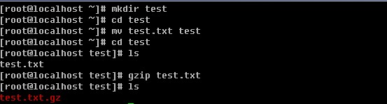
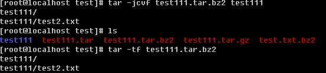
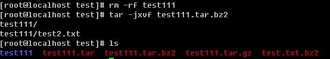
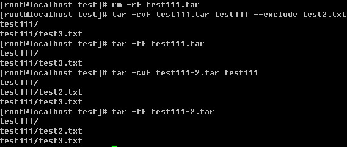
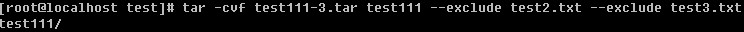

# 文档的压缩与打包

在windows下我们接触最多的压缩文件就是.rar格式的了。但在linux下这样的格式是不能识别的，它有自己所特有的压缩工具。但有一种文件在windows和linux下都能使用那就是.zip格式的文件了。压缩的好处不用笔者介绍相信你也晓得吧，它不仅能节省磁盘空间而且在传输的时候还能节省网络带宽呢。

在linux下最常见的压缩文件通常都是以.tar.gz 为结尾的，除此之外还有.tar, .gz, .bz2, .zip等等。以前也介绍过linux系统中的后缀名其实要不要无所谓，但是对于压缩文件来讲必须要带上。这是为了判断压缩文件是由哪种压缩工具所压缩，而后才能去正确的解压缩这个文件。以下介绍常见的后缀名所对应的压缩工具。

.gz gzip 压缩工具压缩的文件

.bz2 bzip2 压缩工具压缩的文件

.tar tar 打包程序打包的文件(tar并没有压缩功能，只是把一个目录合并成一个文件)

.tar.gz 可以理解为先用tar打包，然后再gzip压缩

.tar.bz2 同上，先用tar打包，然后再bzip2压缩

**【gzip】**

语法： gzip [-d#] filename 其中#为1-9的数字

-d ：解压缩时使用

-# ：压缩等级，1压缩最差，9压缩最好，6为默认

压缩test.txt后，则变成了test.txt.gz

用-d解压缩

要注意的是，gzip不可以压缩目录

**【bzip2】**

语法：bzip2 [-dz] filename

-d ：解压缩

-z ：压缩

其实-z参数是可以省略掉的，你不妨试试

跟gzip的解压类似，也是用-d解压。

**【tar】**

语法：tar [-zjxcvfpP] filename

-z ：是否同时用gzip压缩

-j ：是否同时用bzip2压缩

-x ：解包或者解压缩

-t ：查看tar包里面的文件

-c ：建立一个tar包或者压缩文件包

-v ：可视化

-f ：后面跟文件名，压缩时跟-f文件名，意思是压缩后的文件名为filename，解压时跟-f文件名，意思是解压filename。请注意，如果是多个参数组合的情况下带有-f，请把f写到最后面。

-p ：使用原文件的属性，压缩前什么属性压缩后还什么属性。（不常用）

-P ：可以使用绝对路径。（不常用）

--exclude filename ：在打包或者压缩时，不要将filename文件包括在内。（不常用）

首先在test目录下建立test111目录，然后在test111目录下建立test2.txt，并写入”nihao”到test2.txt中，接着是用tar把test111打包成test111.tar。请记住-f参数后跟的是打包后的文件名。

删除原来的test111目录，然后解包test111.tar，不管是打包还是解包，原来的文件是不会删除的。

打包的同时使用gzip压缩

用-tf 跟包名来查看包或者压缩包内的文件都有哪些

先删除test111,然后用tar -zxvf 来解压.tar.gz的压缩包。

-jcvf 打包的同时用bzip2压缩，-tf同样可以查看.tar.bz2的压缩包

-jxvf解压缩.tar.bz2的压缩包

--exclude参数的作用就是打包的时候过滤掉某些文件，如果想过滤多个文件怎么办

只能是继续跟 --exclude filename了。
