# Linux 磁盘管理 

【**查看磁盘或者目录的容量** **df** **和** **du**】

**df** 查看已挂载磁盘的总容量、使用容量、剩余容量等，可以不加任何参数，默认是按k为单位显示的

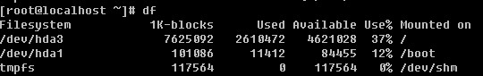

df常用参数有 –i -h -k –m等

-i 使用inodes 显示结果

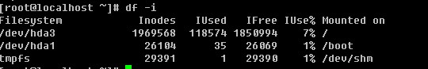

-h 使用合适的单位显示，例如G

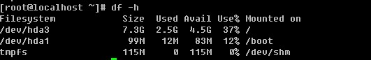

-k -m 分别为使用K，M为单位显示

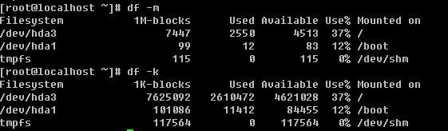

简单介绍一下，你看到的相关数据。Filesystem 表示扇区，也就是你划分磁盘时所分的区；1K-blocks/1M-blocks表示以1K/1M为单位；Used 和 Available 分别是已使用和剩余；Use% 就是已经使用的百分比，如果这个值大于90% 那么你就应该注意了，磁盘很有可能马上就会变满的；Mounted on 则表示该分区（扇区）所挂载的地方。

**du** **用来查看某个目录所占空间大小**

语法：du [-abckmsh] [文件或者目录名] 常用的参数有：

-a：全部文件与目录大小都列出来。如果不加任何选项和参数只列出目录（包含子目录）大小。

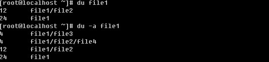

-b：列出的值以bytes为单位输出，默认是以Kbytes

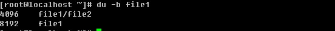

-c：最后加总

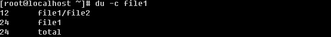

-k：以KB为单位输出

-m：以MB为单位输出

-s：只列出总和

-h：系统自动调节单位，例如文件太小可能就几K，那么就以K为单位显示，如果大到几G，则就以G为单位显示。笔者习惯用 du –sh filename 这样的形式。

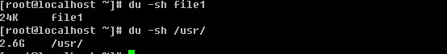

**【****磁盘的分区和格式化****】**

笔者经常做的事情就是拿一个全新的磁盘来分区并格式化。这也说明了作为一个linux系统管理员，对于磁盘的操作必须要熟练。所以请你认真学习该部分内容。

fdisk linux下的硬盘分区工具

语法： fdisk [-l ] [设备名称]

-l ：后边不跟设备名会直接列出系统中所有的磁盘设备以及分区表，加上设备名会列出该设备的分区表。

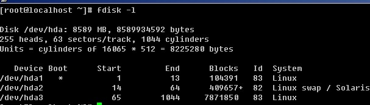

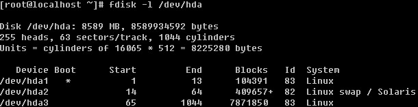

如果不加-l 则进入另一个模式，在该模式下，可以对磁盘进行分区操作。

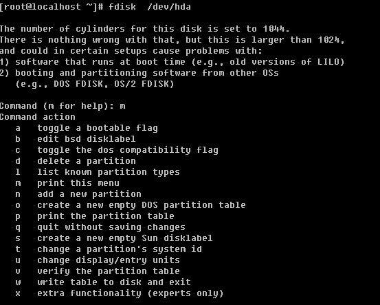

刚进入该模式下，会有一个提示Command (m for help): 此时按m则会打印出帮助列表，如果你英文好，我想你不难理解这些字母的功能。笔者常用的有p, n,d, w, q.

P：打印当前磁盘的分区情况。

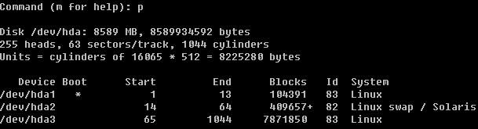

n：重新建立一个新的分区。

w：保存操作。

q：退出。

d：删除一个分区

因为笔者的linux系统是安装在虚拟机上的，所以我可以增加一块新的磁盘。然后笔者会把新的磁盘分成多个分区。

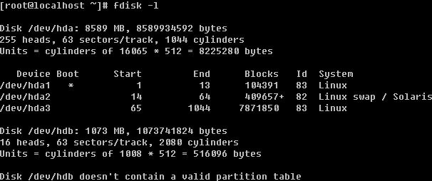

当再次fdisk -l 查看时发现多了一个/dev/hdb 设备，并提示该设备没有可用的分区表。那么下面就来分一下这个/dev/hdb.

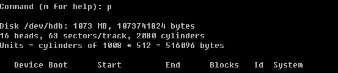

首先用p查看一下，并没有任何分区信息。

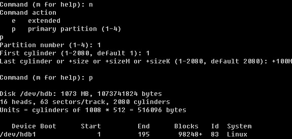

用n创建一个新的分区，会提示要建立e （extended 扩展分区）或者p （primary partition主分区），这里笔者选择主分区，所以按了p回车后，又让输入First cylinder 你或者直接回车或者输入一个数字，因为这块磁盘是新的并没有任何分区，所以直接回车其实就是从1开始了。你也可以自定义输入，但不要超过2080，笔者这里输入1回车。此时会提示要分多大，可以写一个数值（2-2080），也可以输入+sizeK或者+sizeM，后者比较直观容易理解，所以笔者在这里输入+100M，即我分了一个100M的主分区。再用p查看时，果真多出来一个分区。然后笔者继续重复前面的操作，建立了4个主分区。当笔者再次输入n创建分区时，结果提示错了。

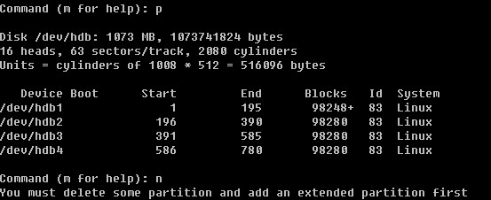

由此你会发现，在linux中最多只能创建4个主分区，那如果你想多创建几个分区如何做？很容易，在创建完第三个分区后，创建第四个分区时选择扩展分区。

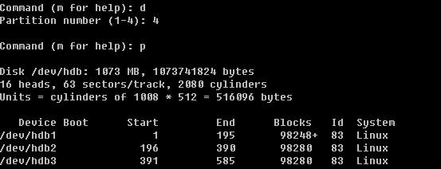先删除第四个主分区，然后建立一个扩展分区

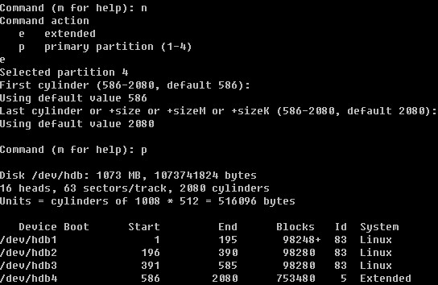

在建立扩展分区时，会问你要分多少给这个扩展分区，笔者直接回车，即把所有空间都分给了这个扩展分区。这个扩展分区/dev/hdb4并不能往里写数据，它只是一个空壳子，需要我们继续在这个空壳中继续创建分区。

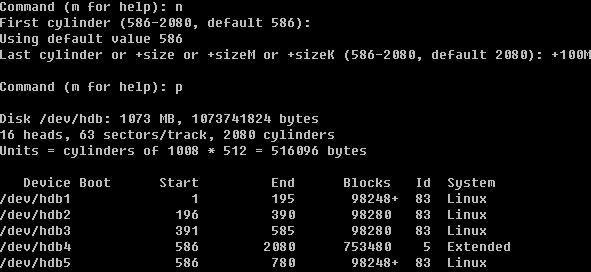

当建立完扩展分区，然后按n创建新分区时你会发现不再提示是要建立p还是e了，因为我们已经不能再创建p了。在这里需要你明白的是，hdb5 其实只是 hdb4 中的一个子分区，到目前为止可用的分区也才4个，那笔者就再创建第5个分区出来。

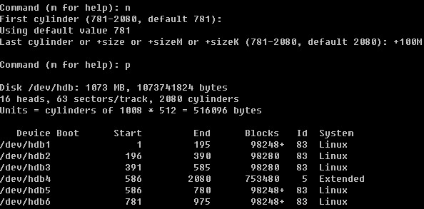

然后按w保存，该模式自动退出，如果你不想保存分区信息直接按q即可退出。

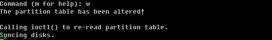

下面我们把刚分好的分区删除，重新建立分区。如何删除你还记得吧，对了就是直接按d然后选择合适的数字。删除完所有分区后，这块磁盘就恢复如初了。

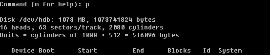

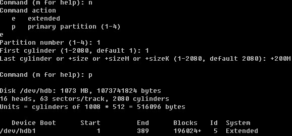

第一个分区，我们就建立成扩展分区。并且分给它200M。

当再次新建分区时，发生了变化，不再是p或者e了，而是p或者l（逻辑分区），这是为什么呢？在上面也提到了，一个扩展分区只是一个空壳，在扩展分区下才可以继续划分小的分区，这个小的分区其实就是逻辑分区了。

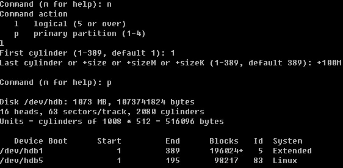

而且这个逻辑分区默认都是从字数5开始的，因为前面的数字要么给主分区留着，要么给扩展分区留着。由此我们也可以得到，在linux中最多可以创建4个主分区，一旦创建4个主分区后就不能增加任何分区了。另外最多也只能创建一个扩展分区。扩展分区下的逻辑分区最多可以创建多少呢？IDE的硬盘（类似于hda, hdb, hdc 等）最多可以创建10个（hdb5-hdb15），这是笔者试验出来的结果。有的资料说linux下的逻辑分区是没有限制的，也有的说最大可以到64，至于对不对，需要你去近一步考察了，我们没有必要多么深入的研究这个问题，也没有什么意义。

通过以上操作，相信你也学会了用fdisk 来分区了吧。值得提出的是，不要闲着没事分区玩儿，这操作的危险性是很高的，一不留神就把你服务器上的数据全部给分没有了。如果有分区的操作，那么请保持百分之二百的细心，切记切记！

**mkfs.ext2 / mkfs.ext3 /mke2fs** **格式化****linux****硬盘分区**

当用man查询这三个命令的帮助文档时，你会发现我们看到了同一个帮助文档，这说明三个命令是一样的。常用的选项有：

-b：分区时设定每个数据区块占用空间大小，目前支持1024, 2048 以及4096 bytes每个块。

-i：设定inode大小

-N：设定inode数量，有时使用默认的inode数不够用，所以要自定设定inode数量。

-c：在格式化前先检测一下磁盘是否有问题，加上这个选项后会非常慢

-L：预设该分区的标签label

-j：建立ext3格式的分区，如果使用mkfs.ext3 就不用加这个选项了

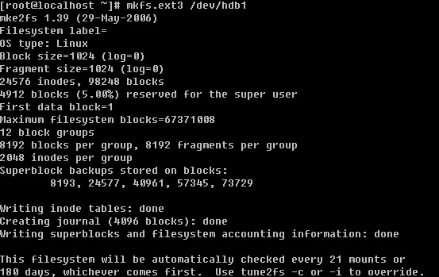

不加任何选项，直接格式化/dev/hdb1

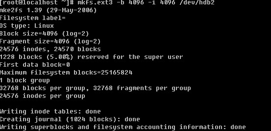

上例中更改了block size为4096 默认是1024，而inode大小设定为4096。

下面的例子分区时自定义分区的label（标签）名。

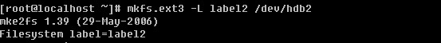

**e2label** **用来查看或者修改分区的标签（****label****）**

这个命令很简单，后边直接跟分区编号，即可查看该分区的label，当想要修改标签名时，分区编号后边跟想要的标签名即可。

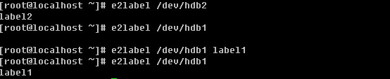

**fsck** **检查硬盘有没有坏道**

语法： fsck [-Aar] [分区]

-A ：加该参数时，后不需要跟分区名作为参数。它会自动检查/etc/fstab 文件下的所有分区（开机过程中就会执行一次该操作）；

-a ：自动修复检查到有问题的分区；

-r ：当检查到有坏道的分区时会让用户决定是否修复。

当你使用fsck检查磁盘有无坏道时，会提示用户“跑这个任务可能会导致某些挂载的文件系统损坏”，所以这个命令不要轻易运行。否则真的遇到问题，系统甚至都不能启动了。

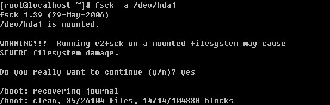

**【****挂载****/****卸载磁盘****】**

在上面的内容中讲到了磁盘的分区和格式化，那么格式化完了后，如何去用它呢？这就涉及到了挂载这块磁盘。格式化后的磁盘其实是一个块设备文件，类型为b，也许你会想，既然这个块文件就是那个分区，那么直接在那个文件中写数据不就写到了那个分区中么？当然不行。

在挂载某个分区前需要先建立一个挂载点，这个挂载点是以目录的形式出现的。一旦把某一个分区挂载到了这个挂载点（目录）下，那么再往这个目录写数据使，则都会写到该分区中。这就需要你注意一下，在挂载该分区前，挂载点（目录）下必须是个空目录。其实目录不为空并不影响所挂载分区的使用，但是一旦挂载上了，那么该目录下以前的东西就不能看到了。只有卸载掉该分区后才能看到。

**mount** **挂载设备**

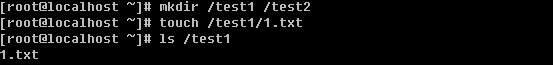

先建立/test1 /test2 目录，然后在/test1目录下建立一个1.txt文件。

把/dev/hdb1分区挂载到/test1目录，然后再查看/test1目录发下，1.txt不存在了。此时往/test1目录下写数据，则会写到/dev/hdb1分区中。在讲mount的-a选项时，我们有必要先了解一下这个文件 /etc/fstab

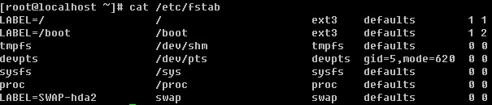

这个文件是系统启动时，需要挂载的各个分区。第一列就是分区的label；第二列是挂载点；第三列是分区的格式；第四列则是mount的一些挂载参数，等下会详细介绍一下有哪些参数，一般情况下，直接写defaults即可；第五列的数字表示是否被dump备份，是的话这里就是1，否则就是0；第六列是开机时是否自检磁盘，就是刚才讲过的那个fsck检测。1，2都表示检测，0表示不检测，在Redhat中，这个1，2还有个说法，/ 分区必须设为1，而且整个fstab中只允许出现一个1，这里有一个优先级的说法。1比2优先级高，所以先检测1，然后再检测2，如果有多个分区需要开机检测那么都设置成2吧，1检测完了后会同时去检测2。下面该说说第四列中常用到的参数了。

async/sync ：async表示和磁盘和内存不同步，系统每隔一段时间把内存数据写入磁盘中，而sync则会时时同步内存和磁盘中数据；

auto/noauto ：开机自动挂载/不自动挂载；

default：按照大多数永久文件系统的缺省值设置挂载定义，它包含了rw, suid, dev, exec, auto, nouser,async ；

ro：按只读权限挂载；

rw：按可读可写权限挂载；

exec/noexec ：允许/不允许可执行文件执行，但千万不要把根分区挂载为noexec，那就无法使用系统了，连mount命令都无法使用了，这时只有重新做系统了；

user/nouser ：允许/不允许root外的其他用户挂载分区，为了安全考虑，请用nouser ；

suid/nosuid ：允许/不允许分区有suid属性，一般设置nosuid ；

usrquota ：启动使用者磁盘配额模式，磁盘配额相关内容在后续章节会做介绍；

grquota ：启动群组磁盘配额模式；

学完这个/etc/fstab后，我们就可以自己修改这个文件，增加一行来挂载新增分区。例如，笔者增加了这样一行

/dev/hdb1 /test1 ext3 defaults 0 0

那么系统再重启时就会挂载这个分区了。

讲完了/etc/fstab 我们继续回来讲这个mount，mout -a 如果运行了这个命令，则会把/etc/fstab中出现的所有磁盘分区挂载上。所以当你在/etc/fstab文件中增加一行后，你完全可以直接运行mount -a 来挂载你增加的那行，这样就不用重启啦。

你可以使用mount -o 选项来重新挂载一个分区，并同时指定你想要的选项（即上边介绍fstab第六列中那些）

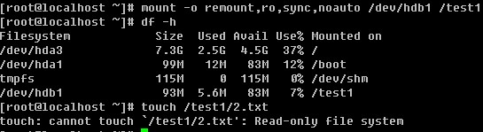

看到了吧，使用了ro选项，则不能新建文件了。

再重新挂载一次就恢复正常了，如果不加任何其他选项，则就是defaults。

笔者在日常的运维工作中遇到过这样的情况，一台服务器上新装了亮块磁盘，磁盘a（在服务器上显示为sdc）和磁盘b（在服务器上显示为sdd），有一次把这两块磁盘都拔掉了，然后再重新插上，重启机器，结果磁盘编号调换了，a变成了sdd，b变成了sdc（这是因为把磁盘插错了插槽），问题来了。通过上边的学习，你挂载磁盘是通过/dev/hdb1 这样的分区名字来挂载的，如果先前加入到了/etc/fstab 中，结果系统启动后则会挂载错分区。那么怎么样避免这样的情况发生？

**blkid** 这个命令是用来显示磁盘分区uuid的，uuid其实就是一大串字符，在linux系统中每一个分区都会有唯一的一个uuid。说到这，聪明的你想到了吧，没有错，我们就用这唯一的uuid来挂载磁盘分区。

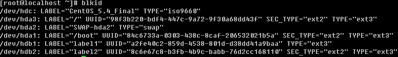

这个命令笔者只是用来显示uuid，没有其他用途所以不做详细介绍，当然你也可以在命令后边跟某一个分区，只显示该分区的uuid。

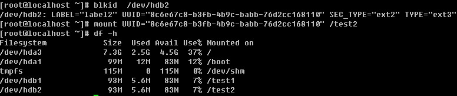

看到了吧，其实是很好用的。那么怎么让它也开机启动？很简单，把刚才敲的mount 磁盘的命令直接写到 /etc/rc.d/rc.local 文件即可。对了，笔者到现在还没有给你讲过这个rc.local文件的作用。简单点说，系统启动完后会执行这个文件中的命令。所以只要你想开机后运行什么命令统统写入到这个文件下面吧。

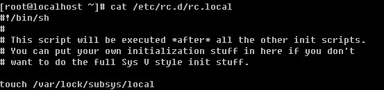

其实这个文件就是一个shell 脚本，以后笔者会单独用一章来介绍它。行开头的”#”是注释的意思，代表这行在这个脚本中不生效。你想让系统开机后运行什么命令，就把什么命令写到这里面来。就比如刚才笔者挂载的那条命令。你可以这样实现：

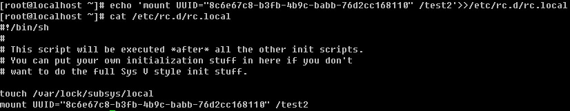

mount 还有一个比较常用的选项就是-t ，后边指定文件系统的类型，比如挂载软盘时就需要指定 vfat，而挂载光盘时就需要指定iso9660，但在笔者多年来的经验，目前的系统都是智能识别所要挂载分区的系统格式类别的。也就是说，用不着你去指定，它会自动判断的。

**umount** **卸载设备**

现在你学会了如何挂载一个设备，那么如何去卸载一个设备呢，这就要用到umount了，这个命令也简单的很，后边可以跟挂载点，也可以跟分区名(/dev/hdb1)

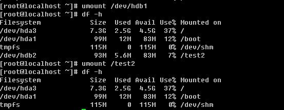

有时也许你会遇到比较难卸载的设备，就像在windows下无法删除U盘一样，教你一个特管用的方法就是 umount -l /dev/hdb1 ，这个-l选项有强制卸载的意思，你一定要记住哦，非常有用的。

**【****建立一个****swap****文件****】**

从装系统时就接触过这个swap了，前面也说过它类似与windows的虚拟内存，分区的时候一般大小为内存的2倍，如果你的内存超过4G，那么你分8G似乎是没有必要了。分4G足够日常交换了。然而，还会有虚拟内存不够用的情况发生。如果真遇到了，莫非还要重新分一下磁盘？当然不能！那我们就增加一个虚拟的磁盘出来。

基本的思路就是：建立swapfile 格式化为swap格式启用该虚拟磁盘

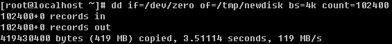

利用dd 来创建一个419M的文件/tmp/newdisk出来，其中if代表从哪个文件读，/dev/zero是linux下特有的一个0生成器，of表示输出到哪个文件，bs即块大小，count则定义有多少个块。

mkswap 这个命令是专门格式化swap格式的分区的，这个命令用的时候一定要看清楚了，否则把其他分区给格式化错了就只有哭了。

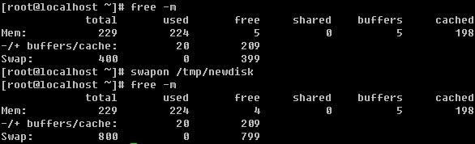

free 是用来查看系统内存以及虚拟内存使用情况的，-m选项是以M的形式查看。可以看到当前系统的。而swapon 是启用我们新建的swap文件，启用后再用free查看发现多了400M。

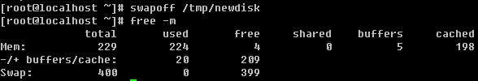

我们还可以用swapoff 关闭启用的swap文件。

**【****磁盘配额****】**

磁盘配合其实就是给每个用户分配一定的磁盘额度，只允许他使用这个额度范围内的磁盘空间。在linux系统中，是多用户多任务的环境，所以会有很多人共用一个磁盘的情况。针对每个用户去限定一定量的磁盘空间是有必要的，这样才显得公平。

在linux中，用来管理磁盘配额的东西就是quota了。如果你的linux上没有quota，则需要你安装这个软件包 quota-3.13-5.el5.RPM （其实版本是多少无所谓了，关键是这个软件包）。quota在实际应用中是针对整个分区进行限制的。如果你的/dev/hda3 是挂载在/home 目录下的，那么/home 所有目录都会受到限制。

quota 这个模块主要分为quota quotacheck quotaoff quotaon quotastats edquota setquota warnquota repquota这几个命令，下面就分别介绍这些命令。

quota 用来显示某个组或者某个使用者的限额。

语法：quota [-guvs] [user,group]

-g ：显示某个组的限额

-u ：显示某个用户的限额

-v ：显示的意思

-s ：选择inod或硬盘空间来显示

 

quotacheck 用来扫描某一个磁盘的quota空间。

语法：quotacheck [-auvg] /path

-a ：扫描所有已经mount的具有quota支持的磁盘

-u ：扫描某个使用者的文件以及目录

-g ：扫描某个组的文件以及目录

-v ：显示扫描过程

-m ：强制进行扫描

 

edquota 用来编辑某个用户或者组的quota值。

语法：edquota [-u user] [-g group] [-t]

edquota -p user -u user

-u ：编辑某个用户的quota

-g ：编辑某个组的quota

-t ：编辑宽限时间

-p ：拷贝某个用户或组的quta到另一个用户或组

当运行edquota -u user 时，系统会打开一个文件，你会看到这个文件中有7列，它们分别代表的含义是：

Filesystem ：磁盘分区，如/dev/hda3

blocks ：当前用户在当前的Filesystem中所占用的磁盘容量，单位是Kb。该值请不要修改。

soft/hard ：当前用户在该Filesystem内的quota值，soft指的是最低限额，可以超过这个值，但必须要在宽限时间内将磁盘容量降低到这个值以下。hard指的是最高限额，即不能超过这个值。当用户的磁盘使用量高于soft值时，系统会警告用户，提示其要在宽限时间内把使用空间降低到soft值之下。

inodes ：目前使用掉的inode的状态，不用修改。

quotaon 启动quta，在编辑好quota后，需要启动才能是quta生效

语法：quotaon [-a] [-uvg directory]

-a ：全部设定的quota启动

-u ：启动某个用户的quota

-g ：启动某个组的quota

-s ：显示相关信息

 

quotaoff 关闭quota

该命令常用只有一种情况 quotaoff -a 关闭全部的quota

以上讲了很多quota的相关命令，那么接下来笔者教你如何在实践应用中去做这个磁盘配额。整个执行过程如下：

首先先确认一下，你的/home目录是不是单独的挂载在一个分区下，用df 查看即可。如果不是则需要你跟我一起做。否则这一步即可省略。

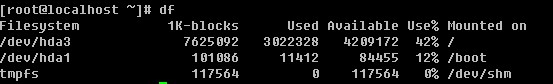

笔者的linux系统中，/home并没有单独占用一个分区。所以需要把/home目录挂载在一个单独的分区下，因为quota是针对分区来限额的。

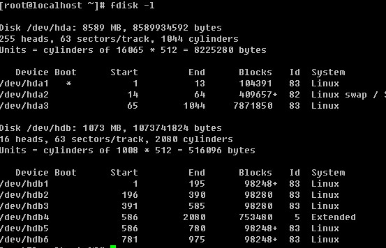

笔者用fdisk -l 查看目前/dev/hdb 磁盘有5个可用分区，所以笔者打算把/dev/hdb1挂载在/home 目录下

看到了吧，目前笔者的/home目录已经是一个单独的分区了。

1）建立测试用户

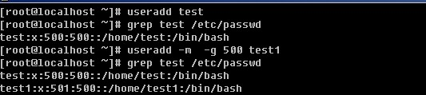

首先建立一个test用户，则同时建立了一个test组。可以在/etc/passwd中有以test为开头的行，其中uid和gid都为500 ，然后又建立一个test1账号，使其加入test组，查看/etc/passwd文件发现test和test1用户的gid都为500。（也许你对/etc/passwd文件、增加一个用户以及uid和gid等概念不熟悉，没有关系，在以后的章节中会做介绍，在这里只需要你明白即可）

2）打开磁盘的quota功能

默认linux并没有对任何分区做quota的支持，所以需要我们手动打开磁盘的quota功能，你是否记得，在前面内容中分析/etc/fstab文件的第四列时讲过这个quota选项（usrquota, grpquota）。没错，要想打开这个磁盘的quota支持就是需要修改这个第四列的。用vim编辑/etc/fstab 加入一行，如下图：

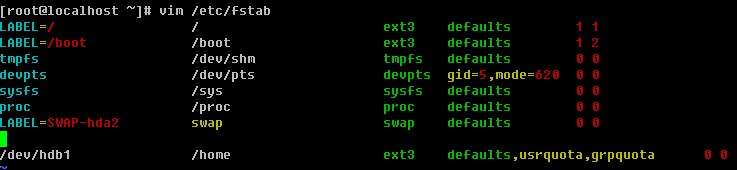

vim命令将会在后续章节详细介绍，前面介绍过如何进入编辑模式以及如何保存文件。如果你的linux系统已经有/home这一行，那么直接修改第四列，加上usrquota,grpguota（中间没有空格）。接下来需要重新挂载/home。

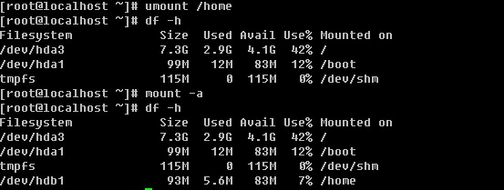

另外你也可以这样实现重新挂载/home

如何查看是否启用了quota呢？

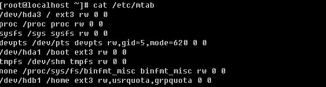

只要查看/etc/mtab文件中/home所在那行是否有usrguota,grpquota即可。笔者的/dev/hdb1现在已经支持了quota

3）扫描磁盘的使用者使用状况，并产生重要的aquota.group与aquota.user

这一步就需要用到quotacheck了，aquota.group与aqouta.user分别是组以及用户磁盘配额需要的配置文件。如果没有这两个文件，则磁盘配额是不会生效的。

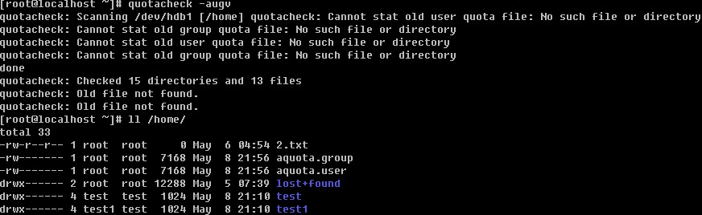

当首次使用quotacheck命令时，会提示“cannot stat old user quota file ……”其实这是在提示你在/home目录下没有aquota.user以及aquota.group两个文件。没有关系，因为以前并没有配置过磁盘配额，当然没有这两个文件了。当执行完quotacheck命令后，会在/home目录下生成这两个文件的。

4）启动quota配额

5）编辑用户磁盘配额

先来设定test账户的配额，然后直接把test的配额拷贝给test1即可。这里就需要用到edquota了。

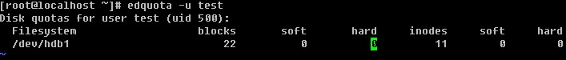

讲上面内容修改为

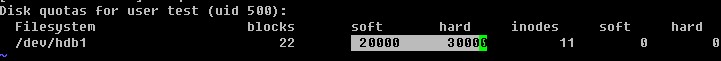

其中单位是Kb，所以soft 值大约为20Mb，hard值为30Mb，保存这个文件，保存的方式跟vim一个文件的方式一样的。

将test的配额复制给test1。下面继续设定宽限时间。

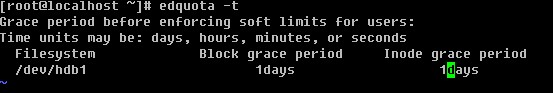

默认是7days 在这里我们改为1days。下面查看一下test以及test1用户的配额吧。

6）编辑组磁盘配额

设定组test的soft配额值为40M，hard值为50M。下面查看组test的配额。

7）设定开机启动

前面已经讲到启动磁盘配额的命令是quotaon -aug ，所以要想开机启动，只需将这条命令加入到 /etc/rc.d/rc.local文件即可。

