# Linux 文件与目录管理

在 linux 中什么是一个文件的路径呢，说白了就是这个文件存在的地方，例如在上一章提到的/root/.ssh/authorized_keys 这就是一个文件的路径。如果你告诉系统这个文件的路径，那么系统就可以找到这个文件。在 linux 的世界中，存在着绝对路径和相对路径。

**绝对路径**：路径的写法一定由根目录”/”写起，例如/usr/local/mysql 这就是绝对路径。

**相对路径**：路径的写法不是由根目录”/”写起，例如，首先用户进入到/ 然后再进入到 home  ，命令为  cd /home  然后  cd test  此时用户所在的路径为 /home/test 。第一个cd命令后跟  /home  第二个 cd 命令后跟 test  ，并没有斜杠，这个test是相对于/home 目录来讲的，所以叫做相对路径。

**pwd**这个命令打印出当前所在目录

**cd** 进入到某一个目录

./ 指的是当前目录

../ 指的是当前目录的上一级目录。

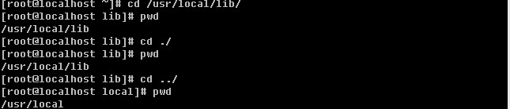

上图中，首先进入到/usr/local/lib/ 目录下，然后再进入 ./ 其实还是进入到当前目录下，用pwd查看当前目录，并没有发生变化，然后再进入../ 则是进入到了/usr/local/目录下，即/usr/local/lib目录的上一级目录。你看明白了吗？

**mkdir**创建一个目录，这个命令在上一章节中提及过。mkdir 其实就是make directory的缩写。其语法为 mkdir [-mp] [目录名称] ，其中-m , –p 为其选项，-m：这个参数用来指定要创建目录的权限，该参数不常用，所以笔者不做重点解释。-p：这个参数很管用的，先来做个试验，你会一目了然的。

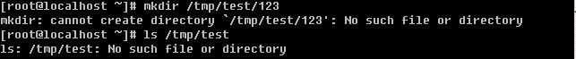

当我们想创建 /tmp/test/123 目录，可是提示不能创建，原因是/tmp/test目录不存在，你会说，这个linux怎么这样傻，/tmp/test目录不存在就自动创建不就OK了嘛，的确linux确实很傻，如果它发现要创建的目录的上一级目录不存在就会报错。然后linux也为我们想好了解决办法，即-p参数。

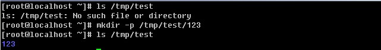

你看到这里，是不是明白-p参数的作用了？没错，它的作用就是递归创建目录，即使上级目录不存在。还有一种情况就是如果你想要创建的目录存在的话，会提示报错，然后你加上-p参数后，就不会报错了。

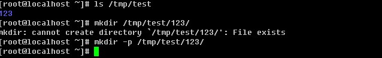

**rmdir**删除一个目录。

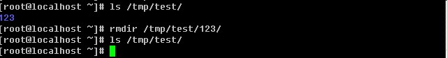

rmdir 其实是rmove directory 缩写，其只有一个选项-p 类似与mkdir命令，这个参数的作用是将上级目录一起删除。举个例子吧，新建目录mkdir -p d1/d2/d3 ，rmdir -p d1/d2/d3相当于是删除了d1,d1/d2, d1/d2/d3。如果一个目录中还有目录，那么当你直接rmdir 该目录时，会提示该目录不为空，不能删除。如果你非要删除不为空的目录，那你用rm指令吧。

**rm**删除目录或者文件

rmdir 只能删除目录但不能删除文件，要想删除一个文件，则要用rm命令了。rm同样也有很多选项。你可以通过 man rm 来获得详细帮助信息。在这里笔者只列举较常用的几个选项。

-f 强制的意思，如果不加这个选项，当删除一个不存在的文件时会报错。

-i 这个选项的作用是，当用户删除一个文件时会提示用户是否真的删除。

如果删除，输入y 否则输入 n

-r 当删除目录时，加该选项，如果不加这个选项会报错。rm是可以删除不为空的目录的。

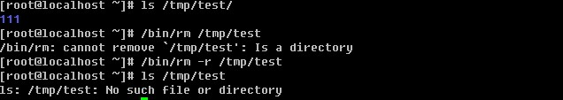

你会发现，笔者在列举的rm例子中使用的是绝对路径，而ls 则使用的相对路径。这是为什么呢？

**which** 用来查找一个命令的绝对路径，这个命令笔者不详细介绍，因为平时笔者只用来查找一个命令的绝对路径。

**alias**用来设置指令的别名。语法：alias[别名]=[指令名称]，例如 alias rm='rm -i' ，即当我们使用rm命令时，实际上是使用的是rm –i ，而用绝对路径的/bin/rm 则不会被alias，该命令在以后章节中会详细介绍。

## 环境变量 PATH

上边提到了alias，也提到了绝对路径的/bin/rm ，然后你意识到没有，为什么我们输入很多命令时是直接打出了命令，而没有去使用这些命令的绝对路径？这是因为环境变量PATH在起作用了。请输入 echo $PATH，这里的echo其实就是打印的意思，而PATH前面的$表示后面接的是变量。

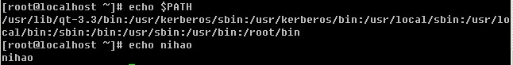

因为/bin 在PATH的设定中，所以自然就可以找到ls了。如果你将 ls 移动到 /root 底下的话，然后你自己本身也在 /root 底下，但是当你执行 ls 的时候，他就是不理你？怎么办？这是因为 PATH 没有 /root 这个目录，而你又将 ls 移动到 /root 底下了，自然系统就找不到可执行文件了，因此就会告诉你， command not found ！那么该怎么克服这种问题呢？

有两个方法，一种方法是直接将 /root 的路径加入 PATH 当中！如何增加？可以使用： 　

PATH=”$PATH”:/root

另一种方式则是使用完整档名，亦即直接使用相对或绝对路径来执行，例如：

/root/ls

./ls

关于rm，笔者使用最多便是-rf两个选项合用了。不管删除文件还是目录都可以。但是方便的同时也要多注意，万一你的手太快后边跟了/那样就会把你的系统文件全部删除的，切记切记。

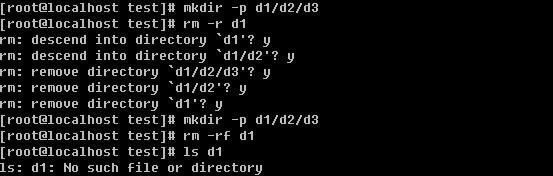

**ls** 在前面的命令中多次用到它。现在你已经明白它的含义了吧。没有错，就是查看某个目录或者某个文件，是list的简写。ls 后可以跟一个目录，也可以跟一个文件。以下是ls的选项，在这里笔者并没有完全列出，只是列出了平时使用最多的选项。其他选项，你可以自行通过man ls 查询。

-a 全部的档案都列出，包括隐藏的。linux文件系统中同样也有隐藏文件。这些隐藏文件的文件名是以.开头的。例如.test, /root/.123, /root/.ssh 等等，隐藏文件可以是目录也可以是普通文件。

-l 详细列出文件的属性信息，包括大小、创建日期、所属主所属组等等。ll 这个命令等同于ls –l 。

--color=never/always/auto never即不要显示颜色，always 即总显示颜色，auto 是由系统自行判断。在Redhat/CentOS 系统中，默认是带颜色的，因为我们平时用的ls已经alias成了ls –color=tty 所以目录的颜色是蓝色的，而可执行文件的颜色是绿色。这样有助于帮我们区分文件的格式。

-d 后边跟目录，如果不加这个选项则列出目录下的文件，加上后只列车目录本身。

**cp** copy的简写，即拷贝。格式为 cp [选项] [ 来源文件 ] [目的文件] ，例如我想把test1 拷贝成test2 ，这样即可 cp test1 test2，以下介绍几个常用的选项

-d 这里涉及到一个“连接”的概念。连接分为软连接和硬连接。在以后的章节中会详细解释，现在你只要明白这里的软连接跟windows中的快捷方式类似即可。如果不加这个-d 则拷贝软连接时会把软连接的目标文件拷贝过去，而加上后，其实只是拷贝了一个连接文件（即快捷方式）。

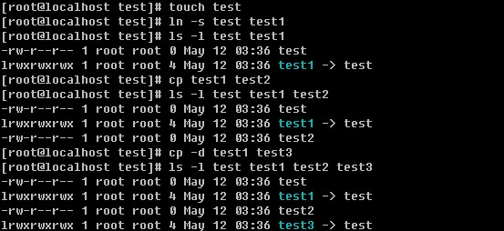

上例中的ln 命令即为建立连接的，以后再做详细解释。

-r 如果你要拷贝一个目录，必须要加-r选项，否则你是拷贝不了目录的。

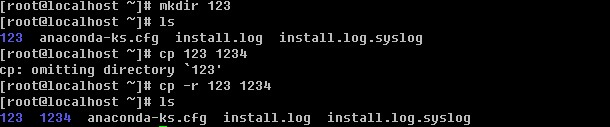

-i 如果遇到一个存在的文件，会问是否覆盖。在Redhat/CentOS系统中，我们使用的cp其实是cp –i

下面简单做一个小试验，很快你就会明白-i 选项的作用了。

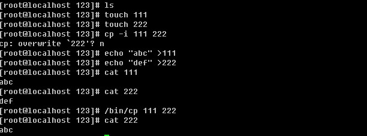

上例中，touch 命令，看字面意思就是摸一下，没错，如果有这个文件，则会改变文件的访问时间，如果没有这个文件就会创建这个文件。前面说过echo，其实就是打印，在这里所echo的内容”abc” 和 “def”并没有显示在屏幕上，而是分别写进了文件 111和222, 其写入作用的就是这个大于号”>” 在linux中这叫做重定向，即把前面产生的输出写入到后面的文件中。在以后的章节中会做详细介绍，这里你要明白它的含义即可。而cat 命令则是读一个文件，并把读出的内容打印到当前屏幕上。该命令也会在后续章节中详细介绍。

-u 该选项仅当目标文件存在时才会生效，如果源文件比目标文件新才会拷贝，否则不做任何动作。

**mv** 移动的意思，是move的简写。格式为 mv [ 选项 ] [源文件] [目标文件]，下面介绍几个常用的选项。

-i 和cp的-i 一样，当目标文件存在时会问用户是否要覆盖。在Redhat/CentOS系统中，我们使用的mv其实是mv –i

-u 和上边cp 命令的-u选项一个作用，当目标文件存在时才会生效，如果源文件比目标文件新才会移动，否则不做任何动作。

该命令有集中情况，你注意到了吗？

1）目标文件是目录，而且目标文件不存在；

2）目标文件是目录，而且目标文件存在；

3）目标文件不是目录不存在；

4）目标文件不是目录存在；

目标文件是目录，存在和不存在，移动的结果是不一样的，如果存在，则会把源文件移动到目标文件目录中。不存在的话移动完后，目标文件是一个文件。这样说也许你会觉得有点不好理解，看例子吧。

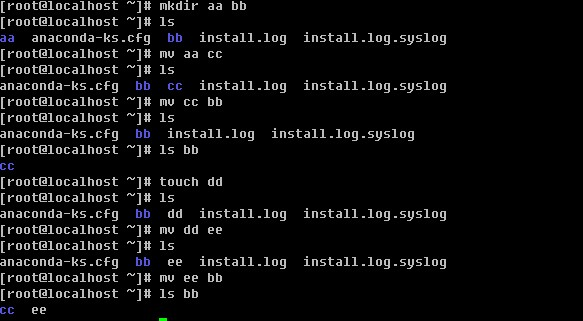

windows下的重命名，在linux下用mv就可以搞定。

**cat** 比较常用的一个命令，即查看一个文件的内容并显示在屏幕上。

-n 查看文件时，把行号也显示到屏幕上。

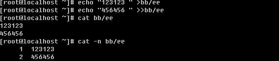

上例中出现了一个”>>”，这个符号跟前面介绍的”>”的作用都是重定向，即把前面输出的东西输入到后边的文件中，只是”>>”是追加的意思，而用”>”，如果文件中有内容则会删除文件中内容，而”>>”则不会。

-A 显示所有东西出来，包括特殊字符

**tac**其实是cat的反写，同样的功能也是反向打印文件的内容到屏幕上。

**more**也是用来查看一个文件的内容。当文件内容太多，一屏幕不能占下，而你用cat肯定是看不前面的内容的，那么使用more就可以解决这个问题了。当看完一屏后按空格键继续看下一屏。但看完所有内容后就会退出。如果你想提前退出，只需按q键即可。

**less**作用跟more一样，但比more好在可以上翻，下翻。空格键同样可以翻页，而按”j”键可以向下移动（按一下就向下移动一行），按”k”键向上移动。在使用more和less查看某个文件时，你可以按一下”/” 键，然后输入一个word回车，这样就可以查找这个word了。如果是多个该word可以按”n”键显示下一个。另外你也可以不按”/”而是按”?”后边同样跟word来搜索这个word，唯一不同的是，”/”是在当前行向下搜索，而”?”是在当前行向上搜索。

**head** head后直接跟文件名，则显示文件的前十行。如果加 –n 选项则显示文件前n行。

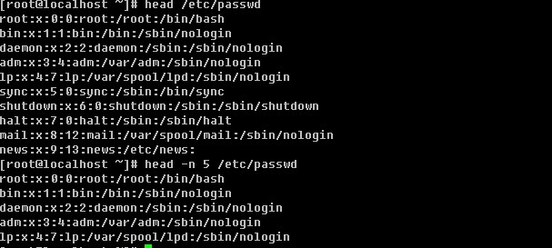

**tail** 和head一样，后面直接跟文件名，则显示文件最后十行。如果加-n 选项则显示文件最后n行。

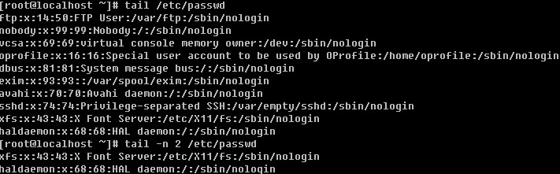

-f 动态显示文件的最后十行，如果文件是不断增加的，则用-f 选项。如：tail -f /var/log/messages

## 文件的所属主以及所属组

一个linux目录或者文件，都会有一个所属主和所属组。所属主，即文件的拥有者，而所属组，即该文件所属主所在的一个组。Linux这样设置文件属性的目的是为了文件的安全。例如，test文件的所属主是user0 而test1文件的所属主是user1，那么user1是不能查看test文件的，相应的user0也不能查看test1文件。然后有这样一个应用，我想创建一个文件同时让user0和user1来查看怎么办呢？

这时“所属组”就派上用场了。即，创建一个群组users，让user0和user1同属于users组，然后建立一个文件test2，且其所属组为users，那么user0和user1都可以访问test2文件。

Linux文件属性不仅规定了所属主和所属组，还规定了所属主（user）、所属组(group)以及其他用户（others）对该文件的权限。你可以通过ls -l 来查看这些属性。

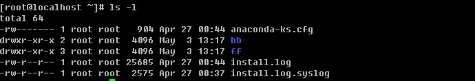

## linux 文件属性

上例中，用ls –l 查看当前目录下的文件时，共显示了9列内容（用空格划分列），都代表了什么含义呢？

第1列，包含的东西有该文件类型和所属主、所属组以及其他用户对该文件的权限。第一列共10位。其中第一位用来描述该文件的类型。上例中，我们看到的类型有”d”, “-“ ，其实除了这两种外还有”l”, “b”, “c”,”s”等。

d 表示该文件为目录；

- 表示该文件为普通文件；

l 表示该文件为连接文件（linux file），上边提到的软连接即为该类型；

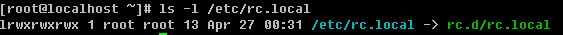

b 表示该文件为块设备文件，比如磁盘分区

c 表示该文件为串行端口设备，例如键盘、鼠标。

s 表示该文件为套接字文件（socket），用于进程间通信。

后边的9位，每三个为一组。均为rwx 三个参数的组合。其中r 代表可读，w代表可写，x代表可执行。前三位为所属主（user）的权限，中间三位为所属组（group）的权限，最后三位为其他非本群组（others）的权限。下面拿一个具体的例子来述说一下。

一个文件的属性为-rwxr-xr-- ，它代表的意思是，该文件为普通文件，文件拥有者可读可写可执行，文件所属组对其可读不可写可执行，其他用户对其只可读。

对于一个目录来讲，打开这个目录即为执行这个目录，所以任何一个目录必须要有x权限才能打开并查看该目录。例如一个目录的属性为 drwxr--r-- 其所属主为root，那么除了root外的其他用户是不能打开这个目录的。

第2列，表示为连接占用的节点（inode），若为目录时，通常与该目录地下还有多少目录有关系，关于连接（link）在以后章节详细介绍。

第3列，表示该文件的所属主。

第4列，表示该文件的所属组。

第5列，表示该文件的大小。

第6列、第7列和第8列为该文件的创建日期或者最近的修改日期，分别为月份日期以及时间。

第9列，文件名。如果前面有一个. 则表示该文件为隐藏文件。

## 更改文件的权限

更改文件的权限，也就是更改所属主、所属组以及他们对应的读写执行权限。

1）**更改所属组** **chgrp**

语法：chgrp [组名] [文件名]

 

这里用到了groupadd 命令，其含义即增加一个用户组。该命令在以后章节中做详细介绍，你只要知道它是用来增加用户组的即可。

2）**更改文件的所属主** **chown**

语法：chown [ -R ] 账户名文件名

chown [ -R ] 账户名：组名文件名

这里的-R选项只作用于目录，作用是级联更改，即不仅更改当前目录，连目录里的目录或者文件全部更改。

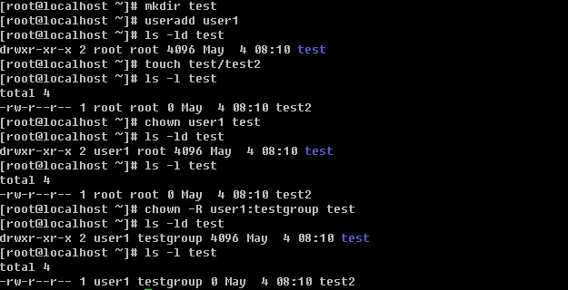

useradd 是增加一个账户，以后会详细介绍。上例中，首先建立一个目录test，然后在test目录下创建一个普通文件test2，因为是以root的身份创建的目录和文件，所以所属主以及所属组都是root。chown user1 test 这使test的目录所属主由root变为了user1 ，然后test目录下的test2文件所属主以及所属组还是root。接着 chown –R user1:testgroup test 这样把test连同test目录下的test2 的所属主以及所属组都改变了。

3）**改变用户对文件的读写执行权限** **chmod**

在linux中为了方便更改这些权限，linux使用数字去代替rwx ，具体规则为r: 4 w:2 x:1 -:0 举个例子，-rwxrwx---用数字表示就是 770，具体是这样来的：

rwx = 4+2+1=7; rwx= 4+2+1=7; --- = 0+0+0=0

chmod 语法： chmod [-R] xyz 文件名（这里的xyz，表示数字）

-R 选项作用同chown，级联更改。

值得提一下的是，在linux系统中，默认一个目录的权限为 755，而一个文件的默认权限为644.

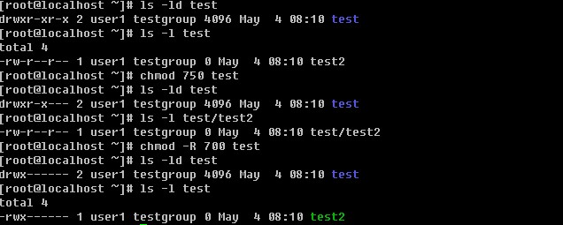

如果你创建了一个目录，而该目录不想让其他人看到内容，则只需设置成 rwxr----- (740) 即可。

chmod 还支持使用rwx的方式来设置权限。！从之前的介绍中我们可以发现，基本上就九个属性分别是(1)user (2)group (3)others 三群啦！那么我们就可以藉由 u, g, o 来代表三群的属性！此外， a 则代表 all 亦即全部的三群！那么读写的属性就可以写成了 r, w, x！也就是可以使用底下的方式来看：

现在我想把一个文件设置成这样的权限 rwxr-xr-x (755)，使用这种方式改变权限的命令为

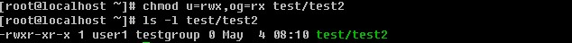

另外还可以针对u, g, o, a增加或者减少某个权限（读，写，执行），例如

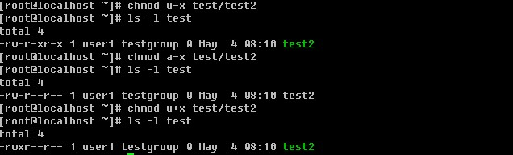

另外linux下还有两个比较特殊的权限s和t，请点击<a>linux下文件的特殊权限s和t</a>

**umask**

上边也提到了默认情况下，目录权限值为766，普通文件权限值为644。那么这个值是由谁规定呢？追究其原因就涉及到了umask。

umask语法： umask xxx （这里的xxx代表三个数字）

查看umask值只要输入umask然后回车。 umask预设是0022，其代表什么含义？先看一下下面的规则：

1）若用户建立为普通文件，则预设“没有可执行权限”，只有rw两个权限。最大为666（-rw-rw-rw-）

2）若用户建立为目录，则预设所有权限均开放，即777（drwxrwxrwx）

umask数值代表的含义为，上边两条规则中的默认值（文件为666，目录为777）需要减掉的权限。所以目录的权限为(rwxrwxrwx) – (----w--w-) = (rwxr-xr-x)，普通文件的权限为(rw-rw-rw-) – (----w--w-) = (rw-r--r--)。umask的值是可以自定义的，比如设定umask 为 002，你再创建目录或者文件时，默认权限分别为(rwxrwxrwx) – (-------w-) = (rwxrwxr-x)和(rw-rw-rw-) – (-------w-) = (rw-rw-r--)。

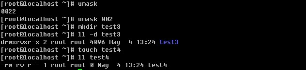

umask 可以在/etc/bashrc里面更改，预设情况下，root的umask为022，而一般使用者则为002，因为可写的权限非常重要，因此预设会去掉写权限。

**chattr** **修改文件的特殊属性**

语法： chattr [+-=][ASaci [文件或者目录名]

+-= ：分别为增加、减少、设定

A：增加该属性后，文件或目录的atime将不可被修改；

S：增加该属性后，会将数据同步写入磁盘中；

a：增加该属性后，只能追加不能删除，非root用户不能设定该属性；

c：自动压缩该文件，读取时会自动解压；

i：增加后，使文件不能被删除、重命名、设定连接、写入、新增数据；

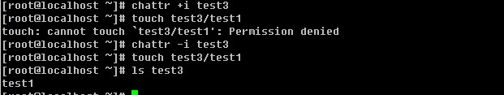

增加i属性后不能在该目录中建立文件。

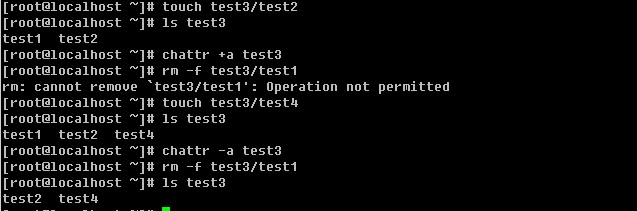

增加a属性后，只能追加不能删除。

**lsattr** **列出文件****/****目录的特殊属性**

语法： lsattr [-aR] [文件/目录名]

-a：类似与ls 的-a 选项，即连同隐藏文件一同列出；

-R：连同子目录的数据一同列出

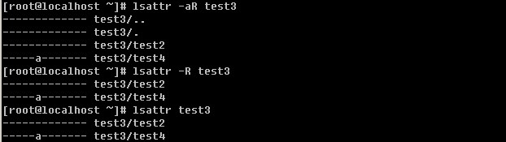

在上例中，test4是在test3目录增加a属性后建立的，所以test4也有a属性，通过这个例子可以看出，chattr 的属性是级联生效的，不仅对当前目录生效而且会对目录下的文件同样生效。

## 在 linux 下搜索一个文件

在windows下有一个搜索工具，可以让我们很快的找到一个文件，这是很有用的。然而在linux下搜索功能更加强大。

**which**用来查找可执行文件的绝对路径。

在前面章节中已经多次用到该命令，需要注意的一点是，which只能用来查找PATH环境变量中出现的路径下的可执行文件。这个命令用的也是蛮多的，有时候我们不知道某个命令的绝对路径，which一下很容易就知道了。

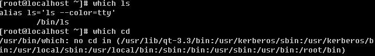

当查找的文件在PATH变量中并没有时，就会报错。

**whereis** 通过预先生成的一个文件列表库去查找跟给出的文件名相关的文件。

语法： whereis [-bmsu] [文件名称]

-b：只找binary 文件

-m：只找在说明文件manual路径下的文件

-s：只找source来源文件

-u：没有说明档的文件

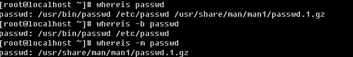

说明：whereis 笔者几乎很少用到，如果你感兴趣请深入研究。

**locate**类似于whereis，也是通过查找预先生成的文件列表库来告诉用户要查找的文件在哪里。后边直接跟文件名。如果你的linux没有这个命令，请安装软件包 mlocate ，这个软件包在你的系统安装盘里，后缀名是RPM，随后介绍的find命令会告诉你如何查找这个包。如果你装的CentOS你可以使用这个命令来安装 yum install –y mlocate 。 前提是你的CentOS能连互联网。至于yum这个命令如何使用，到后续章节你自然会明白。如果你刚装上这个命令，初次使用会报错。

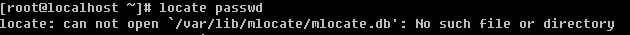

这是因为系统还没有生成那个文件列表库。你可以使用updatedb 命令立即生成（更新）这个库。如果你的服务器上正跑着重要的业务，那么你最好不要去运行这个命令，因为一旦运行，服务器的压力会变大。这个数据库默认情况下每周更新一次。所以你用locate命令去搜索一个文件，正好是在两次更新时间段内，那你肯定是得不到结果的。你可以到/etc/updated.conf 去配置这个数据库生成（更新）的规则。locate命令笔者用的也并不多，所以你只要明白有这么一个东西即可。你用到时再去深究其用法吧。

**find** 这个搜索工具是笔者用的最多的一个，所以请你务必要熟悉它。

语法： find [路径] [参数] 下面介绍几个笔者经常用的参数

-atime +n ：访问或执行时间大于n天的文件

-ctime +n ：写入、更改inode属性（例如更改所有者、权限或者连接）时间大于n天的文件

-mtime +n ：写入时间大于n天的文件

看到这里，你对这三个time是不是有些晕了，那笔者就先给你介绍一下这三个time属性。

文件的 Access time，atime 是在读取文件或者执行文件时更改的。文件的 Modified time，mtime 是在写入文件时随文件内容的更改而更改的。文件的 Create time，ctime 是在写入文件、更改所有者、权限或链接设置时随 Inode 的内容更改而更改的。 因此，更改文件的内容即会更改 mtime 和 ctime，但是文件的 ctime 可能会在 mtime 未发生任何变化时更改，例如，更改了文件的权限，但是文件内容没有变化。 如何获得一个文件的atime mtime 以及ctime ？

ls -l 命令可用来列出文件的 atime、ctime 和 mtime。

ls -lc filename         列出文件的 ctime

ls -lu filename         列出文件的 atime

ls -l filename          列出文件的 mtime    

atime不一定在访问文件之后被修改，因为：使用ext3文件系统的时候，如果在mount的时候使用了noatime参数那么就不会更新atime的信息。而这是加了 noatime 取消了, 不代表真实情況。反正, 這三個 time stamp 都放在 inode 中。若 mtime, atime 修改inode 就一定會改, 既然 inode 改了, 那 ctime 也就跟著要改了。

继续讲find常用的参数。

-name filename 直接查找该文件名的文件，这个使用最多了。

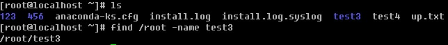

-type type ：通过文件类型查找。文件类型在前面部分已经简单介绍过，相信你已经大体上了解了。type 包含了 f, b, c, d, l, s 等等。后续的内容还会介绍文件类型的。

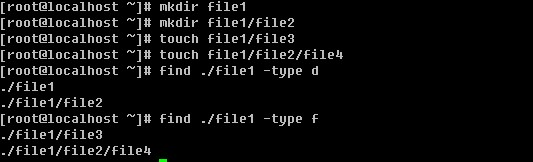

## linux 的文件系统

搞计算机的应该都知道windows的系统格式化硬盘时会指定格式，fat 或者 ntfs。而linux的文件系统格式为Ext2，或者Ext3 。早期的linux使用Ext2格式，目前的linux都使用了Ext3。 Ext2文件系统虽然是高效稳定的。但是，随着Linux系统在关键业务中的应用，Linux文件系统的弱点也渐渐显露出来了，因为Ext2文件系统是非日志文件系统。这在关键行业的应用是一个致命的弱点。Ext3文件系统是直接从Ext2文件系统发展而来，Ext3文件系统带有日志功能，可以跟踪记录文件系统的变化，并将变化内容写入日志，写操作首先是对日志记录文件进行操作，若整个写操作由于某种原因 (如系统掉电) 而中断，系统重启时，会根据日志记录来恢复中断前的写操作，而且这个过程费时极短。目前Ext3文件系统已经非常稳定可靠。它完全兼容Ext2文件系统。用户可以平滑地过渡到一个日志功能健全的文件系统中来。这实际上了也是ext3日志文件系统初始设计的初衷。

Linux文件系统在windows中是不能识别的，但是在linux系统中你可以挂载的windows的文件系统，linux目前支持MS-DOS，VFAT，FAT，BSD等格式。如果你使用的是Redhat或者CentOS，那么你不要妄图挂载NFS格式的文件到linux下，因为它不支持NFS。虽然有些版本的linux支持NFS，但不建议使用，因为目前的技术还不成熟。

Ext3文件系统为Redhat/CentOS默认使用的文件系统，除了Ext3文件系统外，有些linux发行版例如SuSE默认的文件系统为reiserFS ，Ext3 独特的优点就是易于转换，很容易在 Ext2 和 Ext3 之间相互转换，而具有良好的兼容性，其它优点 ReiserFS 都有，而且还比它做得更好。如高效的磁盘空间利用和独特的搜寻方式都是Ext3 所不具备的，速度上它也不能和 ReiserFS相媲美，在实际使用过程中，reiserFS 也更加安全高效，据说反删除功能也不错。

ReiserFS 的优势在于，它是基于 B*Tree 快速平衡树这种高效算法的文件系统，例如在处理小于 1k 的文件比 Ext3 快 10 倍。再一个就是 ReiserFS 空间浪费较少，它不会对一些小文件分配 inode，而是打包存放在同一个磁盘块 (簇) 中，Ext2/Ext3 是把它们单独存放在不同的簇上，如簇大小为 4k，那么 2 个 100 字节的文件会占用 2 个簇，ReiserFS 则只占用一个。当然 ReiserFS 也有缺点，就是每升级一个版本，都要将磁盘重新格式化一次。

## linux 文件类型 

在前面的内容中简单介绍了普通文件(-)，目录(d)等，在linux文件系统中，主要有以下几种类型的文件。

1）正规文件（regular file）：就是一般类型的文件，当用ls –l 查看某个目录时，第一个属性为”-“的文件就是正规文件，或者叫普通文件。正规文件又可分成纯文字文件（ascii）和二进制文件（binary）。纯文本文件是可以通过cat, more, less等工具直接查看内容的，而二进制文件并不能。例如我们用的命令/bin/ls 这就是一个二进制文件。

2）目录（directory）：这个很容易理解，就是目录，跟windows下的文件夹一个意思，只不过在linux中我们不叫文件夹，而是叫做目录。ls –l 查看第一个属性为”d”。

3）连接档（link）：ls –l 查看第一个属性为 “l”，类似windows下的快捷方式。这种文件在linux中很常见，而且笔者在日常的系统运维工作中用的很多，所以你要特意留意一下这种类型的文件。在后续章节笔者会介绍。

4）设备档（device）：与系统周边相关的一些档案，通常都集中在 /dev 这个目录之下！通常又分为两种：区块 (block) 设备档：就是一些储存数据，以提供系统存取的接口设备，简单的说就是硬盘啦！例如你的一号硬盘的代码是 /dev/hda1 等等的档案啦！第一个属性为 “ b “；字符 (character) 设备档：亦即是一些串行端口的接口设备，例如键盘、鼠标等等！第一个属性为 “ c “。

* linux 文件后缀名

对于后缀名这个概念，相信你不陌生吧。在linux系统中，文件的后缀名并没有具体意义，也就是说，你加或者不加，都无所谓。但是为了容易区分，linux爱好者们都习惯给文件加一个后缀名，这样当用户看到这个文件名时就会很快想到它到底是一个什么文件。例如1.sh, 2.tar.gz, my.cnf, test.zip等等，如果你首次接触这些文件，你也许会感到很晕，没有关系，随着学习的深入，你就会逐渐的了解这些文件了。笔者所列举的几个文件名中1.sh代表它是一个shell script ，2.tar.gz 代表它是一个压缩包，my.cnf 代表它是一个配置文件，test.zip 代表它是一个压缩文件。

另外需要你知道的是，早期Unix系统文件名最多允许14个字符，而新的Unix或者linux系统中，文件名最长可以到达 256 个字符！

## linux 中的连接档 

在讲连接档之前，需要你先理解inode的概念。什么是inode呢？这就需要你知道磁盘的整体构造。磁盘是有多个盘片（类似与光盘）重叠在一起构成的，而每个盘片上会有一个可以移动的磁头，这个磁头的作用就是用来读写数据的。磁头并不是一直在动，当磁头固定时，盘片转一圈，这一圈就是一个磁道了。很多个盘片同半径的那一圈的磁道总和称为磁柱。而由圆心向外画出直线，可以得到一个个扇区，如图二所示，一个扇区的物理量大约是 512 bytes ( 约 0.5K )。

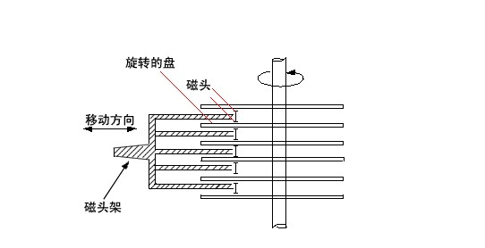

图一

图二

知道了大体的硬盘构造之后，再来谈一谈怎么硬盘分割( partition )呢？我们在进行硬盘分割的时候，最小都是以磁柱为单位进行分割的，那么分割完成之后自然就是格式化( format )啰，在 Linux 里面我们在进行格式化的时候必须要考虑到 Block 与 inode 的信息，这个 block 还好理解，他是我们磁盘可以记录的最小单位，是由数个 sector 所组成的，所以他的大小通常为 n*512 bytes ，例如 4K 。那么 inode 是什么？ Block 是记录“档案内容数据”的地区，而 inode 则是记录“该档案的属性、及该档案放置在哪一个 Block 之内”的信息！所以，每个档案都会占用到至少一个 inode 。而当我们 Linux 系统要找到这个档案时，他会先去搜寻 inode table 找到这个档案的属性及数据放置的地区，然后再到数据去找到数据存放的 Block 进而将数据取出利用。这个 inode 数目在一开始就会被设定好，他的设定方式通常是利用 ( 硬盘大小 / 一个容量 )，这个容量至少应该比 Block 要大一些较佳，例如刚刚的 Block 订为 4K ，那么 inode 可以订为 8K 左右。所以，一颗 1GB 的硬盘，如果以 8K 来规划他的 inode 数时，他的 inode 就会有 131072 个 inode 啦！而一个 inode 的大小为 128 bytes 这么大！这么一来的话，我们就可以清楚的知道了，那就是一个 partition 格式化为一个 filesystem 之后，基本上，他一定会有 inode table 与 data area 两个区块，一个用来记录档案的信息与该档案放置的 block 区块，一个用来记录档案的内容！

由于我们 Linux 在读取数据的时候，是先查询 inode table 以得到数据是放在那个 Block 里面，然后再去该 Block 里面读取真正的数据内容！然后，那个 block 是我们在格式化硬盘的时候规定出来的一个值，这个 block 是由 2 的 n 次方个sector 所集结而成的！所以，他是 0.5K 的倍数！假设我们 block 规划为 4KBytes 好了，那么由于一个 inode 与一个block 最多均只纪录一个档案，所以，如果你的一个档案有 0.1 K bytes 这么大时，你要晓得的是，由于你的 block 为 4K bytes ，因此，你就会有 3.9 Kbytes 的空间浪费掉！所以，当你在格式化硬盘的时候，请千万注意到你的系统未来的使用方向。

## ln 建立连接档

前面提到过两次连接档的概念，现在终于该好好介绍下这部分内容了。连接档分为两种，硬连接（hard link）和软连接（symbolic link）。

**Hard Links****：**上面内容中说过，当系统要读取一个文件时，就会先去读inode table，然后再去根据inode中的信息到块区域去将数据取出来。而hard link 是直接再建立一个inode连接到文件放置的块区域。也就是说，进行hard link的时候实际上该文件内容没有任何变化，只是增加了一个指到这个文件的inode，不过这样一来就会有个问题，因为增加的inode会连接到块区域，而目录本身仅仅消耗inode而已，那么hard link就不能连接目录了。请你记住，hard link 有两个限制：1 不能跨文件系统，因为不通的文件系统有不同的inode table； 2 不能连接目录。

**Symbolic Links****：**跟hard link不同，这个是建立一个独立的文件，而这个文件的作用是当读取这个连接文件时，它会把读取的行为转发到该文件所link的文件上。这样讲，也许比较绕口，那么就来举一个例子。现在有文件a，我们做了一个软连接文件b（只是一个连接文件，非常小），b指向了文件a。当读取b时，那么b就会把读取的动作转发到a上，这样就读取到了文件a。所以，当你删除文件a时，文件b并不会被删除，但是再读取b时，会提示无法打开文件。而，当你删除b时，a是不会有任何影响的。

看样子，似乎 hard link 比较安全，因为即使某一个 inode 被杀掉了，只要有任何一个 inode 存在，那么该文件就不会不见！不过，不幸的是，由于 Hard Link 的限制太多了，包括无法做目录的 link ，所以在用途上面是比较受限的！反而是 Symbolic Link 的使用方向较广！那么如何建立软连接和硬连接呢？这就用到了ln 命令。

ln 语法： ln [-s] [来源文件] [目的文件]

ln 常用的选项就一个-s ，如果不加就是建立硬连接，加上就建立软连接。

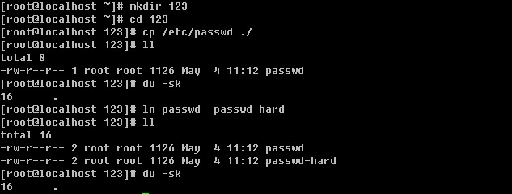

在建立硬连接前后，123目录所占空间大小并没有改变。

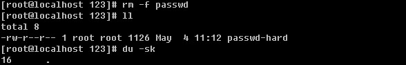

当把源文件删除后，空间仍旧没有变化。说明了删除一个文件其实只是删除了inode信息。

不能创建目录的硬连接。

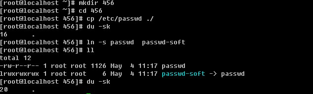

建立软连接后，456目录增加了4k

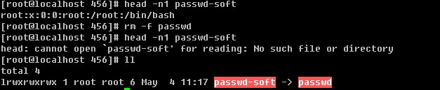

删除源文件后会提示“没有这个文件”的错误。

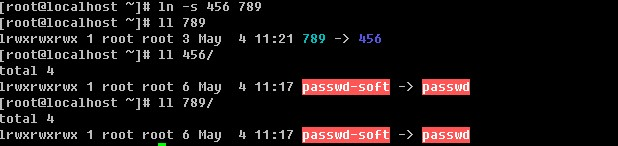

目录是可以软连接的。

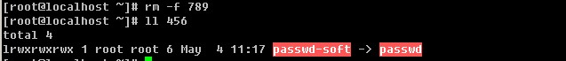

删除软连接对源文件没有任何影响。

