# linux 系统用户以及用户组管理 

关于这部分内容，笔者在日常的linux系统管理工作中用到的并不多，但这并不代表该内容不重要。毕竟linux系统是一个多用户的系统，每个账号都干什么用，你必须了如指掌。因为这涉及到一个安全的问题。

**【****认识****/etc/passwd****和****/etc/shadow】**

这两个文件可以说是linux系统中最重要的文件之一。如果没有这两个文件或者这两个文件出问题，则你是无法正常登录linux系统的。

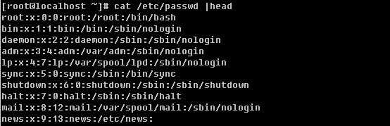

/etc/passwd由’:’分割成7个字段，每个字段的具体含义是：

1）用户名（如第一行中的root就是用户名），代表用户账号的字符串。用户名字符可以是大小写字母、数字、减号（不能出现在首位）、点以及下划线，其他字符不合法。虽然用户名中可以出现点，但不建议使用，尤其是首位为点时，另外减号也不建议使用，因为容易造成混淆。

2）存放的就是该账号的口令，为什么是’x’呢？早期的unix系统口令确实是存放在这里，但基于安全因素，后来就将其存放到/etc/shadow中了，在这里只用一个’x’代替。

3）这个数字代表用户标识号，也叫做uid。系统识别用户身份就是通过这个数字来的，0就是root，也就是说你可以修改test用户的uid为0，那么系统会认为root和test为同一个账户。通常uid的取值范围是0~65535，0是超级用户（root）的标识号，1~499由系统保留，作为管理账号，普通用户的标识号从500开始，如果我们自定义建立一个普通用户，你会看到该账户的标识号是大于或等于500的。

4）表示组标识号，也叫做gid。这个字段对应着/etc/group 中的一条记录，其实/etc/group和/etc/passwd基本上类似。

5）注释说明，该字段没有实际意义，通常记录该用户的一些属性，例如姓名、电话、地址等等。不过，当你使用finger的功能时就会显示这些信息的（稍后做介绍）。

6）用户的家目录，当用户登录时就处在这个目录下。root的家目录是/root，普通用户的家目录则为/home/username，这个字段是可以自定义的，比如你建立一个普通用户test1，要想让test1的家目录在/data目录下，只要修改/etc/passwd文件中test1那行中的该字段为/data即可。

7）shell，用户登录后要启动一个进程，用来将用户下达的指令传给内核，这就是shell。Linux的shell有很多种sh, csh, ksh, tcsh, bash等，而Redhat/CentOS的shell就是bash。查看/etc/passwd文件，该字段中除了/bin/bash外还有/sbin/nologin比较多，它表示不允许该账号登录。如果你想建立一个账号不让他登录，那么就可以把该字段改成/sbin/nologin，默认是/bin/bash。

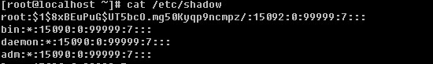

再来看看/etc/shadow这个文件，和/etc/passwd类似，用”:”分割成9个字段。

1）用户名，跟/etc/passwd对应。

2）用户密码，这个才是该账号的真正的密码，不过这个密码已经加密过了，但是有些黑客还是能够解密的。所以为了安全，该文件属性设置为600，只允许root读写。

3）上次更改密码的日期，这个数字是这样计算得来的，距离1970年1月1日到上次更改密码的日期，例如上次更改密码的日期为2012年1月1日，则这个值就是365*（2012-1970）+1=15331。

4）要过多少天才可以更改密码，默认是0，即不限制。

5）密码多少天后到期。即在多少天内必须更改密码，例如这里设置成30，则30天内必须更改一次密码，否则将不能登录系统，默认是99999，可以理解为永远不需要改。

6）密码到期前的警告期限，若这个值设置成7，则表示当7天后密码过期时，系统就发出警告告诉用户，提醒用户他的密码将在7天后到期。

7）账号失效期限。你可以这样理解，如果设置这个值为3，则表示：密码已经到期，然而用户并没有在到期前修改密码，那么再过3天，则这个账号就失效了，即锁定了。

8）账号的生命周期，跟第三段一样，是按距离1970年1月1日多少天算的。它表示的含义是，账号在这个日期前可以使用，到期后账号作废。

9）作为保留用的，没有什么意义。

**【****新增****/****删除用户和用户组****】**

a. 新增一个组 groupadd [-g GID] groupname

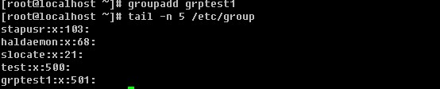

不加-g 则按照系统默认的gid创建组，跟用户一样，gid也是从500开始的

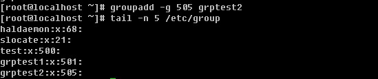

-g选项可以自定义gid

b. 删除组 gropudel groupname

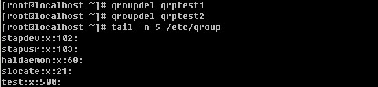

没有特殊选项。

c. 增加用户 useradd [-u UID] [-g GID] [-d HOME] [-M] [-s]

-u 自定义UID

-g 使其属于已经存在的某个GID

-d 自定义用户的家目录

-M 不建立家目录

-s 自定义shell

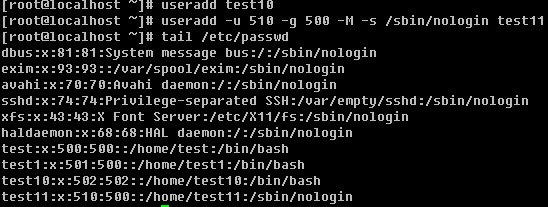

你会发现，创建test11时，加上了-M选项后，在/etc/passwd文件中test11那行的第六字段依然有/home/test11，可是ls查看该目录时，会提示该目录不存在。

-M选项的作用就是不创建用户的家目录。

-d. 删除用户 userdel [-r] username

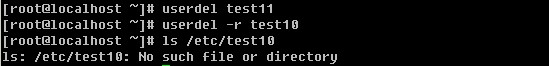

-r 选项的作用是删除用户时，连同用户的家目录一起删除。

**【chfn** **更改用户的****finger** **（不常用）****】**

前面内容中提到了findger，即在/etc/passwd文件中的第5个字段中所显示的信息，那么如何去设定这个信息呢？

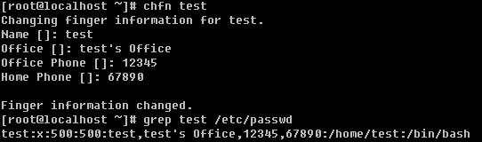

就是chfn这个命令了。修改完后，就会在/etc/passwd文件中的test的那一行第五个字段中看到相关信息了，默认是空的。

**【****创建****/****修改一个用户的密码** **“passwd [username]”】**

等创建完账户后，默认是没有设置密码的，虽然没有密码，但该账户同样登录不了系统。只有设置好密码后方可登录系统。

为用户创建密码时，为了安全起见，请尽量设置复杂一些。你可以按照这样的规则来设置密码：a. 长度大于10个字符；b. 密码中包含大小写字母数字以及特殊字符（*&等）；c. 不规则性（不要出现root, happy, love, linux, 123456, 111111等等单词或者数字）；d. 不要带有自己名字、公司名字、自己电话、自己生日等。

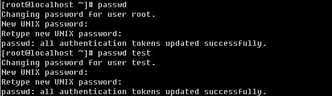

passwd 后面不跟用户名则是更改当前用户的密码，当前用户为root，所以此时修改的是root的密码，后面跟test则修改的是test的密码。

**【****用户身份切换****】**

Linux系统中，有时候普通用户有些事情是不能做的，除非是root用户才能做到。这时就需要临时切换到root身份来做事了。

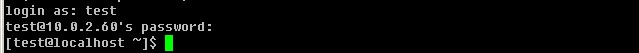

用test账号登录linux系统，然后使用su - 就可以切换成root身份，前提是知道root的密码。

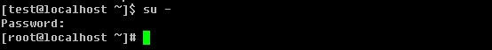

你可以使用echo $LOGNAME来查看当前登录的用户名

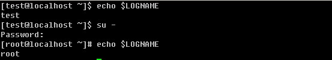

su 的语法为： su [-] username

后面可以跟”-”也可以不跟，普通用户su不加username时就是切换到root用户，当然root用户同样可以su到普通用户。

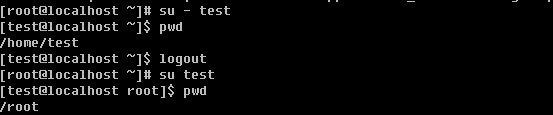

加”-“后会连同用户的环境变量一起切换过来。su test 后虽然切换到了test用户，但是当前目录还是切换前的/root目录，然后当用su - test时切换用户后则到了test的家目录/home/test。当用root切换普通用户时，是不需要输入密码的。这也体现了root用户至高无上的权利。

用su是可以切换用户身份，如果每个普通用户都能切换到root身份，如果某个用户不小心泄漏了root的密码，那岂不是系统非常的不安全？没有错，为了改进这个问题，产生了sudo这个命令。使用sudo执行一个root才能执行的命令是可以办到的，但是需要输入密码，这个密码并不是root的密码而是用户自己的密码。默认只有root用户能使用sudo命令，普通用户想要使用sudo，是需要root预先设定的，即，使用visudo命令去编辑相关的配置文件/etc/sudoers。如果没有visudo这个命令，请使用” yum install -y sudo”安装。

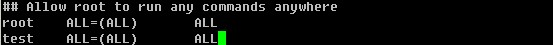

默认root能够sudo是因为这个文件中有一行” root ALL=(ALL) ALL” 在该行下面加入” test ALL=(ALL) ALL”就可以让test用户拥有了sudo的权利。如果每增加一用户就设置一行，这样太麻烦了。所以你可以这样设置。

把这一行前面的”#”去掉，让这一行生效。它的意思是，wheel这个组的所有用户都拥有了sudo的权利。接下来就需要你把想让有sudo权利的所有用户加入到wheel这个组中即可。

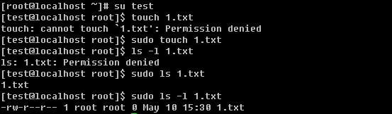

