# linux 系统日常管理 

笔者在前面介绍的内容都为linux系统基础类的，如果你现在把前面的内容全部很好的掌握了，那最好了。不过笔者要说的是，即使你完全掌握了，你现在还是不能作为一名合格的linux系统管理员的，毕竟系统管理员要会做的事情太多了。本章以及后面章节笔者会陆续教给你作为linux系统管理员所必备的知识。只要你熟练掌握那绝对可以胜任一个最初级的管理员职位，不过只是初级的，因为你还需要在日常的管理工作中获得成长。

**【****监控系统的状态****】**

**1\. w** **查看当前系统的负载**

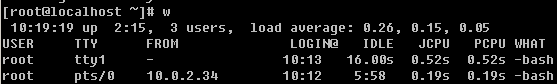

相信所有的linux管理员最常用的命令就是这个’w’ 了，该命令显示的信息还是蛮丰富的。第一行从左面开始显示的信息依次为：时间，系统运行时间，登录用户数，平均负载。第二行开始以及下面所有的行，告诉我们的信息是，当前登录的都有哪些用户，以及他们是从哪里登录的等等。其实，在这些信息当中，笔者认为我们最应该关注的应该是第一行中的’load average:’后面的三个数值。

第一个数值表示1分钟内系统的平均负载值；第二个数值表示5分钟内系统的平均负载值；第三个数值表示15分钟系统的平均负载值。这个值的意义是，单位时间段内CPU活动进程数。当然这个值越大就说明你的服务器压力越大。一般情况下这个值只要不超过你服务器的cpu数量就没有关系，如果你的服务器cpu数量为8，那么这个值若小于8，就说明你的服务器没有压力，否则就要关注一下了。到这里你肯定会问，如何查看服务器有几个cpu？

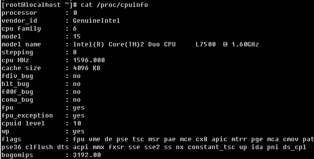

就是用这个命令了。’/proc/cpuinfo’这个文件记录了cpu的详细信息。目前市面上的服务器通常都是2颗4核cpu，在linux看来，它就是8个cpu。查看这个文件时则会显示8段类似的信息，而最后一段信息中processor : 后面跟的是’7’。所以查看当前系统有几个cpu，你可以使用这个命令：’ grep -c 'processor' /proc/cpuinfo’ 。

**2\. vmstat** **监控系统的状态**

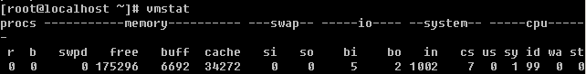

上面讲的w查看的是系统整体上的负载，通过看那个数值可以知道当前系统有没有压力，但是具体是哪里（CPU, 内存，磁盘等）有压力就无法判断了。通过vmstat就可以知道具体是哪里有压力。vmstat命令打印的结果共分为6部分：procs, memory, swap, io, system, cpu.请重点关注一下红色标出的项。

1）procs 显示进程相关信息

r：表示运行和等待cpu时间片的进程数，如果长期大于服务器cpu的个数，则说明cpu不够用了；

b：表示等待资源的进程数，比如等待I/O, 内存等，这列的值如果长时间大于1，则需要你关注一下了；

2）memory 内存相关信息

swpd ：表示切换到交换分区中的内存数量；

free ：当前空闲的内存数量；

buff ：缓冲大小，（即将写入磁盘的）；

cache ：缓存大小，（从磁盘中读取的）；

3）swap 内存交换情况

si ：由内存进入交换区的数量；

so：由交换区进入内存的数量；

4）io 磁盘使用情况

bi ：从块设备读取数据的量（读磁盘）；

bo：从块设备写入数据的量（写磁盘）；

5）system 显示采集间隔内发生的中断次数

in ：表示在某一时间间隔中观测到的每秒设备中断数；

cs ：表示每秒产生的上下文切换次数；

6）CPU 显示cpu的使用状态

us ：显示了用户下所花费 cpu 时间的百分比；

sy ：显示系统花费cpu时间百分比；

id ：表示cpu处于空闲状态的时间百分比；

wa：表示I/O等待所占用cpu时间百分比；

st ：表示被偷走的cpu所占百分比（一般都为0，不用关注）；

以上所介绍的各个参数中，笔者经常会关注r列，b列，和wa列，三列代表的含义在上边说得已经很清楚。IO部分的bi以及bo也是我要经常参考的对象。如果磁盘io压力很大时，这两列的数值会比较高。另外当si, so两列的数值比较高，并且在不断变化时，说明内存不够了，内存中的数据频繁交换到交换分区中，这往往对系统性能影响极大。

笔者用vmstat时，经常用这样的形式，’vmstat 1 5’ 表示每隔1秒钟打印一次系统状态，连续打印5次。当然你也可以 ‘vmstat 1 ‘ 表示每隔1秒钟打印一次系统状态，一直打印，除非你按ctrl + c强制结束。

**3\. top** **显示进程所占系统资源**

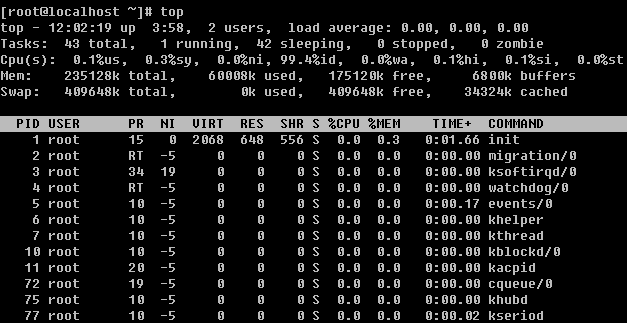

这个命令用于动态监控进程所占系统资源，每隔3秒变一次。这个命令的特点是把占用系统资源（CPU，内存，磁盘IO等）最高的进程放到最前面。top命令打印出了很多信息，包括系统负载（load average）、进程数（Tasks）、cpu使用情况、内存使用情况以及交换分区使用情况。其实上面这些内容可以通过其他命令来查看，所以用top重点查看的还是下面的进程使用系统资源详细状况。这部分东西反映的东西还是比较多的，不过需要你关注的也就是几项：%CPU, %MEM, COMMAND 这些项目所代表的意义，不用笔者介绍相信你也能看懂吧。

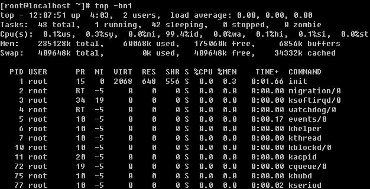

另外笔者使用top命令时还常常使用-bn1 这个组合选项，它表示非动态打印系统资源使用情况，可以用在脚本中，你不妨记一下，以后也许你会用得到。

**4\. sar** **监控系统状态**

sar 命令很强大，它可以监控系统所有资源状态，比如平均负载、网卡流量、磁盘状态、内存使用等等。它不同于其他系统状态监控工具的地方在于，它可以打印历史信息，可以显示当天从零点开始到当前时刻的系统状态信息。如果你系统没有安装这个命令，请使用”yum install -y sysstat”命令安装。初次使用sar命令会报错，那是因为sar工具还没有生成相应的数据库文件（时时监控就不会了，因为不用去查询那个库文件）。它的数据库文件在” /var/log/sa/”目录下，默认保存9天。因为这个命令太过复杂，所以笔者只介绍几个。

**1****）查看网卡流量** **‘sar -n DEV ‘**

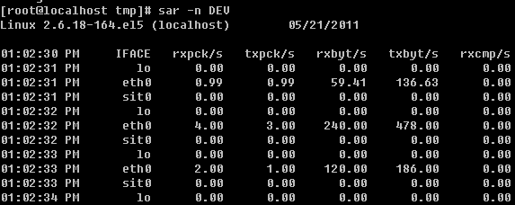

IFACE这列表示设备名称，rxpck/s 表示每秒进入收取的包的数量，txpck/s 表示每秒发送出去的包的数量，rxbyt/s 表示每秒收取的数据量（单位Byte），txbyt/s表示每秒发送的数据量。后面几列不需要关注。如果有一天你所管理的服务器丢包非常严重，那么你就应该看一看这个网卡流量是否异常了，如果rxpck/s 那一列的数值大于4000，或者rxbyt/s那列大于5,000,000则很有可能是被攻击了，正常的服务器网卡流量不会高于这么多，除非是你自己在拷贝数据。上面的命令是查看网卡流量历史的，如何时时查看网卡流量呢？

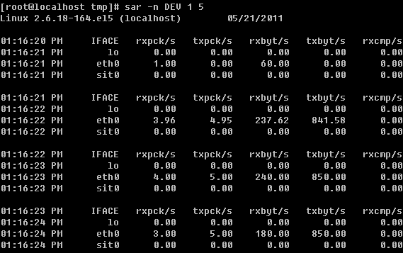

另外也可以查看某一天的网卡流量历史，使用-f选项，后面跟文件名，如果你的系统格式Redhat或者CentOS那么sar的库文件一定是在/var/log/sa/目录下的。

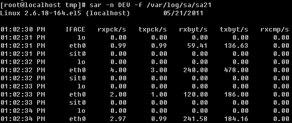

**2****）查看历史负载** **‘sar -q’**

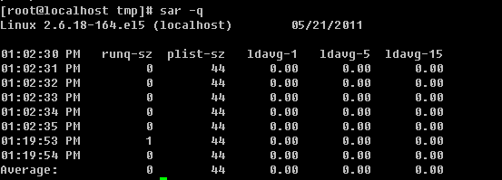

这个命令有助于我们查看服务器在过去的某个时间的负载状况。

关于sar的介绍笔者不愿写太多，毕竟介绍太多会给你带来更多的压力，其实笔者介绍这个命令的目的只是让你学会查看网卡流量（这是非常有用的）。如果你很感兴趣那就man一下吧，它的用法太多了。

**5\. free****查看内存使用状况**

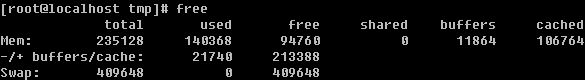

只要你敲一个free然后回车就可以当前系统的总内存大小以及使用内存的情况。从上图中可看到当前系统内存总大小为235128（单位是k）已经使用120368，剩余94760。其实真正剩余并不是这个94760，而是第二行的213388，真正使用的也是第二行的21740。这是因为系统初始化时，就已经分配出很大一部分内存给缓存，这部分缓存用来随时提供给程序使用，如果程序不用，那这部分内存就空闲。所以，查看内存使用多少，剩余多少请看第二行的数据。另外你还可以加-m 或者-g选项分别以M或G为单位打印内存使用状况。

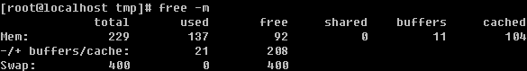

**6\. ps** **查看系统进程**

作为系统管理员，一定要知道你所管理的系统都有那些进程在运行，在windows下只要打开任务管理器即可查看。在linux下呢？其实在上面介绍的top命令就可以，但是不够专业，当然还有专门显示系统进程的命令。

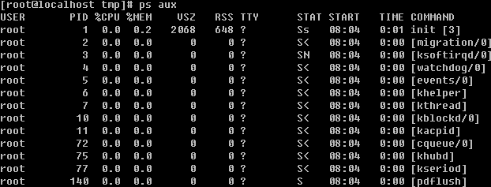

对了，就是这个’ps aux’。笔者也经常看到有的人喜欢用’ps -elf’ 大同小异，显示的信息基本上是一样的。 ps命令还有更多的用法，笔者不再做介绍，因为你只要会用这个命令就足够了，请man一下。下面介绍上图上出现的几个参数的意义。

**PID**：进程的id，这个id很有用，在linux中内核管理进程就得靠pid来识别和管理某一个程，比如我想终止某一个进程，则用 ‘kill 进程的pid’，有时并不能杀掉，则需要加一个-9选项了’kill -9 进程pid’

**STAT** ：表示进程的状态，进程状态分为以下几种（不要求记住，但要了解）

D  不能中断的进程（通常为IO）

R  正在运行中的进程

S  已经中断的进程，通常情况下，系统中大部分进程都是这个状态

T  已经停止或者暂停的进程，如果我们正在运行一个命令，比如说sleep 10，如果我们按一下ctrl -z 让他暂停，那么我们用ps查看就会显示T这个状态

W 这个好像是说，从内核2.6xx 以后，表示为没有足够的内存页分配

X  已经死掉的进程（这个好像从来不会出现）

Z  僵尸进程，杀不掉，打不死的垃圾进程，占系统一小点资源，不过没有关系。如果太多，就有问题了。一般不会出现。

<  高优先级进程

N  低优先级进程

L   在内存中被锁了内存分页

s   主进程

l   多线程进程

+  代表在前台运行的进程

这个ps命令是笔者在工作中用的非常多的命令之一，所以请记住它吧。关于ps命令的使用，笔者经常会连同管道符一起使用，用来查看某个进程或者它的数量。

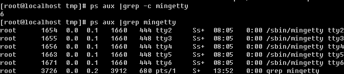

上面的6不对，需要减掉1，因为使用grep命令时，grep命令本身也算作了一个。

**7\. netstat** **查看网络状况**

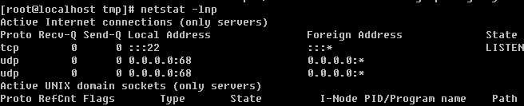

netstat命令用来打印网络连接状况、系统所开放端口、路由表等信息。笔者最常用的关于netstat的命令就是这个netstat -lnp（打印当前系统启动哪些端口）以及netstat -an （打印网络连接状况）这两个命令非常有用，请一定要记住。

如果你所管理的服务器是一台提供web服务（80端口）的服务器，那么你就可以使用netstat -an |grep 80开查看当前连接web服务的有哪些IP了。

**8\.** **抓包工具****tcpdump**

有时候，也许你会有这样的需求，想看一下某个网卡上都有哪些数据包，尤其是当你初步判定你的服务器上有流量攻击。这时，使用抓包工具来抓一下数据包，就可以知道有哪些IP在攻击你了。

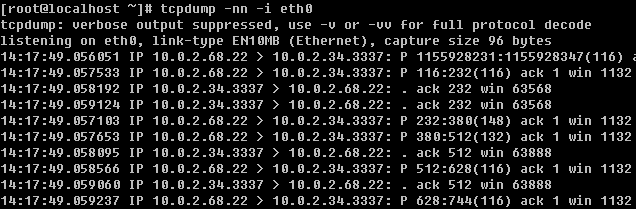

如果你没有tcpdump 这个命令，需要用’yum install -y tcpdump ’命令去安装一下。上图中第三列和第四列显示的信息为哪一个IP+port在连接哪一个IP+port，后面的信息是该数据包的相关信息，如果不懂也没有关系，毕竟你不是专门搞网络的，而这里需要你关注的只是第三列以及第四列。-i 选项后面跟设备名称，如果你想抓eth1网卡的包，后面则要跟eth1.至于-nn选项的作用是让第三列和第四列显示成IP+端口号的形式，如果不加-nn则显示的是主机名+服务名称。

**【linux****网络相关****】**

**1\. ifconfig** **查看网卡****IP**

ifconfig类似与windows的ipconfig，不加任何选项和参数只打印当前网卡的IP相关信息（子网掩码、网关等）

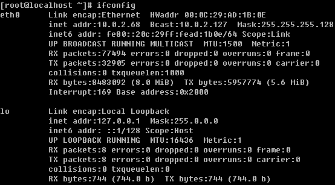

当然ifconfig后面可以跟设备名，只打印指定设备的IP信息。

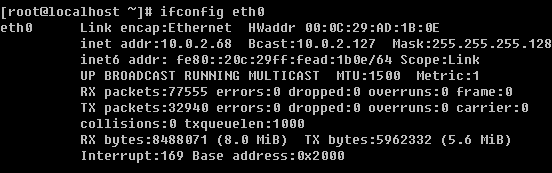

在windows下设置IP非常简单，然而在命令窗口下如何设置？这就需要去修改配置文件/etc/sysconfig/network-scripts/ifcfg-eth0了，如果是eth1那么配置文件是/etc/sysconfig/network-scripts/ifcfg-eth1.

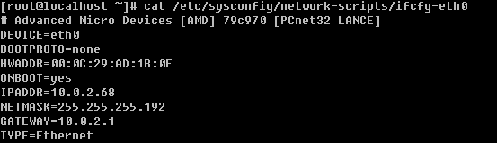

如果想修改IP的话，则只需要修改IPADDR , NETMASK以及GATEWAY即可。如果你的linux是通过dhcp服务器自动获得的IP，那么配置文件肯定和上图中的不一样，BOOTPROTO那里会是’dhcp’，如果你要配置成静态IP的话，这里就需要写成’none’。关于如何设置IP以及子网掩码的这些知识属于网络相关的基础知识了，如果你对这方面比较陌生的话，建议你去看看网络相关的资料。当修改完IP后需要重启网络服务新IP才能生效，重启命令为’ service network restart’

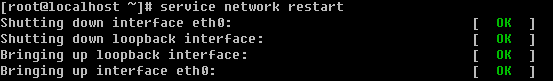

另外如果你有多个网卡的情况时，只想重启某一个网卡的话，还可以使用这个命令。

ifdown 即停掉网卡，ifup即启动网卡。有一点要提醒你的是，如果你远程登录你的服务器，当你使用ifdown eth0这个命令的时候，很有可能后面的命令ifup eth0不会被运行，这样导致你断网而无法连接服务器，所以请尽量使用service network restart 这个命令来重启网卡。

**2\.** **给一个网卡设定多个****IP**

在linux系统中，网卡是可以设定多重IP的，笔者曾经管理的一台服务器的eth1就设定了5个IP，实在是够变态的。

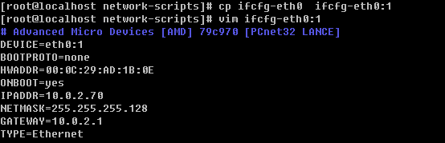

把ifcfg-eth0复制成ifcfg-eth0:1 然后编辑ifcfg-eth0:1修改DEVICE以及IPADDR保存后重启网卡。

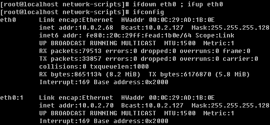

再次查看eth0上就有两个IP了。这里你要注意一下，文件名（ifcft-eth0:1）写成什么都无所谓，但是文件内的DEVICE=eth0:1一定要按照这样的格式写，否则你启动不起来网卡。

**3\.** **查看网卡连接状态**

mii-tool这个命令用来查看网卡是否连接，如图显示link ok等字样说明连接正常，否则会显示’no link’字样，下图是笔者所管理的一台服务器，eth1网卡没有连接。

如果你的机器是虚拟机，那么你使用该命令时应该显示成如下：

这是因为使用的是虚拟网卡，不支持这个工具查看。不用多关注此，你记住这个mii-tool命令即可，它可是会经常用到的。

**4\.** **更改主机名**

当装完系统后，默认主机名为localhost，使用hostname就可以知道你的linux的主机名是什么。

同样使用hostname可以更改你的主机名。

下次登录时就会把命令提示符中的’localhost’更改成’Aming’。不过这样修改只是保存在内存中，下次重启还会变成未改之前的主机名，所以需要你还要去更改相关的配置文件’/etc/sysconfig/network’。

把HOSTNAME=localhost.localdomain 修改成你想要的主机名，这样再重启就会读取这个配置文件中的HOSTNAME.

**5\.** **设置****DNS**

DNS是用来解析域名用的，平时我们访问网站都是直接输入一个网址，而dns把这个网址解析到一个IP。关于dns的概念，如果你很陌生的话，那就去网上查一下吧。在linux下面设置dns非常简单，只要把dns地址写到一个配置文件中即可。这个配置文件就是/etc/resolv.conf

resolv.conf有它固有的格式，一定要写成’nameserver IP’的格式，上面那行以’;’为开头的行是一行注释，没有实际意义，建议写两个或多个namserver ，默认会用第一个namserver去解析域名，当第一个解析不到时会使用第二个。在linux下面有一个特殊的文件/etc/hosts也能解析域名，不过是需要我们手动在里面添加IP+域名这些内容，它的作用是临时解析某个域名，非常有用。

它的格式如上图，每一行作为一条记录，分成两部分，第一部分是IP，第二部分是域名。关于hosts文件，有几点需要你注意：

1）一个IP后面可以跟多个域名，可以是几十个甚至上百个；

2）每行只能有一个IP，也就是说一个域名不能对应多个IP；

3）如果有多行中出现相同的域名（前面IP不一样），会按最前面出现的记录来解析。

【**linux****的防火墙**】

**1\. selinux**

Selinux是Redhat/CentOS系统特有的安全机制。不过因为这个东西限制太多，配置也特别繁琐所以几乎没有人去真正应用它。所以装完系统，我们一般都要把selinux关闭，以免引起不必要的麻烦。关闭selinux的方法为：

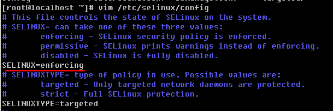

把’SELINUX=enforcing’改成’SELINUX=disabled’，然后重启机器。临时关闭selinux的命令为

getenforce命令可以得到selinux的状态，其中有两种（Enforcing|Permissive），前者表示开放，后者表示关闭，但是会发出警告。setenforce用来设置selinux的状态，后面跟0则设置成Permissive后面跟1设置成Enforcing。关闭selinux的命令为setenforce 0，但是这只是临时关闭，重启后恢复，想要永久生效，请更改配置文件/etc/selinux/config。

**2\. iptables**

Iptables是linux上特有的防火墙机制，其功能非常强大，然而笔者在日常的管理工作中仅仅用到了一两个应用，这并不代表iptables不重要。作为一个网络管理员，iptables是必要要熟练掌握的。但是作为系统管理员，我们也应该会最基本的iptables操作，认识iptables的基本规则。

**1****）****iptalbes****的三个表**

filter ：这个表主要用于过滤包的，是系统预设的表，这个表也是笔者用的最多的。内建三个链INPUT、OUTPUT以及FORWARD。INPUT作用于进入本机的包；OUTPUT作用于本机送出的包；FORWARD作用于那些跟本机无关的包。

nat ：主要用处是网络地址转换，也有三个链。PREROUTING 链的作用是在包刚刚到达防火墙时改变它的目的地址，如果需要的话。OUTPUT链改变本地产生的包的目的地址。POSTROUTING链在包就要离开防火墙之前改变其源地址。该表笔者用的不多，但有时候会用到。

mangle ：这个表主要是用于给数据包打标记，然后根据标记去操作哪些包。这个表几乎不怎么用。除非你想成为一个高级网络工程师，否则你就没有必要花费很多心思在它上面。

**2****）****iptables** **基本语法**

**A.** **查看规则以及清除规则**

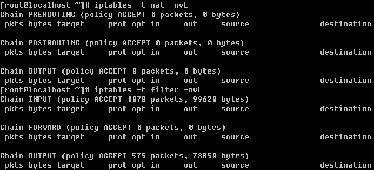

如上图，-t 后面跟表名，-nvL 即查看该表的规则，其中-n表示不针对IP反解析主机名；-L表示列出的意思；而-v表示列出的信息更加详细。如果不加-t ，则打印filter表的相关信息。

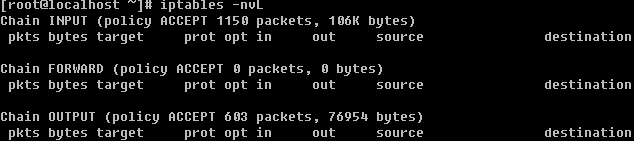

这个和-t filter 打印的信息是一样的。

关于清除规则的命令中，笔者用的最多就是

不加-t默认是针对表filter来操作的，-F 表示把所有规则全部删除；-Z表示把包以及流量计数器置零（这个笔者认为很有用）。

**B.** **增加****/****删除一条规则**

这就是增加了一条规则，省略-t所以针对的是filter表。-A 表示增加一条规则，另外还有-I 表示插入一条规则，-D删除一条规则；后面的INPUT即链名称，还可以是OUTPUT或者FORWORD；-s 后跟源地址；-p 协议（tcp, udp, icmp）； --sport/--dport 后跟源端口/目标端口；-d 后跟目的IP（主要针对内网或者外网）；-j 后跟动作（DROP即把包丢掉，REJECT即包拒绝；ACCEPT即允许包）。这样讲可能很乱，那笔者多举几个例子来帮你理解：

上例表示：插入一条规则，把来自10.0.2.36的所有数据包丢掉。

删除刚刚插入的规则。注意要删除一条规则时，必须和插入的规则一致，也就是说，两条iptables命令，除了-I 和-D不一样外，其他地方都一样。

上例表示把来自10.0.2.36 并且是tcp协议到本机的80端口的数据包丢掉。这里要说的是，--dport/--sport 必须要和-p选项一起使用，否则会出错。

把发送到10.0.2.34的22端口的数据包丢掉。下面做一个小试验：

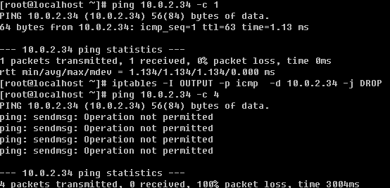

一开始用本机ping 10.0.2.34是通的，然后使用iptables增加一条规则，使到10.0.2.34的icmp包丢掉，再ping 10.0.2.34则不通了。此时用’iptables –nvL’查看iptalbes规则。

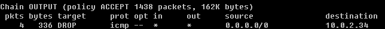会有一条这样的记录，看pkts那列显示4个数据包，因为我们ping 的时候给10.0.2.34发送了4个数据包，第二列表示这4个数据包一共有多大（336bytes）。此时使用’iptables -Z' 清零。

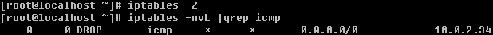

现在你明白’iptables -Z’的意义了吧。至于FORWORD链的应用笔者几乎没有用到过，所以不再举例。再总结一下各个选项的作用：

-A/-D ：增加删除一条规则；

-I ：插入一条规则，其实跟-A的效果一样；

-p ：指定协议，可以是tcp，udp或者icmp；

--dport ：跟-p一起使用，指定目标端口；

--sport ：跟-p一起使用，指定源端口；

-s ：指定源IP（可以是一个ip段）；

-d ：指定目的IP（可以是一个ip段）；

-j ：后跟动作，其中ACCEPT表示允许包，DROP表示丢掉包，REJECT表示拒绝包；

-i ：指定网卡（不常用，但有时候能用到）；

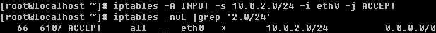

上例中表示，把来自10.0.2.0/24这个网段的并且作用在eth0上的包放行。有时候你的服务器上iptables过多了，想删除某一条规则时，又不容易掌握当时创建时的规则。其实有一种比较简单的方法：

查看结果如下：

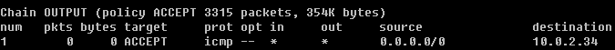

删除某一个规则的方法是：

-D 后跟链名，然后是规则num，这个num就是查看iptables规则时第一列的值。

iptables还有一个选项经常用到，-P（大写）选项，表示预设策略。用法如下：

-P后面跟链名，策略内容或者为DROP或者为ACCEPT，默认是ACCEPT。注意：如果你在连接远程服务器，千万不要随便敲这个命令，因为一旦你敲完回车你就会断掉。

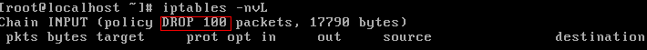

看到上图中红框标出的部分了吧，现在所有进来的数据包全部DROP了。这个策略一旦设定后，只能使用iptables -P ACCEPT才能恢复成原始状态，而不能使用-F参数。下面笔者针对一个小需求讲述一下这个iptables规则如何设定。

需求：只针对filter表，预设策略INPUT链DROP，其他两个链ACCEPT，然后针对10.0.2.0/24开通22端口，对所有网段开放80端口，对所有网段开放21端口。

这个需求不算复杂，但是因为有多条规则，所以最好写成脚本的形式。

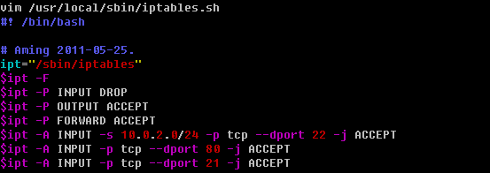

完成脚本的编写后，直接运行 ‘sh /usr/local/sbin/iptables.sh ’ 即可。如果想开机启动时初始化防火墙规则，则需要在/etc/rc.d/rc.local 中添加一行 ‘sh /usr/local/sbin/iptables.sh’ 。

关于icmp的包有一个比较常见的应用。

--icmp-type 这个选项是要跟-p icmp 一起使用的，后面指定类型编号。这个8指的是能在本机ping通其他机器，而其他机器不能ping通本机。这个有必要记一下。

**C. nat****表的应用**

其实，linux的iptables功能是十分强大的，笔者曾经的一个老师这样形容linux的网络功能：只有想不到没有做不到！也就是说只要你能够想到的关于网络的应用，linux都能帮你实现。在日常生活中相信你接触过路由器吧，它的功能就是分享上网。本来一根网线过来（其实只有一个公网IP），通过路由器后，路由器分配了一个网段（私网IP），这样连接路由器的多台pc都能连接intnet而远端的设备认为你的IP就是那个连接路由器的公网IP。这个路由器的功能其实就是由linux的iptables实现的，而iptables又是通过nat表作用而实现的这个功能。

至于具体的原理以及过程，笔者不想阐述，请查看相关资料。笔者在这里只举一个例子来说明iptables如何实现的这个功能。假设你的机器上有两块网卡eth0和eth1，其中eth0的IP为10.0.2.68 ，eth1的IP为192.168.1.1 。eth0连接了intnet 但eth1没有连接，现在有另一台机器（192.168.1.2）和eth1是互通的，那么如何设置也能够让连接eth1的这台机器能够连接intnet（即能和10.0.2.68互通）?

其实就是这样简单的两个命令就能实现上面的需求。第一个命令涉及到了内核参数相关的配置文件，它的目的是为了打开路由转发功能，否则无法实现我们的应用。第二个命令则是iptables对nat表做了一个IP转发的操作，-o 选项后跟设备名，表示出口的网卡，MASQUERADE表示伪装的意思。

关于nat表，笔者不想讲太多内容，你只要学会这个路由转发即可。其他的东西交给网络工程师去学习吧，毕竟你将来可是要做linux系统工程师的。

**D.** **保存以及备份****iptalbes****规则**

也许你不知道，咱们设定的防火墙规则只是保存在内存中，并没有保存到某一个文件中，也就说当系统重启后以前设定的规则就没有了，所以设定好规则后要先保存一下。

它会提示你把规则保存在了/etc/sysconfig/iptables文件内。其实，这个文件就是iptables的配置文件了，你不妨查看一下它。

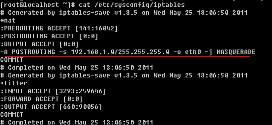

红线部分就是咱们刚才设定那条规则！有时可能因为我们设置防火墙规则有误导致服务器出问题，这时候不妨先备份一下这个配置文件，然后停止防火墙服务。

这样防火墙就失效了，但是一旦你重新设定规则后（哪怕只有一条），防火墙又开始工作了。

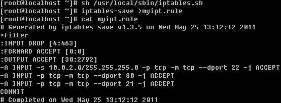

我还可以使用iptables-save >filename 这条命令来保存一个防火墙规则，这样就可以起到备份的作用了。要想恢复这个规则使用下面这个命令即可。

【**linux****系统的任务计划**】

这部分内容太重要了，其实大部分系统管理工作都是通过定期自动执行某一个脚本来完成的，那么如何定期执行某一个脚本呢？这就要借助linux的cron功能了。

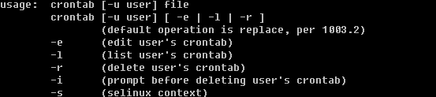

关于cron任务计划功能的操作都是通过crontab这个命令来完成的。其中常用的选项有：

-u ：指定某个用户，不加-u选项则为当前用户；

-e ：制定计划任务；

-l ：列出计划任务；

-r ：删除计划任务。

使用crontab -e 来制定计划任务，上面的例子表示在05月26日（这天必须是周四）的10点01分执行’ echo "ok" >/root/cron.log’这样的任务。

Cron的格式是这样的，每一行代表一个任务计划，总共分成两部分，前面部分为时间，后面部分要执行的命令。后面的命令不用多讲，至于前面的时间是有讲究的，这个时间共分为5段，用空格隔开（可以是多个空格），第一段表示分钟(0-59)，第二段表示小时(0-23)，第三段表示日(1-31)，第四段表示月(1-12)，第五段表示周(0-7,0或者7都可以表示为周日)。从左至右依次是：分，时，日，月，周（一定要牢记）！

crontab -e 实际上是打开了/var/spool/cron/username （如果是root则打开的是/var/spool/cron/root）这个文件。使用的是vim编辑器，所以要保存的话则在命令模式下输入:wq即可。但是，你千万不要直接去编辑那个文件，因为可能会出错，所以一定要使用crontab -e来编辑。查看已经设定的任务计划使用crontab -l

删除计划任务要用crontab -r

下面笔者给你出一些练习题，帮助你熟悉这个cron的应用。

1\. 每天凌晨1点20分清除/var/log/slow.log这个文件；

2\. 每周日3点执行’/bin/sh /usr/local/sbin/backup.sh’；

3\. 每月14号4点10分执行’/bin/sh /usr/local/sbin/backup_month.sh’；

4\. 每隔8小时执行’ntpdate time.windows.com’；

5\. 每天的1点，12点，18点执行’/bin/sh /usr/local/sbin/test.sh’；

6\. 每天的9点到18点执行’/bin/sh /usr/local/sbin/test2.sh’；

答案：

1\. 20 1 * * * echo “”>/var/log/slow.log

2\. 0 30 * * 0 /bin/sh /usr/local/sbin/backup.sh

3\. 10 04 14 * * /bin/sh /usr/local/sbin/backup_month.sh

4\. 0 */8 * * * ntpdate time.windows.com

5\. 0 1,12,18 * * /bin/sh /usr/local/sbin/test.sh

6\. 0 9-18 * * * /bin/sh /usr/local/sbin/test2.sh

Cron的这部分内容并不难，你只要会了这6道练习题，你就算掌握它了。这里要简单说一下，每隔8小时，就是用全部小时（0-23）去除以8，你仔细想一下结果，其实算出来应该是0,8,16三个数。当遇到多个数（分钟、小时、月、周）例如第5题，则需要用逗号隔开。而时间段是可以用’-‘的方式表示的。等设置好了所有的计划任务后需要查看一下crond服务是否启动，如果没有启动，需要启动它。

如何启动稍后会做介绍。除了用户自定义的计划任务外，其实系统本身也有计划任务的。

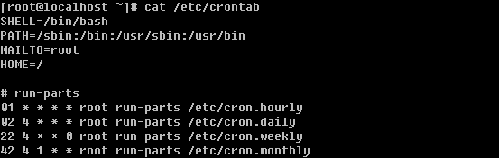

系统会安装这个配置文件中的计划去执行内定的任务。

【**linux****的系统服务管理**】

如果你对windows非常熟悉的话，相信你肯定配置过开机启动的服务，有些服务我们日常用不到则要把它停掉，一来可以节省资源，二来可以减少安全隐患。在linux上同样也有相关的工具来管理系统的服务。

**1\. ntsysv**

用来配置哪些服务开启或者关闭，有点想图形界面，不过是使用键盘来控制的。如果没有这个命令请使用 yum install -y ntsysv 安装它。

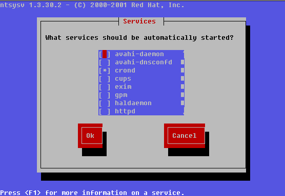

敲完这个命令后则显示出如上图中的画面。在屏幕的最上面有’Red Hat’等字样，这是在告诉我们这个工具是由Red Hat公司开发的。按键盘的上下方向键可以调节红色光标，按空格可以选择开启或者不开启，如果前面的中括号内显示有’*’ 则表示开启否则不开启。通过这个工具也可以看到目前系统中所有的服务。建议除’crond, iptables, network, sshd, syslog, irqbalance, sendmail, microcode_ctl’ 外其他服务全部停掉。选择好后，按’tab’键选择ok然后回车。需要重启机器才能生效。

**2\. chkconfig**

Linux系统所有的预设服务可以查看/etc/init.d/目录得到

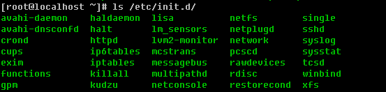

其实这就是系统所有的预设服务了。为什么这样讲，因为系统预设服务都是可以通过这样的命令实现 ‘service 服务名 start|stop|restart’ ，这里的服务名就是/etc/init.d/目录下的这些文件了。除了可以使用’service crond start ‘启动crond外，还可以使用/etc/init.d/crond start 来启动。

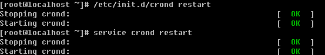

如上图，这两个命令出来的结果是一样的。

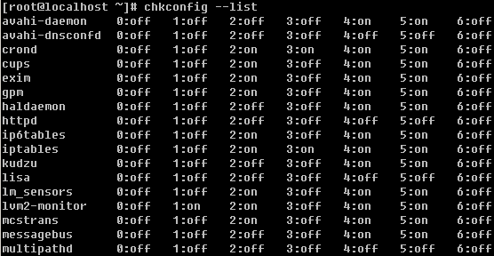

再看看这个chkconfig命令，它不仅可以列出来所有的服务，还可以详细到每个级别。这里的级别（0,1,2,3,4,5,6）就是inittab里面介绍的那几个启动级别了。

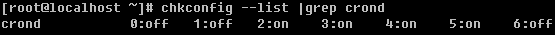

这样还可以查看某一个服务的启动情况。

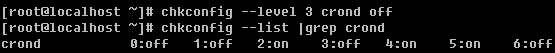

用--level 指定级别，后面是服务名，然后是off或者on，--level后还可以跟多个级别。

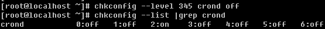

另外还可以省略级别，默认是针对2,3,4,5级别操作。

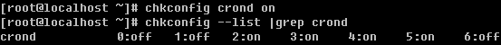

另外这个chkconfig 还有一个功能就是可以把某个服务加入到系统服务，即可以使用service 服务名 start 这样的形式，并且可以在chkconfig --list 中查找到。当然也能删除掉。

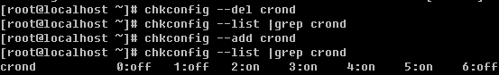

这个功能常用在把自定义的启动脚本加入到系统服务当中。关于系统服务就讲这些内容，其实还有很多内容笔者没有介绍，道理很简单，一来讲多了你不能消化二来讲多了你也用不上。

【**linux****中的数据备份**】

数据备份，不用说太多吧，毫无疑问很重要。笔者就曾经有过一次非常痛苦的经历，备份策略没有做好，结果磁盘坏掉数据丢失，简直是撕心裂肺的痛呀。还好数据重要性不是特别高，即使是不高也是丢失了数据，这是作为系统管理员最不应该出现的事故。所以，在你以后的系统维护工作中，一定要把数据备份当回事，认真对待。在linux上作为数据备份的工具很多，但笔者就只用一种那就是rsync 从字面上的意思你可以理解为remote sync （远程同步）这样可以让你理解的更深刻一些。Rsync不仅可以远程同步数据（类似于scp），当然还可以本地同步数据（类似于cp），但不同于cp或scp的一点是，rsync不像cp/scp一样会覆盖以前的数据（如果数据已经存在），它会先判断已经存在的数据和新数据有什么不同，只有不同时才会把不同的部分覆盖掉。如果你的linux上下面看例子吧。（如果没有rsync命令请使用yum install -y rsync安装）

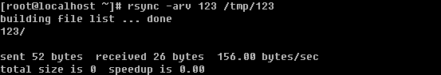

上面例子表示把当前目录下的123同步到/tmp/目录下，并且同样也命名为123。如果是远程拷贝的话就是这样的形式了 IP:path （如：10.0.2.34:/root/）

当建立连接后，是需要输入密码的。如果手动去执行这些操作还好，但是如果是写在脚本中怎么办？这就涉及到添加信任关系了，该部分内容稍后会详细介绍。

**1\. rsync****的命令格式**

rsync [OPTION]... SRC DEST

rsync [OPTION]... SRC [USER@]HOST:DEST

rsync [OPTION]... [USER@]HOST:SRC DEST

rsync [OPTION]... [USER@]HOST::SRC DEST

rsync [OPTION]... SRC [USER@]HOST::DEST

笔者在一开始举的两个例子，第一个例子即为第一种格式，第二个例子即为第二种格式，但不同的是，笔者并没有加user@host 如果不加默认指的是root 。第三种格式是从远程目录同步数据到本地。第四种以及第五种格式使用了两个冒号，这种方式和前面的方式的不同在于验证方式不同，稍后详细介绍。

**2\. rsync****常用选项**

-a：归档模式，表示以递归方式传输文件，并保持所有属性，等同于-rlptgoD ，-a选项后面可以跟一个 --no-OPTION 这个表示关闭-rlptgoD中的某一个例如 -a --no-l 等同于-rptgoD

-r ：对子目录以递归模式处理，主要是针对目录来说的，如果单独传一个文件不需要加-r，但是传输的是目录必须加-r选项

-v ：打印一些信息出来，比如速率，文件数量等

-l ：保留软链结

-L ：向对待常规文件一样处理软链结，如果是SRC中有软连接文件，则加上该选项后将会把软连接指向的目标文件拷贝到DST

-p ：保持文件权限

-o ：保持文件属主信息

-g ：保持文件属组信息

-D ：保持设备文件信息

-t ：保持文件时间信息

--delete ：删除那些DST中SRC没有的文件

--exclude=PATTERN：指定排除不需要传输的文件，等号后面跟文件名，可以是万用字符模式（如*.txt）

-u ：加上这个选项后将会把DST中比SRC还新的文件排除掉，不会覆盖

下面笔者将会针对这些选项做一些列小实验：

1）建立目录以及文件

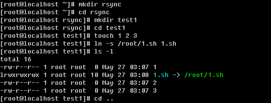

笔者建立这些文件的目的就是为做试验做一些准备工作。

2）使用-a选项

这里有一个问题，就是本来想把test1目录直接拷贝成test2目录，可结果rsync却新建了test2目录然后把test1放到test2当中。为了避免这样的情况发生，可以这样做：

加一个斜杠就好了，所以笔者建议你在使用rsync备份目录时要养成加斜杠的习惯。在上面讲了-a选项等同于- rlptgoD，而且-a还可以和--no-OPTION一并使用。

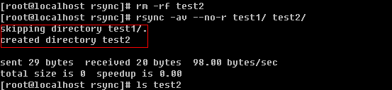

笔者加上-v选项来获得更多的信息，上例中因为没有使用-r选项导致只能拷贝目录但不能拷贝目录下面的内容（英文翻译过来就是“忽略了目录test1/.”，其中test1/.指的就是test1目录内部的所有文件），所以虽然创建了test2目录，但是test2目录为空。下面再看看那个-l选项的作用。

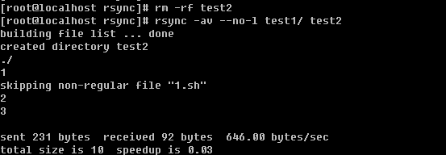

使用-v选项看来就是方便呀，上例告诉我们跳过了非普通文件1.sh，其实1.sh是一个软连接文件，如果不使用-l选项则不会理会软连接文件的。

果真test2目录当中没有那个1.sh的影子。当然加上-l选项则会把软连接文件给拷贝过去，但是软连接的目标文件却没有拷贝过去，有时候咱们指向拷贝软连接文件所指向的目标文件，那这时候该怎么办呢？

3）使用-L选项

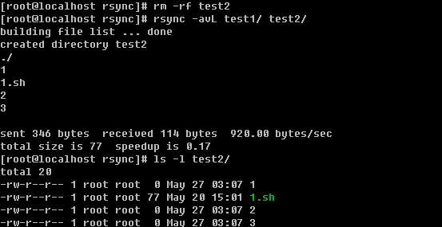

一个-L就可以把SRC中软连接的目标文件给拷贝到DST

4）使用-u选项

首先查看一下test1/1 和 test2/1的访问时间（肯定是一样的），然后使用touch修改一下test2/1的访问时间（此时test2/1要比test1/1的访问时间晚了一些），如果不加-u选项的话，会把test2/1的访问时间变成和test1/1的访问时间一样。这样讲也许你会迷糊，不妨看一看。

看到了吧，本来test2/1的访问时间已经不同于test1/1的访问时间了，但是同步后访问时间又一致了。

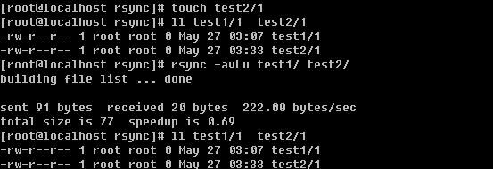

现在你明白-u选项的妙用了吧。

5）使用--delete选项

如果不使用--delete选项当SRC有文件删除时，DST是不会删除的，只有加上--delete选项后才能删除掉。还有一种情况就是如果在DST增加文件了，而SRC当中没有这些文件，同步时加上--delete选项后同样会删除新增的文件。

6）使用--exclude 选项

另外还可以使用万用字符*匹配

最后简单总结一下，平时你使用rsync同步数据的时候，使用-a选项基本上就可以达到我们想要的效果了，只是有时候会有个别的需求，会用到-a --no-OPTION, -u, -L, --delete, --exclude这些选项，但是笔者要求你把上面这些全部掌握，毕竟这才几个而已，大部分选项笔者都没有介绍。如果在以后的工作中遇到特殊需求了，就去查一下rsync的man文档吧。

**3\. rsync** **应用实例**

**1****）通过****ssh****的方式**

最上面介绍的5种方式当中，第二、第三（1个冒号）就属于通过ssh的方式，这种方式其实就是让用户去登录到远程机器，然后执行rsync的任务。

这种方式就是前面介绍的第二种方式了，是通过ssh拷贝的数据，是要输入10.0.2.69那台机器root的密码的。

这个则为第三种方式。这两种方式如果写到脚本里，备份起来就有麻烦了，因为要输入密码，脚本本来就是自动的，不可能做到的。但是不代表没有解决办法。那就是通过密钥验证，密钥不设立密码就ok了。还记得在前面笔者曾经介绍过通过密钥登录远程主机吗，下面要讲的内容就是那些东西了。

先提前说一下基本的主机信息： 10.0.2.68 （主机名Aming-1）和10.0.2.69（主机名Aming）需要从Aming-1上拷贝数据到Aming上。

A. 首先确认一下Aming-1上是否有这个文件 /root/.ssh/id_rsa.pub

如果没有安装以下的方法生成：

在这个过程中会有一些交互的过程，因为笔者的/root/.ssh/id_rsa已经存在，所以会问是否覆盖，笔者选择覆盖，然后会提示要输入这个密钥的密码，出于安全考虑应该定义个密码，但是我们的目的就是为了自动化同步数据，所以这里不输入任何密码，直接按回车，即密码为空。最后则生成了私钥(/root/.ssh/id_rsa)和公钥文件(/root/.ssh/id_rsa.pub)

B. 把公钥文件的内容拷贝到目标机器上

复制主机Aming-1的/root/.ssh/id_rsa.pub文件内容，并粘贴到主机Aming的/root/.ssh/authorized_keys中

在这一步也许你会遇到/root/.ssh目录不存在的问题，可以手动创建，并修改目录权限为700也可以执行ssh-keygen命令生成这个目录。保存/root/.ssh/authorized_keys文件后，再到主机Aming-1上执行

你会发现，现在不用输入密码也可以登录主机Aming了。下面再从主机Aming-1上执行一下rsync命令试试吧。

**2****）通过后台服务的方式**

这种方式可以理解成这样，在远程主机上建立一个rsync的服务器，在服务器上配置好rsync的各种应用，然后本机作为rsync的一个客户端去连接远程的rsync服务器。下面笔者就介绍一下，如何去配置一台rsync服务器。

A. 建立并配置rsync的配置文件 /etc/rsyncd.conf

其中配置文件分为两部分全部配置部分和模块配置部分，全局部分就是几个参数而已，就像笔者的rsyncd.conf中port, log file, pid file, address这些都属于全局配置，而[test] 以下部分就是模块配置部分了。一个配置文件中可以有多个模块，模块名自定义，格式就像笔者的rsyncd.conf中的这样。其实模块中的一些参数例如use chroot, max connections, udi, gid, auth users, secrets file以及hosts allow都可以配置成全局的参数。当然笔者给出的参数并不是所有的，你可以通过man rsyncd.conf 获得更多信息。

下面就简单解释一下这些参数的意义：

**port** ：指定在哪个端口启动rsyncd服务，默认是873

**log file**：指定日志文件

**pid file**：指定pid文件，这个文件的作用涉及到服务的启动以及停止等进程管理操作

**address**：指定启动rsyncd服务的IP，假如你的机器有多个IP，就可以指定其中一个启动rsyncd服务，默认是在全部IP上启动

**[test]** ：指定模块名，自定义

**path** ：指定数据存放的路径

**use chroot**：true|false 默认是true，意思是在传输文件以前首先chroot到path参数所指定的目录下。这样做的原因是实现额外的安全防护，但是缺点是需要以roots权限，并且不能备份指向外部的符号连接所指向的目录文件。默认情况下chroot值为true，如果你的数据当中有软连接文件的话建议设置成false。

**max connections**：指定最大的连接数，默认是0即没有限制

**read only**：ture|false 如果为true则不能上传到该模块指定的路径下

**list** ：指定当用户查询该服务器上的可用模块时，该模块是否被列出，设定为true则列出，false则隐藏

**uid/gid** ：指定传输文件时，以哪个用户/组的身份传输

**auth users**：指定传输时要使用的用户名

**secrets file**：指定密码文件，该参数连同上面的参数如果不指定则不使用密码验证

**hosts allow** ：指定被允许连接该模块的主机，可以是IP或者网段，如果是多个，之间用空格隔开

B. 编辑secrets file，保存后要赋予600权限

C. 启动rsyncd服务

启动后查看日志，看看是否有错误信息，然后再看下端口是否启动。

如果想开机启动，请把”rsync –daemon –confg=/etc/rsyncd.conf” 写入到/etc/rc.d/rc.local文件。

D. 到另一台机器上测试

记得那个use chroot参数吗，如果设置为true，则/root/test4/1.sh不会被拷贝过来。

修改rsyncd.conf文件，把use chroot改成true，不用重启服务即可生效。

从上例中的详细信息中也可以看到，不能拷贝软连接的。所以请记住，如果涉及到软连接，请设置use chroot=false 。另外这种方式也是可以不用手动输入密码的，两种实现方式。

第一种：指定密码文件

先编辑一个密码文件，并修改600权限。

在同步时，指定密码文件即可(--password-file=/etc/rsyncd.passwd)

第二种：在rsync服务器端不指定用户

把相关的参数都用’#’注释掉。然后再到客户端上测试。

注意，这里不用再加test@这个用户了，默认是以root的身份拷贝的，现在已经不需要输入密码了。

【**linux****系统日志**】

日志重要吗？必须的，没有日志你怎么知道你的系统状况？没有日志你如何排查一个trouble？日志记录了系统每天发生的各种各样的事情，你可以通过他来检查错误发生的原因，或者受到攻击时攻击者留下的痕迹。日志主要的功能有：审计和监测。他还可以实时的监测系统状态，监测和追踪侵入者等等。

笔者常查看的日志文件为/var/log/message. 它是核心系统日志文件，包含了系统启动时的引导消息，以及系统运行时的其他状态消息。IO 错误、网络错误和其他系统错误都会记录到这个文件中。另外其他信息，比如某个人的身份切换为 root以及用户自定义安装的软件（apache）的日志也会在这里列出。通常，/var/log/messages 是在做故障诊断时首先要查看的文件。那你肯定会说了，这么多日志都记录到这个文件中，那如果服务器上有很多服务岂不是这个文件很快就会写的很大，没有错，但是系统有一个日志轮询的机制，每星期切换一个日志，变成message.1, message.2,…messages.4 连同message一共有5个这样的日志文件。这是通过logrotate工具的控制来实现的，它的配置文件是/etc/logrotate.conf. 如果没有特殊需求请不要修改这个配置文件。

/var/log/message是由syslogd这个守护进程产生的，如果停掉这个服务则系统不会产生/var/log/message，所以这个服务不要停。Syslogd服务的配置文件为/etc/syslog.conf这个文件定义了日志的级别，具体详细的东西笔者不再阐述，因为若没有特殊需求是不需要修改这个配置文件的，请使用”man syslog.conf” 获得更多关于它的信息。

除了关注/var/log/message外，你还应该多关注一下’dmesg’这个命令，它可以显示系统的启动信息，如果你的某个硬件有问题（比如说网卡）用这个命令也是可以看到的。

这一小节就介绍这么多，在结束之前，笔者给你一个小小的建议。以后在你日常的管理工总中要养成多看日志的习惯，尤其是一些应用软件的日志，比如apache, mysql, php等常用的软件，看它们的日志（错误日志）可以帮助你排查问题以及监控它们的运行状况是否良好。

【**xargs****与****-exec**】

**1\. xargs**

在前面的例子中笔者曾经使用过这个命令，你是否有印象呢？现在就详细介绍一下它，平时笔者使用xargs还是比较多的，很方便。

查看xargs的man文档，解释是这样的：build and execute command lines from standard input. 至于翻译成中文理解着有点困难。不妨笔者举个例子说明它的作用。

它的作用就是把管道符前面的输出作为xargs 后面的命令的输入。它的好处在于可以把本来两步或者多步才能完成的任务简单一步就能完成。xargs常常和find命令一起使用，比如，查找当前目录创建时间大于10天的文件，然后再删除。

这种应用是最为常见的，xargs后面的rm 也可以更选项，当是目录时，就需要-r选项了。在笔者看来xargs的这个功能不叫什么，它的另一个功能才叫神奇。现在我有一个这样的需求，查找当前目录下所有.txt的文件，然后把这些.txt的文件变成.txt_bak 。正常情况下，我们不得不写脚本去实现，但是使用xargs就一步。

xargs -n1 –i{} 类似for循环，-n1意思是一个一个对象的去处理，-i{} 把前面的对象使用{}取代，mv {} {}_bak 相当于 mv 1.txt 1.txt_bak。你刚开始接触这个命令时也许有点难以理解，多练习一下你就会熟悉了，笔者建议你记住这个应用，很实用。

**2\. -exec**

使用find命令时，经常使用一个选项就是这个-exec了，可以达到和xargs同样的效果。比如，查找当前目录创建时间大于10天的文件并删除。

这个命令中也是把{}作为前面find出来的文件的替代符，后面的”\”为”;”的脱意符，不然shell会把分号作为该行命令的结尾。这个-exec有时候也挺实用的。

用-exec同样可以实现前面那个复杂的需求。

【**screen****工具介绍**】

有时候，也许你会有这样的需求，需要执行一个命令或者脚本，但是需要几个小时甚至几天。这就要考虑一个问题，就是中途断网或出现其他意外情况，执行的任务中断了怎么办？你可以把命令或者脚本丢到后台运行，不过也不保险。笔者下面就介绍两种方法来避免这样的问题发生。

**1\.** **使用****nohup**

直接加一个’&’虽然丢到后台了，但是当退出该终端时很有可能这个脚本也会退出的，而在前面加上’nohup’就没有问题了。nohup的作用就是不挂断地运行命令。

**2\. screen****工具的使用**

简单来说，screen是一个可以在多个进程之间多路复用一个物理终端的窗口管理器。screen中有会话的概念，用户可以在一个screen会话中创建多个screen窗口，在每一个screen窗口中就像操作一个真实的SSH连接窗口那样。下面笔者介绍screen的一个简单应用。

1）打开一个会话，直接输入screen命令然后回车，进入screen会话窗口。如果你没有screen命令，请用’yum install -y screen’安装。

2）screen -ls 查看已经打开的screen会话

3）Ctrl +a 再按d退出该screen会话，只是退出，并没有结束。结束的话输入Ctrl +d 或者输入exit

4）退出后还想再次登录某个screen会话，使用screen -r [screen 编号]，这个编号就是上图中那个2082\. 当只有一个screen会话时，后面的编号是可以省略的。

当你有某个需要长时间运行的命令或者脚本时就打开一个screen会话，然后运行该任务。按ctrl +a 再按d退出会话，不影响终端窗口上的任何操作。

 

【**linux下同步时间服务器**】

时间的准确性在服务器上非常重 要，所以要与标准时间保持同步，毕竟服务器的时钟并不一定精准，所以需要我们每隔一段时间去同步一下时间。笔者所管理的服务器每隔6小时就会同步一下时 间。如何同步呢？这就要用到ntpdate 这个指令。如果你的服务器上没有这个指令，请使用'yum install -y ntpdate'安装，或者下载源码包安装。

同步时间的命令为：'ntpdate  timeserver'  这里的timeserver为时间服务器的IP或者hostname，常用的timeserver有210.72.145.44, time.windows.com(windows的时间服务器)。如果你想每隔6小时同步一次那么请指定一个计划任务。

00 */6 * * *  /usr/sbin/ntpdate 210.72.145.44 >/dev/null

之所以在后面加一个重定向，是因为这个同步的过程是有内容输出的，因为我们的计划任务是在后台执行的，输出的内容会以邮件的形式发送给用户，所以为了避免邮件太多请输出到/dev/null （在linux下这个设备是虚拟的存在，你可以理解为空洞）
