# Linux 操作系统的安装

因为笔者一直都是使用 CentOS，所以这次安装系统也是基于CentOS的安装。把光盘插入光驱，设置bios光驱启动。进入光盘的欢迎界面。也可参考**[Ubuntu 12.04 安装教程详细步骤](http://www.jb51.net/os/84475.html)**。

其中有两个选项，可以直接按回车，也可以在当前界面下输入 linux text 按回车。前者是图形下安装，可以动鼠标的，后者是纯文字形式的。建议初学者用前者安装。直接回车后，出现一下界面：

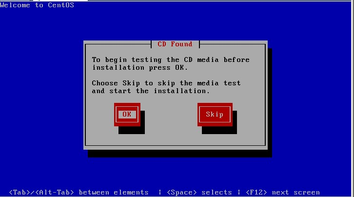

这一步是要提示你是否要校验光盘，目的是看看光盘中的安装包是否完整或者是否被人改动过，一般情况下，如果是正规的光盘不需要做这一步操作，因为太费时间。接下来是：

这一步没有什么可说明的，直接点“Next”：

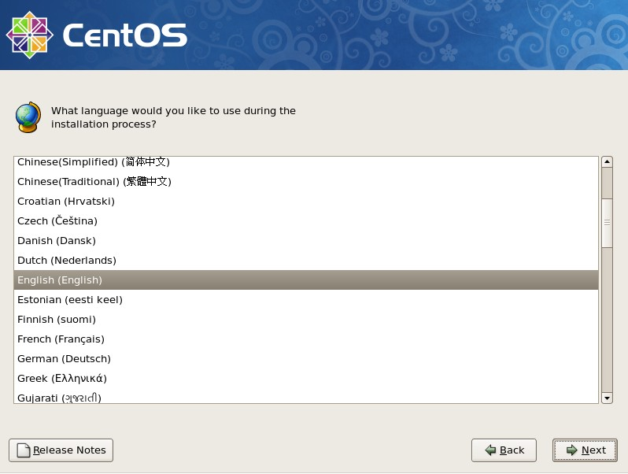

这里是选择安装系统时所用语言，笔者习惯用 English，当然你也可以选择 Chinese(Simplified)（简体中文），选择好后点“Next”：

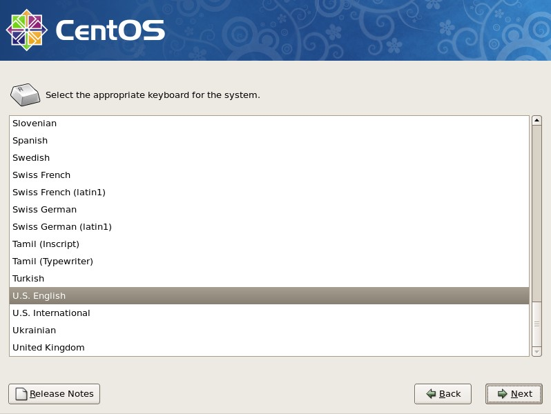

这里是选择合适的键盘，我们平时使用的都是英文键盘，所以这里不用动，默认即可，直接“Next”：

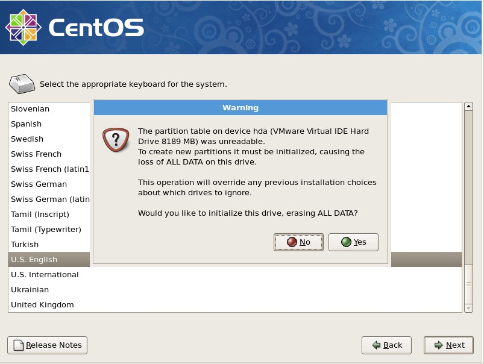

到这里就会提示你，下面会分区，会初始化磁盘，磁盘上的数据会丢失，问你是否要初始化设备并清除磁盘上的数据。因为是空盘，所以选择“Yes”：

到这一步，就该分区了。其中一共有四种方式可以供你选择：

第一种，在所选磁盘上把所有分区移除，然后按照默认的方式分区；

第二种，在所选磁盘上把所有 linux 分区移除（如果磁盘上有 Windows 格式的分区，并不会移除），然后按照默认方式分区；

第三种，在所选磁盘上只使用空闲部分，并且按照默认方式分区；

第四种，用户自定义。

这里我们选第四种。然后“Next”：

接下来该分区了，分区的很灵活，但大体上按照这个规则来（这是服务器上这样分，如果你是虚拟机，请看后边部分）：

1./boot 分区 100M

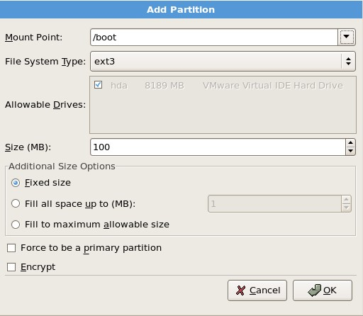

2.Swap 分区 内存的2倍，如果大于等于 4G，则只需给 4G 即可：

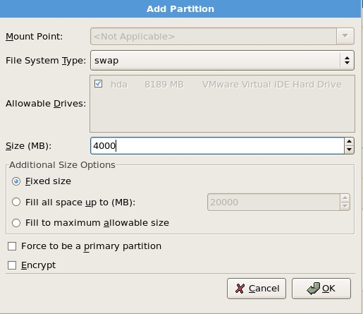

3./ 分区给 20G

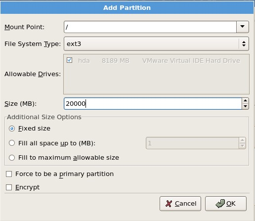

4.剩余空间给/data

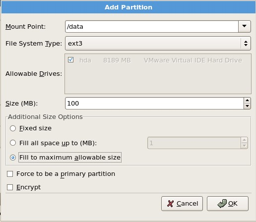

说明：/boot 分区是系统启动所需要的文件，就跟 Windows 的 C 盘中的 windows 目录类似，这个分区中的文件并不大，只需要 100M 足够。Swap 分区是交换分区，当内存不够时，系统会把这部分空间当内存使用。/ 分区，其实就是一个根目录，在以后的章节中会介绍到。现在不懂并没有关系，只要知道有这么一个东西即可。/data 这个分区是我们自定义的，就是专门放数据的分区。

如果你安装的是虚拟机，并且你只有8G的磁盘空间，那么我建议你这样分区：

1 /boot 100M

2 swap 内存的 2 倍

3 / 全部剩余空间

分区完后，点“Next”：

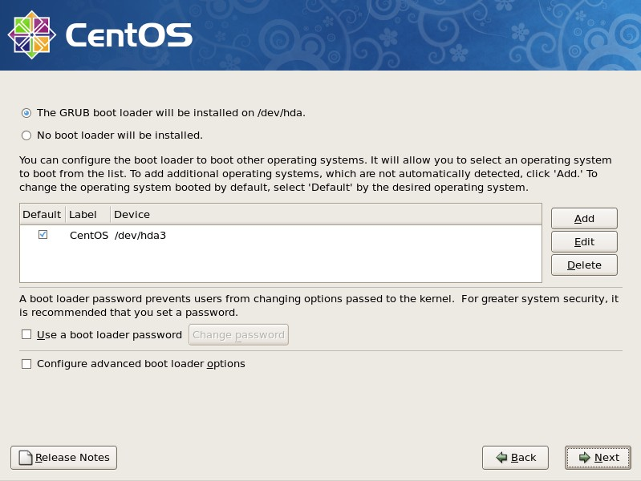

可以在 Use a boot loader password 前面打勾，这个选项的作用是，给 boot loader 加一个密码，为了防止有人通过光盘进入单用户模式修改 root 密码。

下面的选项同样可以打勾，笔者从来没有用过该功能，如果你有兴趣，可以研究一下。然后下一步。

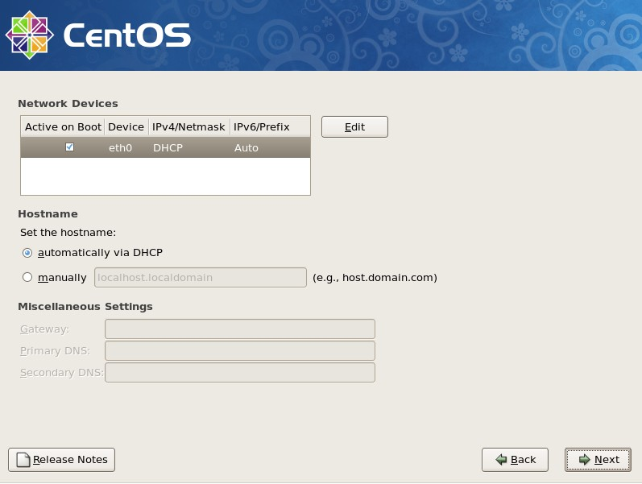

这一步是配置网卡信息，可以现在自定义网卡的 IP，和配置主机名，默认是通过 DHCP 获得，你也可以点 manually 自定义一个主机名，如 mail.example.com 。如果这两种方式都没有配置，那么 linux 会给你配置一个万能的主机名，即 localhost.localdomain 剩下的几个就不用配置了，默认留空。

接着下一步，选择时区，在这里当然要选择我们所处的时区 Asia/Chongqing 如果没有 Chongqing 那就选择 Asia/Shanghai。

继续下一步：

在这里自己定义一个 root 的密码，继续下一步：

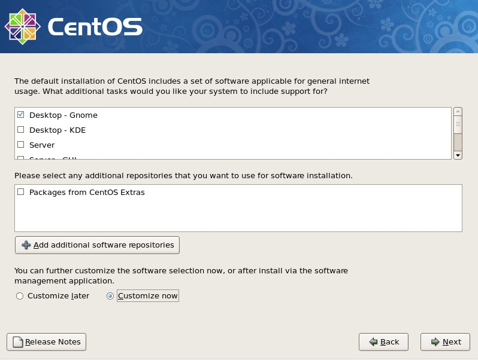

这里要我们选择要安装的包，笔者习惯自定义安装，需要点下面的“customize now”然后下一步

“Desktop Environments” 看右侧，把 GNOME 前面的勾去掉，这个其实就是图形界面的安装包，如果不去掉这个勾，就会安装图形界面。

“Applications” 除了 Editors 前面的勾去掉外，其他均不要

“Development”全部都要勾上

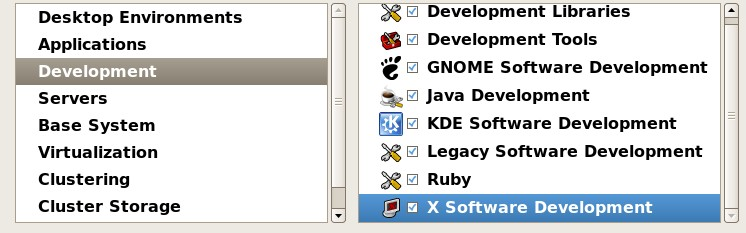

“Servers”以及以下所有项都不要勾任何，然后下一步

点 Next 后，系统就开始安装了。

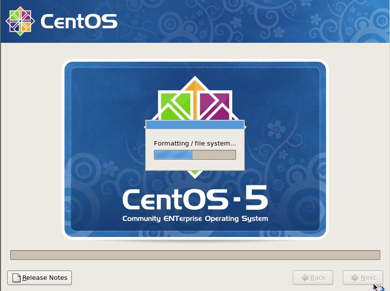

等过会后，会出现

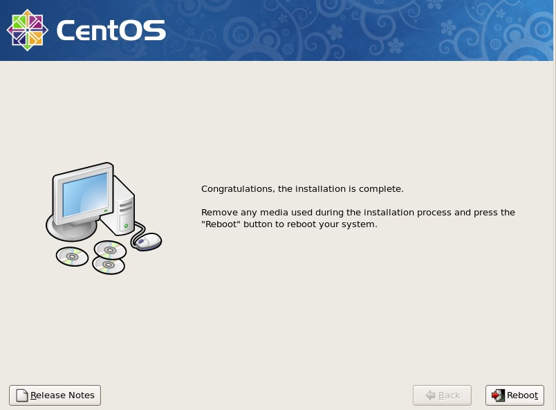

至此，linux 系统已经安装完成了。接下来点“Reboot”重启一下，进入 linux 系统看看吧。

