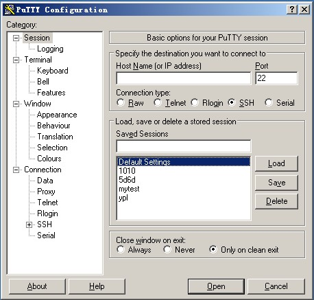
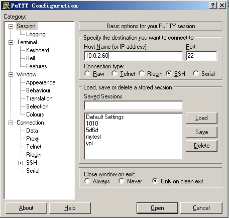
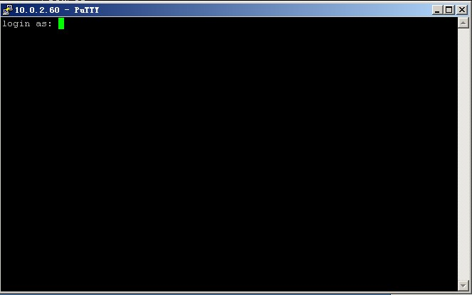
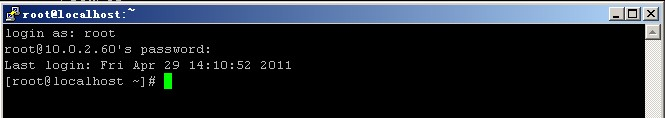
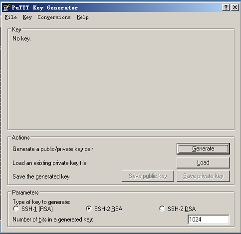
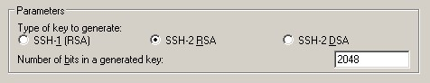
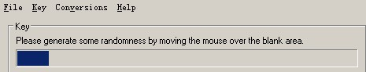
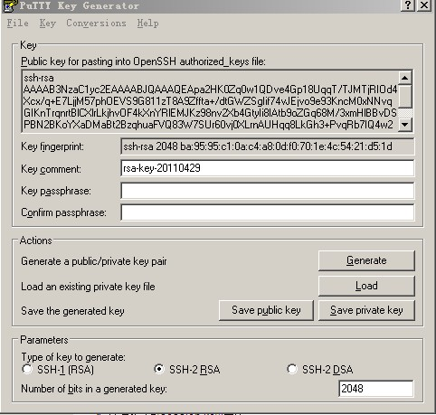
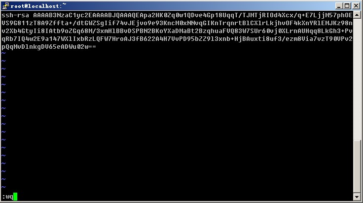
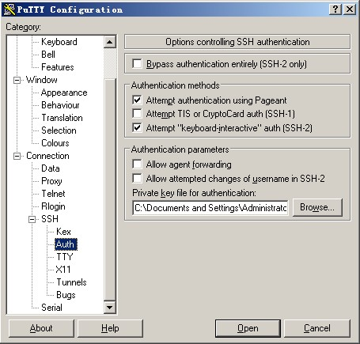

# Linux 系统的远程登录

首先要说一下，该部分内容对于linux初学者来讲并不是特别重要的，可以先跳过该章节，先学下一章，等学完后再回来看这一章。

 Linux 大多应用于服务器，而服务器不可能像 PC 一样放在办公室，它们是放在 IDC 机房的，所以我平时登录 linux 系统都是通过远程登录的。Linux 系统中是通过 ssh 服务实现的远程登录功能。默认 ssh 服务开启了 22 端口，而且当我们安装完系统时，这个服务已经安装，并且是开机启动的。所以不需要我们额外配置什么就能直接远程登录linux系统。ssh服务的配置文件为  /etc/ssh/sshd_config ，你可以修改这个配置文件来实现你想要的 ssh 服务。比如你可以更改启动端口为 36000. 

如果你是 Windows 的操作系统，则Linux远程登录需要在我们的机器上额外安装一个终端软件。目前比较常见的终端登录软件有SecureCRT, Putty, SSH Secure Shell等，很多朋友喜欢用SecureCRT因为它的功能是很强大的，而笔者喜欢用 Putty ，只是因为它的小巧以及非常漂亮的颜色显示。不管你使用哪一个客户端软件，最终的目的只有一个，就是远程登录到 linux 服务器上。这些软件网上有很多免费版的，你可以下载一个试着玩玩。下面笔者介绍如何使用Putty登录远程linux服务器。

如果你下载了putty，请双击putty.exe 然后弹出如下的窗口。笔者所用putty为英文版的，如果你觉得英文的用着别扭，可以下载一个中文版的。

因为是远程登录，所以你要登录的服务器一定会有一个IP或者主机名。请在Host Name( or IP address) 下面的框中输入你要登录的远程服务器IP(如果你的linux还没有IP，那么请自行设置一个IP，如何设置请到后续章节查找)，然后回车。

此时，提示我们输入要登录的用户名。

输入root 然后回车，再输入密码，就能登录到远程的linux系统了。

## 使用密钥认证机制远程登录 linux

SSH服务支持一种安全认证机制，即密钥认证。所谓的密钥认证，实际上是使用一对加密字符串，一个称为公钥(public key)，任何人都可以看到其内容，用于加密；另一个称为密钥(private key)，只有拥有者才能看到，用于解密。 通过公钥加密过的密文使用密钥可以轻松解密，但根据公钥来猜测密钥却十分困难。 ssh 的密钥认证就是使用了这一特性。服务器和客户端都各自拥有自己的公钥和密钥。 如何使用密钥认证登录linux服务器呢？

首先使用工具 PUTTYGEN.EXE 生成密钥对。打开工具PUTTYGEN.EXE后如下图所示：

该工具可以生成三种格式的key ：SSH-1(RSA) SSH-2(RSA) SSH-2(DSA) ，我们采用默认的格式即SSH-2(RSA)。Number of bits in a generated key 这个是指生成的key的大小，这个数值越大，生成的key就越复杂，安全性就越高。这里我们写2048.

然后单击Generate 开始生成密钥对：

注意的是，在这个过程中鼠标要来回的动，否则这个进度条是不会动的。

到这里，密钥对已经生成了。你可以给你的密钥输入一个密码，（在Key Passphrase那里）也可以留空。然后点 Save public key 保存公钥，点 Save private Key 保存私钥。笔者建议你放到一个比较安全的地方，一来防止别人偷窥，二来防止误删除。接下来就该到远程linux主机上设置了。

1）创建目录 /root/.ssh 并设置权限

[root@localhost ~]# mkdir /root/.ssh mkdir 命令用来创建目录，以后会详细介绍，暂时只了解即可。

[root@localhost ~]# chmod 700 /root/.ssh chmod 命令是用来修改文件属性权限的，以后会详细介绍。

2）创建文件 / root/.ssh/authorized_keys

[root@localhost ~]# vim /root/.ssh/authorized_keys vim 命令是编辑一个文本文件的命令，同样在后续章节详细介绍。

3）打开刚才生成的public key 文件，建议使用写字板打开，这样看着舒服一些，复制从AAAA开头至 “---- END SSH2 PUBLIC KEY ----“ 该行上的所有内容，粘贴到/root/.ssh/authorized_keys 文件中，要保证所有字符在一行。（可以先把复制的内容拷贝至记事本，然后编辑成一行载粘贴到该文件中）。在这里要简单介绍一下，如何粘贴，用vim打开那个文件后，该文件不存在，所以vim会自动创建。按一下字母”i”然后同时按shift + Insert 进行粘贴（或者单击鼠标邮件即可），前提是已经复制到剪切板中了。粘贴好后，然后把光标移动到该行最前面输入ssh-ras ，然后按空格。再按ESC，然后输入冒号wq 即 :wq 就保存了。格式如下图：

4）再设置putty选项，点窗口左侧的SSh –> Auth ，单击窗口右侧的Browse… 选择刚刚生成的私钥，再点Open ，此时输入root，就不用输入密码就能登录了。

如果在前面你设置了Key Passphrase ，那么此时就会提示你输入密码的。为了更加安全建议大家要设置一个Key Passphrase。

