# 正则表达式

这部分内容可以说是学习shell脚本之前必学的内容。如果你这部分内容学的越好，那么你的shell脚本编写能力就会越强。所以不要嫌这部分内容啰嗦，也不要怕麻烦，要用心学习。一定要多加练习，练习多了就能熟练掌握了。

在计算机科学中，正则表达式是这样解释的：它是指一个用来描述或者匹配一系列符合某个句法规则的字符串的单个字符串。在很多文本编辑器或其他工具里，正则表达式通常被用来检索和/或替换那些符合某个模式的文本内容。许多程序设计语言都支持利用正则表达式进行字符串操作。对于系统管理员来讲，正则表达式贯穿在我们的日常运维工作中，无论是查找某个文档，抑或查询某个日志文件分析其内容，都会用到正则表达式。

其实正则表达式，只是一种思想，一种表示方法。只要我们使用的工具支持表示这种思想那么这个工具就可以处理正则表达式的字符串。常用的工具有grep, sed, awk 等，下面笔者就介绍一下这三种工具的使用方法。

【**grep / egrep**】

笔者在前面的内容中多次提到并用到grep命令，可见它的重要性。所以好好学习一下这个重要的命令吧。你要知道的是grep连同下面讲的sed, awk都是针对文本的行才操作的。

语法： grep [-cinvABC] ‘word’ filename

-c ：打印符合要求的行数

-i ：忽略大小写

-n ：在输出符合要求的行的同时连同行号一起输出

-v ：打印不符合要求的行

-A ：后跟一个数字（有无空格都可以），例如 –A2则表示打印符合要求的行以及下面两行

-B ：后跟一个数字，例如 –B2 则表示打印符合要求的行以及上面两行

-C ：后跟一个数字，例如 –C2 则表示打印符合要求的行以及上下各两行

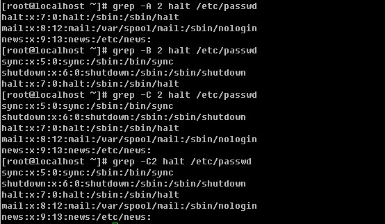

以下，笔者举几个小例子帮助你好好掌握这个grep工具的用法。

**a.** **过滤出带有某个关键词的行并输出行号**

**b.** **过滤不带有某个关键词的行，并输出行号**

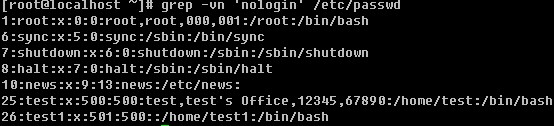

**c.** **过滤出所有包含数字的行**

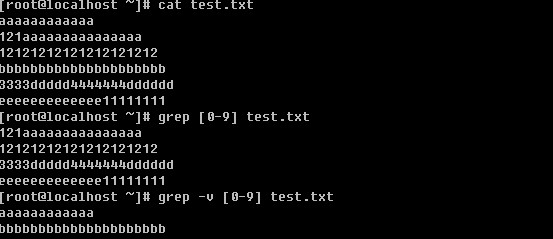

在前面也提到过这个”[ ]”的应用，如果是数字的话就用[0-9]这样的形式，当然有时候也可以用这样的形式[15]即只含有1或者5，注意，它不会认为是15。如果要过滤出数字以及大小写字母则要这样写[0-9a-zA-Z]。另外[ ]还有一种形式，就是[^字符] 表示除[ ]内的字符之外的字符。

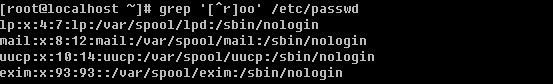

这就表示筛选包含oo字符串，但是不包含r字符。

**d.** **过滤出文档中以某个字符开头或者以某个字符结尾的行**

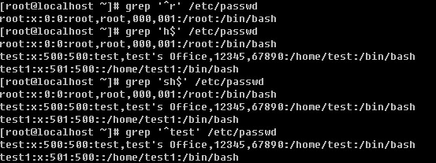

在正则表达式中，”^”表示行的开始，”$”表示行的结尾，那么空行则表示”^$”,如果你只想筛选出非空行，则可以使用 “grep -v ‘^$’ filename”得到你想要的结果。现在想一下，如何打印出不以英文字母开头的行呢？

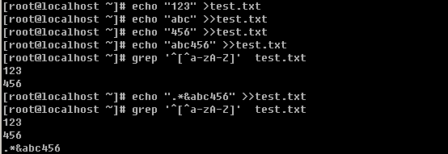

**e.** **过滤任意一个字符与重复字符**

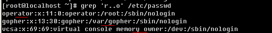

“.”表示任意一个字符，上例中，就是把符合r与o之间有两个任意字符的行过滤出来。

“*”表示零个或多个前面的字符。

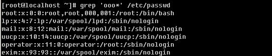

‘ooo*’ 表示oo, ooo, oooo … 或者更多的’o’。现在你是否想到了’.*’ 这个组合表示什么意义？

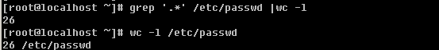

‘.*’表示零个或多个任意字符，空行也包含在内。

**f.** **指定要过滤字符出现的次数**

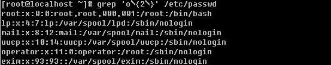

这里用到了{ }，其内部为数字，表示前面的字符要重复的次数。上例中表示包含有两个o 即’oo’的行。注意，{ }左右都需要加上脱意字符’\’。另外，使用{ }我们还可以表示一个范围的，具体格式是 ‘\’其中n1<n2，表示重复n1到n2次前面的字符，n2还可以为空，则表示大于等于n1次。

上面部分讲的grep，另外笔者常常用到egrep这个工具，简单点讲，后者是前者的扩展版本，我们可以用egrep完成grep不能完成的工作，当然了grep能完成的egrep完全可以完成。如果你嫌麻烦，egrep了解一下即可，因为grep的功能已经足够可以胜任你的日常工作了。下面笔者介绍egrep不用于grep的几个用法。为了试验方便，笔者把test.txt 编辑成如下内容：

rot:x:0:0:/rot:/bin/bash

operator:x:11:0:operator:/root:/sbin/nologin

operator:x:11:0:operator:/rooot:/sbin/nologin

roooot:x:0:0:/rooooot:/bin/bash

1111111111111111111111111111111

aaaaaaaaaaaaaaaaaaaaaaaaaaaaaaa

**a.** **筛选一个或一个以上前面的字符**

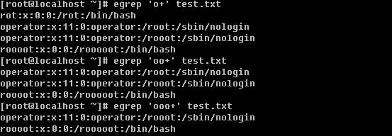

和grep 不同的是，egrep这里是使用’+’的。

**b.** **筛选零个或一个前面的字符**

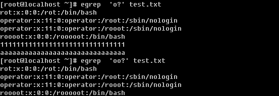

**c.** **筛选字符串****1****或者字符串****2**

中间有一个’|’表示或者的意思，笔者用这个用的很多，所以这个你最好记一下。

**d. egrep****中****’( )’****的应用**

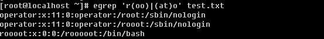

用’( )’表示一个整体，例如(oo)+就表示1个’oo’或者多个’oo’

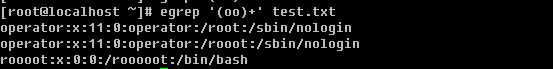

【**sed** **工具的使用**】

grep 工具的功能其实还不够强大，其实说白了，grep实现的只是查找功能，而它却不能实现把查找的内容替换掉。以前用vim的时候，可以查找也可以替换，但是只局限于在文本内部来操作，而不能输出到屏幕上。sed工具以及下面要讲的awk工具就能实现把替换的文本输出到屏幕上的功能了，而且还有其他更丰富的功能。sed和awk都是流式编辑器，是针对文档的行来操作的。

**a.** **打印某行** **sed -n ‘n’p filename** **单引号内的****n****是一个数字，表示第几行**

**b.** **打印多行****打印整个文档用** **-n ‘1,$’p**

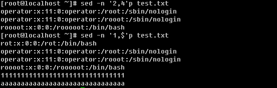

**c.** **打印包含某个字符串的行**

上面grep中使用的特殊字符，如’^’, ‘$’, ‘.’, ‘*’等同样也能在sed中使用。

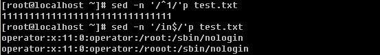

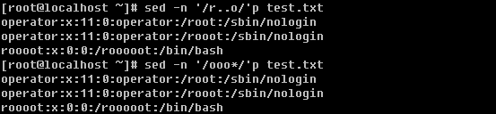

**d. -e** **可以实现多个行为**

**e.** **删除某行或者多行**

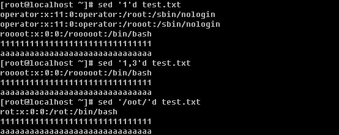

‘d’ 这个字符就是删除的动作了，不仅可以删除指定的单行以及多行，而且还可以删除匹配某个字符的行，另外还可以删除从某一行一直到文档末行。

**f.** **替换字符或字符串**

上例中的’s’就是替换的命令，’g’为本行中全局替换，如果不加’g’，只换该行中出现的第一个。

除了可以使用’/’外，还可以使用其他特殊字符例如’#’或者’@’都没有问题。

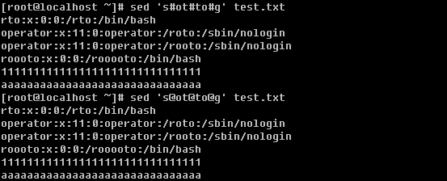

现在思考一下，如何删除文档中的所有数字或者字母？

有意思吧，[0-9]表示任意的数字。这里你也可以写成[a-zA-Z]甚至[0-9a-zA-Z]

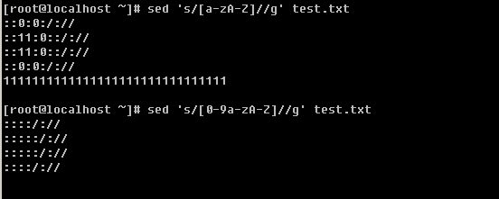

**g.** **调换两个字符串的位置**

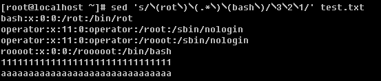

这个就需要解释一下了，上例中用’()’把所想要替换的字符括起来成为一个整体，因为括号在sed中属于特殊符号，所以需要在前面加脱意字符’\’，替换时则写成’\1’, ‘\2’, ‘\3’ 的形式。除了调换两个字符串的位置外，笔者还常常用到在某一行前或者后增加指定内容。

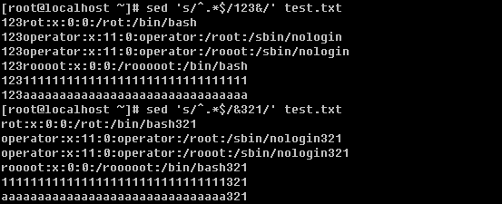

**h.** **直接修改文件的内容**

sed -i ‘s/:/#/g’ test.txt ，这样就可以直接更改test.txt文件中的内容了。由于这个命令可以直接把文件修改，所以在修改前最好先复制一下文件以免改错。

sed常用到的也就上面这些了，只要你多加练习就能熟悉它了。为了能让你更加牢固的掌握sed的应用，笔者留几个练习题给你，希望你能认真完成。

1\. 把/etc/passwd 复制到/root/test.txt，用sed打印所有行；

2\. 打印test.txt的3到10行；

3\. 打印test.txt 中包含’root’的行；

4\. 删除test.txt 的15行以及以后所有行；

5\. 删除test.txt中包含’bash’的行；

6\. 替换test.txt 中’root’为’toor’；

7\. 替换test.txt中’/sbin/nologin’为’/bin/login’

8\. 删除test.txt中5到10行中所有的数字；

9\. 删除test.txt 中所有特殊字符（除了数字以及大小写字母）；

10\. 把test.txt中第一个单词和最后一个单词调换位置；

11\. 把test.txt中出现的第一个数字和最后一个单词替换位置；

12\. 把test.txt 中第一个数字移动到行末尾；

13\. 在test.txt 20行到末行最前面加’aaa:’；

现在给出以上练习题的答案，你如果实在想不出如何操作，那你看看答案吧，请尽量多想一下。

1\. /bin/cp /etc/passwd /root/test.txt ; sed -n '1,/span>p test.txt

2\. sed -n '3,10'p test.txt

3\. sed -n '/root/'p test.txt

4\. sed '15,/span>d test.txt

5\. sed '/bash/'d test.txt

6\. sed 's/root/toor/g' test.txt

7\. sed 's#sbin/nologin#bin/login#g' test.txt

8\. sed '5,10s/[0-9]//g' test.txt

9\. sed 's/[^0-9a-zA-Z]//g' test.txt

10\. sed 's/\(^[a-zA-Z][a-zA-Z]*\)\([^a-zA-Z].*\)\([^a-zA-Z]\)\([a-zA-Z][a-zA-Z]*$\)/\4\2\3\1/' test.txt

11\. sed 's#\([^0-9][^0-9]*\)\([0-9][0-9]*\)\([^0-9].*\)\([^a-zA-Z]\)\([a-zA-Z][a-zA-Z]*$\)#\1\5\3\4\2#' test.txt

12\. sed 's#\([^0-9][^0-9]*\)\([0-9][0-9]*\)\([^0-9].*$\)#\1\3\2#' test.txt

13\. sed '20,$s/^.*$/aaa:&/' test.txt

【**awk****工具的使用**】

上面也提到了awk和sed一样是流式编辑器，它也是针对文档中的行来操作的，一行一行的去执行。awk比sed更加强大，它能做到sed能做到的，同样也能做到sed不能做到的。awk工具其实是很复杂的，有专门的书籍来介绍它的应用，但是笔者认为学那么复杂没有必要，只要能处理日常管理工作中的问题即可。何必让自己的脑袋装那么东西来为难自己？毕竟用的也不多，即使现在教会了你很多，你也学会了，如果很久不用肯定就忘记了。鉴于此，笔者仅介绍比较常见的awk应用，如果你感兴趣的话，再去深入研究吧。

**a.** **截取文档中的某个段**

解释一下，-F 选项的作用是指定分隔符，如果不加-F指定，则以空格或者tab为分隔符。

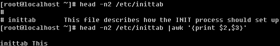

Print为打印的动作，用来打印出某个字段。$1为第一个字段，$2为第二个字段，依次类推，有一个特殊的那就是$0，它表示整行。

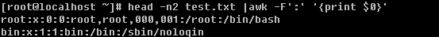

注意awk的格式，-F后紧跟单引号，然后里面为分隔符，print的动作要用’{ }’括起来，否则会报错。print还可以打印自定义的内容，但是自定义的内容要用双引号括起来。

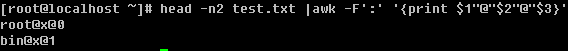

**b.** **匹配字符或字符串**

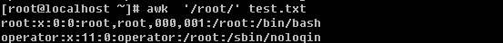

跟sed很类似吧，不过还有比sed更强大的匹配。

可以让某个段去匹配，这里的’~’就是匹配的意思，继续往下看

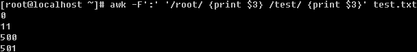

awk还可以多次匹配，如上例中匹配完root，再匹配test，它还可以只打印所匹配的段。

不过这样没有啥意义，笔者只是为了说明awk确实比sed强大。

**d.** **条件操作符**

awk中是可以用逻辑符号判断的，比如’==’就是等于，也可以理解为“精确匹配”。另外也有’>’, ‘>=’, ‘<’, ‘<=’, ‘!=’ 等等，值得注意的是，即使$3为数字，awk也不会把它当数字看待，它会认为是一个字符。所以不要妄图去拿$3当数字去和数字做比较。

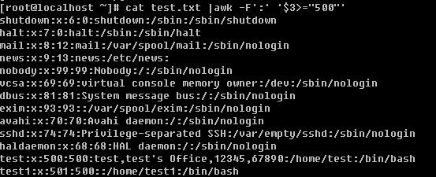

这样是得不到我们想要的效果的。这里只是字符与字符之间的比较，’6’是>’500’的。

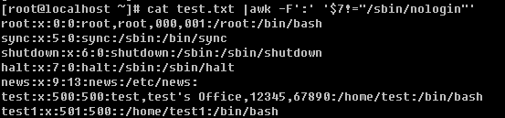

上例中用的是’!=’ 即不匹配。

另外还可以使用”&&” 和 “||”表示“并且”和“或者”的意思。

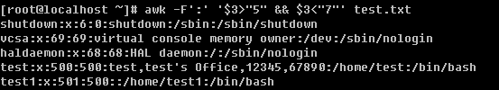

也可以是或者的关系

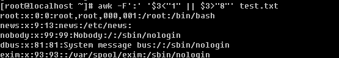

**d. awk****的内置变量**

常用的变量有：

NF ：用分隔符分隔后一共有多少段；

NR ：行数

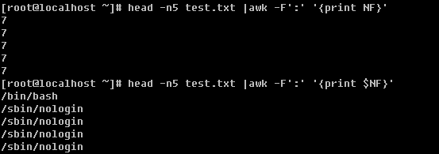

上例中，打印总共的段数以及最后一段的值。

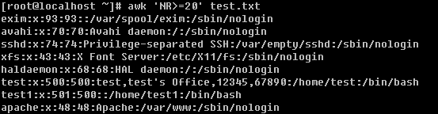

可以使用NR作为条件，来打印出指定的行。

**e. awk****中的数学运算**

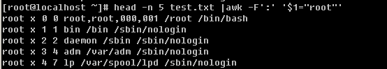

awk比较强的地方，还在于能把某个段改成指定的字符串，下面还有更强的呢！

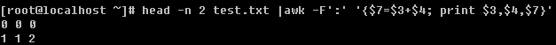

当然还可以计算某个段的总和。

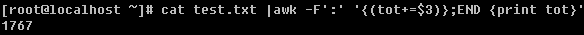

这里的END要注意一下，表示所有的行都已经执行，这是awk特有的语法，其实awk连同sed都可以写成一个脚本文件，而且有他们特有的语法，在awk中使用if判断、for循环都是可以的，只是笔者认为日常管理工作中没有必要使用那么复杂的语句而已。

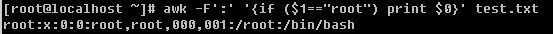

注意这里’( )’的使用。

基本上，正则表达的内容就这些了。但是笔者要提醒你一下，笔者介绍的这些仅仅是最基本的东西，并没有提啊深入的去讲sed和awk，但是完全可以满足日常工作的需要，有时候也许你会碰到比较复杂的需求，如果真遇到了就去请教一下google吧。下面出几道关于awk的练习题，希望你要认真完成。

1\. 用awk 打印整个test.txt （以下操作都是用awk工具实现，针对test.txt）；

2\. 查找所有包含’bash’的行；

3\. 用’:’作为分隔符，查找第三段等于0的行；

4\. 用’:’作为分隔符，查找第一段为’root’的行，并把该段的’root’换成’toor’(可以连同sed一起使用)；

5\. 用’:’作为分隔符，打印最后一段；

6\. 打印行数大于20的所有行；

7\. 用’:’作为分隔符，打印所有第三段小于第四段的行；

8\. 用’:’作为分隔符，打印第一段以及最后一段，并且中间用’@’连接（例如，第一行应该是这样的形式 “root@/bin/bash”；

9\. 用’:’作为分隔符，把整个文档的第四段相加，求和；

下面给出答案：

1\. awk '' test.txt

2\. awk '/bash/' test.txt

3\. awk -F':' '$3=="0"' test.txt

4\. awk -F':' '$1=="root"' test.txt |sed 's/root/toor/'

5\. awk -F':' '' test.txt

6\. awk -F':' 'NR>20' test.txt

7\. awk -F':' '$3<$4' test.txt

8\. awk -F':' '' test.txt

9\. awk -F':' '{(sum+=$4)}; END ' test.txt
