# 安装 RPM 包或者安装源码包 

在windows下安装一个软件很轻松，只要双击.exe的文件，安装提示连续“下一步”即可，然而linux系统下安装一个软件似乎并不那么轻松了，因为我们不是在图形界面下。所以你要学会如何在linux下安装一个软件。

在前面的内容中多次提到的yum，这个yum是Redhat所特有的安装RPM程序包的工具，使用起来相当方便。因为使用RPM安装某一个程序包有可能会因为该程序包依赖另一个程序包而无法安装。而使用yum工具就可以连同依赖的程序包一起安装。当然CentOS同样可以使用yum工具，而且在CentOS中你可以免费使用yum，但Redhat中只有当你付费后才能使用yum，默认是无法使用yum的。在介绍yum之前先说一说RPM相关的东西。

【**RPM****工具**】

RPM是”Redhat Package Manager”的缩写，根据名字也能猜到这是Redhat公司开发出来的。RPM 是以一种数据库记录的方式来将你所需要的套件安装到你的Linux 主机的一套管理程序。也就是说，你的linux系统中存在着一个关于RPM的数据库，它记录了安装的包以及包与包之间依赖相关性。RPM包是预先在linux机器上编译好并打包好的文件，安装起来非常快捷。但是也有一些缺点，比如安装的环境必须与编译时的环境一致或者相当；包与包之间存在着相互依赖的情况；卸载包时需要先把依赖的包卸载掉，如果依赖的包是系统所必须的，那就不能卸载这个包，否则会造成系统崩溃。

如果你的光驱中还有系统安装盘的话，你可以通过”mount /dev/cdrom /mnt”命令把光驱挂载到/mnt目录下，那么你会在/mnt/CentOS目录下看到很多.rpm的文件，这就是RPM包了。

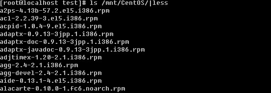

每一个rpm包的名称都由”-“和”.”分成了若干部分。就拿 a2ps-4.13b-57.2.el5.i386.rpm 这个包来解释一下，a2ps 为包名；4.13b则为版本信息；57.2.el5为发布版本号；i386为运行平台。其中运行平台常见的有i386, i586, i686, x86_64 ，需要你注意的是cpu目前是分32位和64位的，i386,i586和i686都为32位平台，x86_64则代表为64位的平台。另外有些rpm包并没有写具体的平台而是noarch，这代表这个rpm包没有硬件平台限制。例如 alacarte-0.10.0-1.fc6.noarch.rpm 。下面介绍一下rpm常用的命令。

1）安装一个rpm包

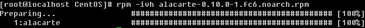

-i ：安装的意思

-v ：可视化

-h ：显示安装进度

另外在安装一个rpm包时常用的附带参数有：

--force 强制安装，即使覆盖属于其他包的文件也要安装

--nodeps 当要安装的rpm包依赖其他包时，即使其他包没有安装，也要安装这个包

2）升级一个rpm包

rpm -Uvh filename -U ：即升级的意思

3）卸载一个rpm包

rpm -e filename 这里的filename是通过rpm的查询功能所查询到的，稍后会作介绍。

卸载时后边跟的filename和安装时的是有区别的。上面命令提到的 “|”在linux系统中用的非常多也非常有用，它是一个管道符，用来把前面运行的结果传递给后面的命令。以后会做详细介绍，而后出现的grep命令则是用来过滤某个关键词的工具，在后续章节中会做详细介绍。

4）查询一个包是否安装

rpm -q rpm包名（这里的包名，是不带有平台信息以及后缀名的）

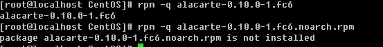

如果加上了平台信息以及后缀名反而不能查出来。你还可以查询当前系统中所安装的所有rpm包。

因为太多，所以笔者列出前十个。

5）得到一个rpm包的相关信息

rpm -qi 包名（同样不需要加平台信息与后缀名）

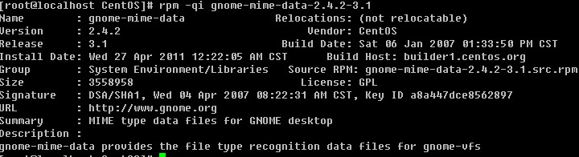

6）列出一个rpm包安装的文件

rpm -ql 包名

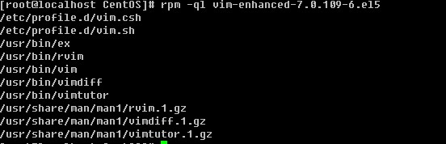

通过上面的命令可以看出vim是通过安装vim-enhanced-7.0.109-6.el5这个rpm包得来的。那么反过来如何通过一个文件去查找是由安装哪个rpm包得来的？

7）列出某一个文件属于哪个rpm包

rpm -qf 文件的绝对路径

前面讲过如何查找一个文件（可执行命令）的绝对路径

所以你也可以把这两条命令连起来写

看到了吗，which vim 这条命令是由两个反引号引起来的，这代表引用反引号里面的命令所产生的结果。关于rpm工具的使用还有很多内容，笔者就不一一列举了，只要你掌握上面这些内容，完全够你平时工作用的了。

【**yum****工具**】

介绍完rpm工具后，还需要你掌握最常用的yum工具，这个工具比rpm工具好用多了，当然前提是你使用的linux系统是支持yum的。yum最大的优势在于可以联网去下载所需要的rpm包，然后自动安装，在这个工程中如果要安装的rpm包有依赖关系，yum会帮你解决掉这些依赖关系依次安装所有rpm包。下面笔者介绍常用的yum 命令。

1）列出所有可用的rpm包 “yum list “

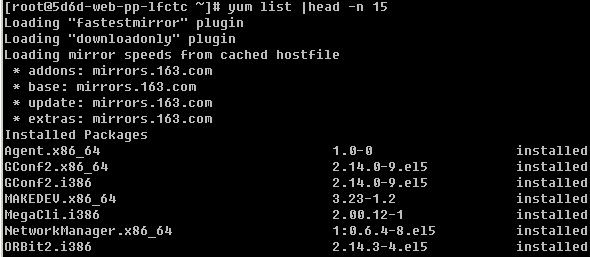

限于篇幅，笔者只列举出来前7个包信息。从上例中可以看到有”mirrors.163.com”信息出现，这是在告诉用户，它是从mirrors.163.com这里下载到的rpm包资源。如果你使用的是CentOS则你可以从/etc/yum.repos.d/CentOS-Base.repo这个文件下看到相关的配置信息。从上面的例子中你还可以看到最左侧是rpm包名字，中间是版本信息，最右侧是安装信息，如果安装了就显示installed，未安装则显示base或者extras，如果是该rpm包已安装但需要升级则显示updates。

2）搜索一个rpm包 “yum search [相关关键词]”

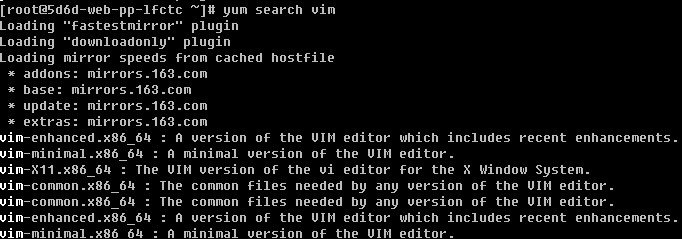

除了这样搜索外，笔者常用的是利用grep来过滤

相信你也会喜欢用后者吧，这样看起来简明的多。

3）安装一个rpm包 “yum install [-y] [rpm包名]”

如果不加-y选项，则会以与用户交互的方式安装，首先是列出需要安装的rpm包信息，然后会问用户是否需要安装，输入y则安装，输入n则不安装。而笔者嫌这样太麻烦，所以直接加上-y选项，这样就省略掉了问用户是否安装的那一步。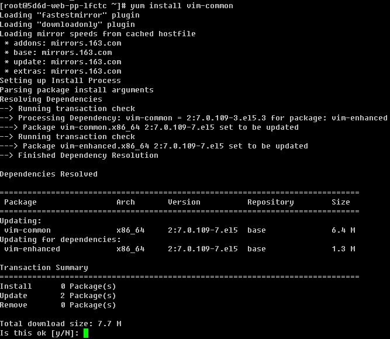

4）卸载一个rpm包 “yum remove [-y] [rpm包名]”

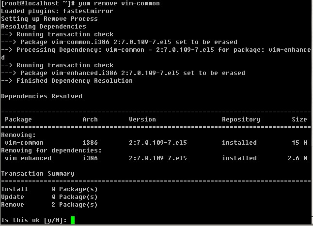

卸载和安装一样，你也可以直接加上-y选项来省略掉和用户交互的步骤。在这里笔者要提醒你一下，卸载某个rpm包一定要看清楚了，不要连其他重要的rpm包一起卸载了，以免影响正常的业务。

4）升级一个rpm包 “yum update [-y] [rpm包]”

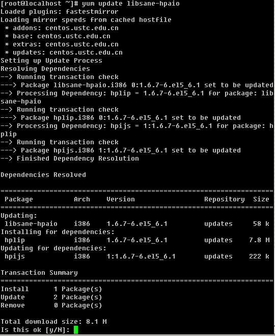

以上介绍了如何使用yum搜索、安装、卸载以及升级一个rpm包，如果你掌握了这些那么你就已经可以解决日常工作中遇到的与rpm包相关问题了。当然yum工具还有好多其他好用的命令，笔者不在列举出来，如果你感兴趣就去man一下吧。除此之外，笔者还会教你一些关于yum的小应用。

**1** **使用本地的光盘来制作一个****yum****源**

有时候你的linux系统不能联网，当然就不能很便捷的使用联网的yum源了，这时候就需要你自己会利用linux系统光盘制作一个yum源。具体步骤如下：

a.挂载光盘

[root@fortest Server]# mount -t iso9660 -o loop /dev/cdrom /mnt

b.删除/etc/yum.repos.d目录所有的repo文件

[root@fortest Server]# rm -rf /etc/yum.repos.d/*

c.创建新文件dvd.repo

[root@fortest Server]# vim /etc/yum.repos.d/dvd.repo

加入以下内容：

[dvd]

name=install dvd

baseurl=file:///mnt

enabled=1

gpgcheck=0

d.刷新repos,生成缓存

[root@fortest Server]#yum makecache

然后就可以使用yum命令安装你所需要的软件包了

**2** **利用****yum****工具下载一个****rpm****包**

有时，我们需要下载一个rpm包，只是下载下来，拷贝给其他机器使用，前面也介绍过yum安装rpm包的时候，首先得下载这个rpm包然后再去安装，所以使用yum完全可以做到只下载而不安装。

a. 首选要安装 yum-downloadonly

# yum install -y yum-downloadonly.noarch

b. 下载一个rpm包而不安装

# yum install test.rpm -y --downloadonly //这样虽然下载了，但是并没有保存到我们想要的目录下，那么如何指定目录呢？

c. 下载到指定目录

# yum install test.rpm -y --downloadonly --downloaddir=/usr/local/src

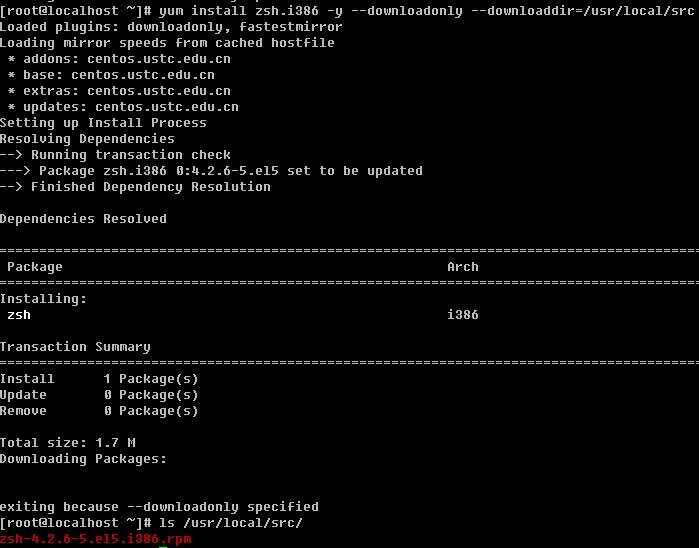

【**安装源码包**】

其实，在linux下面安装一个源码包是最常用的，笔者在日常的管理工作中，大部分软件都是通过源码安装的。安装一个源码包，是需要我们自己把源代码编译成二进制的可执行文件。如果你读得懂这些源代码，那么你就可以去修改这些源代码自定义功能，然后再去编译成你想要的。使用源码包的好处除了可以自定义修改源代码外还可以定制相关的功能，因为源码包在编译的时候是可以附加额外的选项的。

源码包的编译用到了linux系统里的编译器，常见的源码包一般都是用C语言开发的，这也是因为C语言为linux上最标准的程序语言。Linux上的C语言编译器叫做gcc，利用它就可以把C语言变成可执行的二进制文件。所以如果你的机器上没有安装gcc就没有办法去编译源码。你可以使用 yum install -y gcc 来完成安装。

安装一个源码包，通常需要三个步骤：

1\. ./config 在这一步可以定制功能，加上相应的选项即可，具有有什么选项可以通过”./config --help ”命令来查看。在这一步会自动检测你的linux系统与相关的套件是否有编译该源码包时需要的库，因为一旦缺少某个库就不能完成编译。只有检测通过后才会生成一个Makefile文件。

2\. make 使用这个命令会根据Makefile文件中预设的参数进行编译，这一步其实就是gcc在工作了。

3\. make install 安装步骤，生成相关的软件存放目录和配置文件的过程。

上面介绍的3步并不是所有的源码包软件都一样的，笔者以前也曾经遇到过，安装步骤并不是这样，也就是说源码包的安装并非具有一定的标准安装步骤。这就需要你拿到源码包解压后，然后进入到目录找相关的帮助文档，通常会以INSTALL或者README为文件名。所以，你一定要去看一下。下面笔者会编译安装一个源码包来帮你更深刻的去理解如何安装源码包。

1\. 下载一个源码包

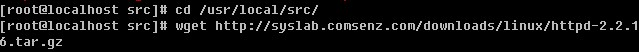

这里要提一下，建议以后你把所有下载的源码包放到/usr/local/src/目录下，这个并不是必须的，只是一个约定。方便你和你的同事将来更好的去运维这台服务器。wget即为下载的命令，后边跟源码包的下载地址。该地址为笔者从网上找的一个apache的下载地址。

2\. 解压源码包

一般的源码包都是一个压缩包，如何解压一个.tar.gz的包上一章讲过的。

3\. 配置相关的选项，并生成Makefile

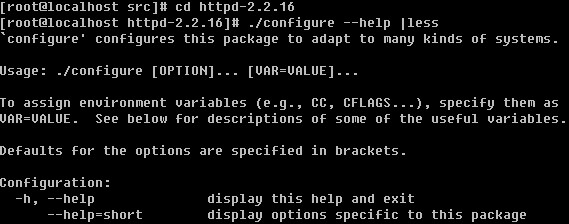

使用./config --help 可以查看可用的选项。一般常用的有”--prefix=PREFIX “ 这个选项的意思是定义软件包安装到哪里。到这里，笔者再提一个小小的约定，通常源码包都是安装在/usr/local/目录下的。比如，我们把apache安装在/usr/local/apache2下，那么这里就应该这样写” --prefix=/usr/local/apache2”。其他还有好多选项，如果你有耐心你可以挨个去看一看都有什么作用。

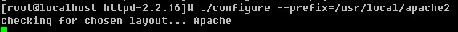

笔者在这里只定义了apache的安装目录，其他都是默认。回车后，开始执行check操作。

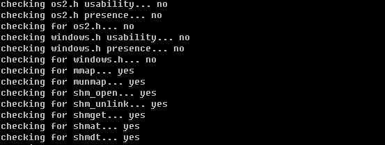

等check结束后生成了Makefile文件

除了查看有没有生成Makefile文件来判定有没有完成./config 的操作外，还可以通过这个命令”echo $?”来判定，如果是0，则表示上一步操作成功完成，否则就是没有成功。

4\. 进行编译

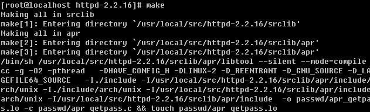

这一步操作，就是把源代码编译成二进制的可执行文件，这一步也是最漫长的一步，编译时间的长短取决于源代码的多少和机器配置。

5\. 安装

在安装前，先确认上一步操作是否成功完成。

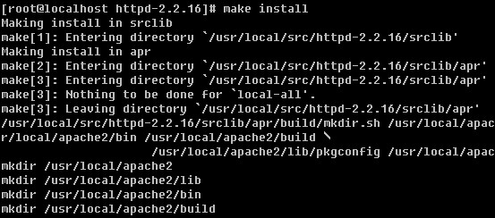

make install 会创建相应的目录以及文件。当完成安装后，会在/usr/local目录下多了一个apache2目录，这就是apache所安装的目录了。

其实在日常的源码安装工作中，并不是每个都像笔者这样顺利完成安装的，遇到错误不能完成安装的情况是很多的。通常都是因为缺少某一个库文件导致的。这就需要你仔细琢磨报错信息或者查看当前目录下的config.log去得到相关的信息。另外，如果自己不能解决那就去网上google一下吧，通常你会得到你想要的答案。

