# shell 脚本 

终于到shell 脚本这章了，在以前笔者卖了好多关子说shell脚本怎么怎么重要，确实shell脚本在linux系统管理员的运维工作中非常非常重要。下面笔者就带你正式进入shell脚本的世界吧。

到现在为止，你明白什么是shell脚本吗？如果明白最好了，不明白也没有关系，相信随着学习的深入你就会越来越了解到底什么是shell脚本。首先它是一个脚本，并不能作为正式的编程语言。因为是跑在linux的shell中，所以叫shell脚本。说白了，shell脚本就是一些命令的集合。举个例子，我想实现这样的操作：1）进入到/tmp/目录；2）列出当前目录中所有的文件名；3）把所有当前的文件拷贝到/root/目录下；4）删除当前目录下所有的文件。简单的4步在shell窗口中需要你敲4次命令，按4次回车。这样是不是很麻烦？当然这4步操作非常简单，如果是更加复杂的命令设置需要几十次操作呢？那样的话一次一次敲键盘会很麻烦。所以不妨把所有的操作都记录到一个文档中，然后去调用文档中的命令，这样一步操作就可以完成。其实这个文档呢就是shell脚本了，只是这个shell脚本有它特殊的格式。

Shell脚本能帮助我们很方便的去管理服务器，因为我们可以指定一个任务计划定时去执行某一个shell脚本实现我们想要需求。这对于linux系统管理员来说是一件非常值得自豪的事情。现在的139邮箱很好用，发邮件的同时还可以发一条邮件通知的短信给用户，利用这点，我们就可以在我们的linux服务器上部署监控的shell脚本，比如网卡流量有异常了或者服务器web服务器停止了就可以发一封邮件给管理员，同时发送给管理员一个报警短信这样可以让我们及时的知道服务器出问题了。

有一个问题需要约定一下，凡是自定义的脚本建议放到/usr/local/sbin/目录下，这样做的目的是，一来可以更好的管理文档；二来以后接管你的管理员都知道自定义脚本放在哪里，方便维护。

【**shell****脚本的基本结构以及如何执行**】

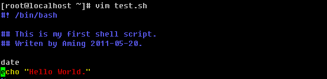

Shell脚本通常都是以.sh 为后缀名的，这个并不是说不带.sh这个脚本就不能执行，只是大家的一个习惯而已。所以，以后你发现了.sh为后缀的文件那么它一定会是一个shell脚本了。test.sh中第一行一定是 “#! /bin/bash” 它代表的意思是，该文件使用的是bash语法。如果不设置该行，那么你的shell脚本就不能被执行。’#’表示注释，在前面讲过的。后面跟一些该脚本的相关注释内容以及作者和创建日期或者版本等等。当然这些注释并非必须的，如果你懒的很，可以省略掉，但是笔者不建议省略。因为随着你工作时间的增加，你写的shell脚本也会越来越多，如果有一天你回头查看你写的某个脚本时，很有可能忘记该脚本是用来干什么的以及什么时候写的。所以写上注释是有必要的。另外系统管理员并非你一个，如果是其他管理员查看你的脚本，他看不懂岂不是很郁闷。该脚本再往下面则为要运行的命令了。

Shell脚本的执行很简单，直接”sh filename “ 即可，另外你还可以这样执行

默认我们用vim编辑的文档是不带有执行权限的，所以需要加一个执行权限，那样就可以直接使用’./filename’ 执行这个脚本了。另外使用sh命令去执行一个shell脚本的时候是可以加-x选项来查看这个脚本执行过程的，这样有利于我们调试这个脚本哪里出了问题。

该shell脚本中用到了’date’这个命令，它的作用就是用来打印当前系统的时间。其实在shell脚本中date使用率非常高。有几个选项笔者常常在shell脚本中用到：

%Y表示年，%m表示月，%d表示日期，%H表示小时，%M表示分钟，%S表示秒

注意%y和%Y的区别。

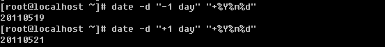

-d 选项也是经常要用到的，它可以打印n天前或者n天后的日期，当然也可以打印n个月/年前或者后的日期。

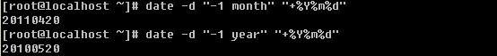

另外星期几也是常用的

**【shell****脚本中的变量****】**

在shell脚本中使用变量显得我们的脚本更加专业更像是一门语言，开个玩笑，变量的作用当然不是为了专业。如果你写了一个长达1000行的shell脚本，并且脚本中出现了某一个命令或者路径几百次。突然你觉得路径不对想换一下，那岂不是要更改几百次？你固然可以使用批量替换的命令，但是也是很麻烦，并且脚本显得臃肿了很多。变量的作用就是用来解决这个问题的。

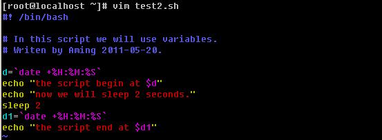

在test2.sh中使用到了反引号，你是否还记得它的作用？’d’和’d1’在脚本中作为变量出现，定义变量的格式为 “变量名=变量的值”。当在脚本中引用变量时需要加上’$’符号，这跟前面讲的在shell中自定义变量是一致的。下面看看脚本执行结果吧。

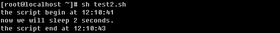

下面我们用shell计算两个数的和。

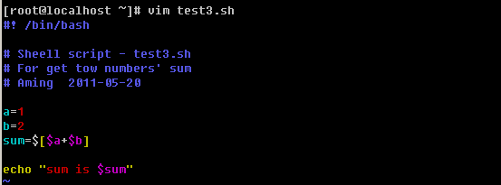

数学计算要用’[ ]’括起来并且外头要带一个’$’。脚本结果为：

Shell脚本还可以和用户交互。

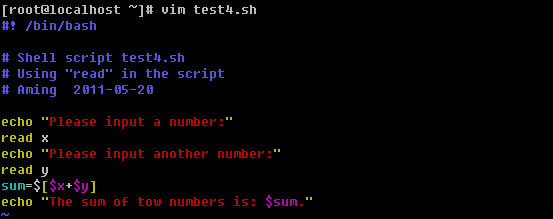

这就用到了read命令了，它可以从标准输入获得变量的值，后跟变量名。”read x”表示x变量的值需要用户通过键盘输入得到。脚本执行过程如下：

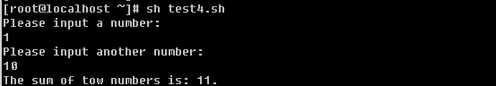

我们不妨加上-x选项再来看看这个执行过程：

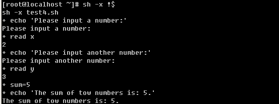

在test4.sh中还有更加简洁的方式。

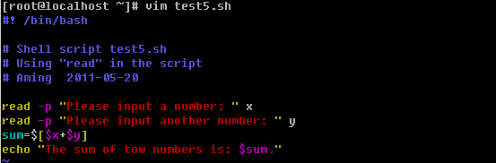

read -p 选项类似echo的作用。执行如下：

你有没有用过这样的命令”/etc/init.d/iptables restart “ 前面的/etc/init.d/iptables 文件其实就是一个shell脚本，为什么后面可以跟一个”restart”? 这里就涉及到了shell脚本的预设变量。实际上，shell脚本在执行的时候后边是可以跟变量的，而且还可以跟多个。不妨笔者写一个脚本，你就会明白了。

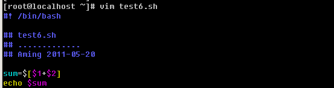

执行过程如下：

在脚本中，你会不会奇怪，哪里来的$1和$2，这其实就是shell脚本的预设变量，其中$1的值就是在执行的时候输入的1，而$2的值就是执行的时候输入的$2，当然一个shell脚本的预设变量是没有限制的，这回你明白了吧。另外还有一个$0，不过它代表的是脚本本身的名字。不妨把脚本修改一下。

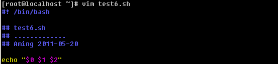

执行结果想必你也猜到了吧。

**【shell****脚本中的逻辑判断****】**

如果你学过C或者其他语言，相信你不会对if 陌生，在shell脚本中我们同样可以使用if逻辑判断。在shell中if判断的基本语法为：

**1****）不带****else**

if 判断语句; then

command

fi

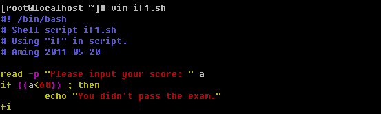

在if1.sh中出现了 ((a<60))这样的形式，这是shell脚本中特有的格式，用一个小括号或者不用都会报错，请记住这个格式，即可。执行结果为：

**2****）带有****else**

if 判断语句 ; then

command

else

command

fi

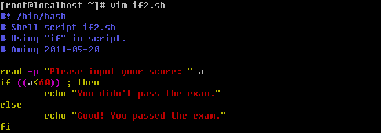

执行结果为：

**3****）带有****elif**

if 判断语句一 ; then

command

elif 判断语句二; then

command

else

command

fi

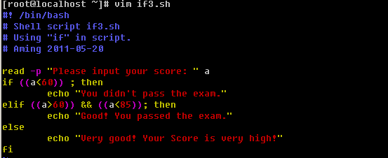

这里的 && 表示“并且”的意思，当然你也可以使用 || 表示“或者”，执行结果：

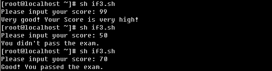

以上只是简单的介绍了if语句的结构。在判断数值大小除了可以用”(( ))”的形式外，还可以使用”[ ]”。但是就不能使用>, < , = 这样的符号了，要使用 -lt （小于），-gt （大于），-le （小于等于），-ge （大于等于），-eq （等于），-ne （不等于）。

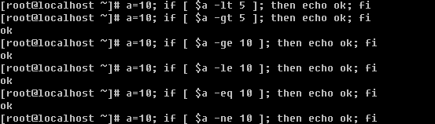

再看看if中使用 && 和 ||的情况。

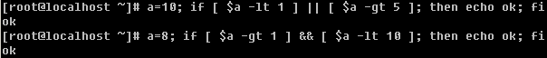

shell 脚本中if还经常判断关于档案属性，比如判断是普通文件还是目录，判断文件是否有读写执行权限等。常用的也就几个选项：

-e ：判断文件或目录是否存在

-d ：判断是不是目录，并是否存在

-f ：判断是否是普通文件，并存在

-r ：判断文档是否有读权限

-w ：判断是否有写权限

-x ：判断是否可执行

使用if判断时，具体格式为： if [ -e filename ] ; then

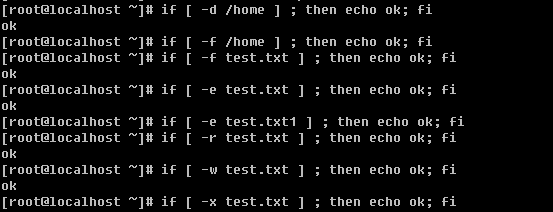

在shell 脚本中，除了用if来判断逻辑外，还有一种常用的方式，那就是case了。具体格式为：

case 变量 in

value1)

command

;;

value2)

command

;;

value3)

command

;;

*)

command

;;

esac

上面的结构中，不限制value的个数，*则代表除了上面的value外的其他值。下面笔者写一个判断输入数值是奇数或者偶数的脚本。

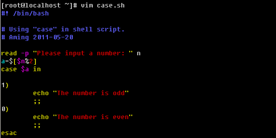

$a 的值或为1或为0，执行结果为：

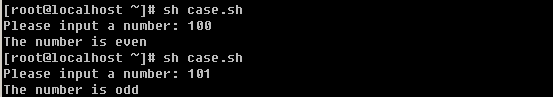

也可以看一下执行过程：

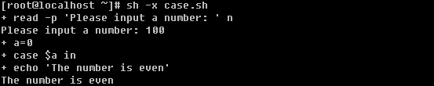

case脚本常用于编写系统服务的启动脚本，例如/etc/init.d/iptables中就用到了，你不妨去查看一下。

**【shell****脚本中的循环****】**

Shell脚本中也算是一门简易的编程语言了，当然循环是不能缺少的。常用到的循环有for循环和while循环。下面就分别介绍一下两种循环的结构。

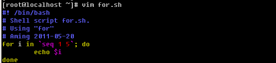

脚本中的seq 1 5 表示从1到5的一个序列。你可以直接运行这个命令试下。脚本执行结果为：

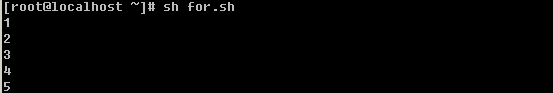

通过这个脚本就可以看到for循环的基本结构：

for 变量名 in 循环的条件； do

command

done

循环的条件那一部分也可以写成这样的形式，中间用空格隔开即可。你也可以试试，for i in `ls`; do echo $i; done 和 for i in `cat test.txt`； do echo $i; done

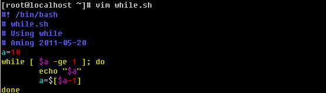

再来看看这个while循环，基本格式为：

while 条件; do

command

done

脚本的执行结果为：

另外你可以把循环条件忽略掉，笔者常常这样写监控脚本。

while :; do

command

done

**【shell****脚本中的函数****】**

如果你学过开发，肯定知道函数的作用。如果你是刚刚接触到这个概念的话，也没有关系，其实很好理解的。函数就是把一段代码整理到了一个小单元中，并给这个小单元起一个名字，当用到这段代码时直接调用这个小单元的名字即可。有时候脚本中的某段代总是重复使用，如果写成函数，每次用到时直接用函数名代替即可，这样就节省了时间还节省了空间。

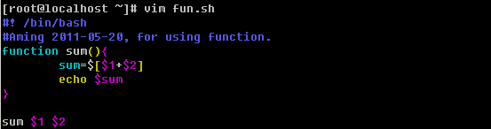

fun.sh 中的sum() 为自定义的函数，在shell脚本中要用

function 函数名() {

command

}

这样的格式去定义函数。

上个脚本执行过程如下：

有一点笔者要提醒你一下，在shell脚本中，函数一定要写在最前面，不能出现在中间或者最后，因为函数是要被调用的，如果还没有出现就被调用，肯定是会出错的。

Shell脚本大体上就介绍这么多了，笔者所举的例子都是最基础的，所以即使你把所有例子完全掌握也不代表你的shell脚本编写能力有多么好。所以剩下的日子里你尽量要多练习，多写脚本，你写的脚本越多，你的能力就越强。希望你能够找专门介绍shell脚本的书籍深入的去研究一下它。随后笔者将给你留几个shell脚本的练习题，你最好不要偷懒。

1\. 编写shell脚本，计算1-100的和；

2\. 编写shell脚本，要求输入一个数字，然后计算出从1到输入数字的和，要求，如果输入的数字小于1，则重新输入，直到输入正确的数字为止；

3\. 编写shell脚本，把/root/目录下的所有目录（只需要一级）拷贝到/tmp/目录下；

4\. 编写shell脚本，批量建立用户user_00, user_01, … ,user_100并且所有用户同属于users组；

5\. 编写shell脚本，截取文件test.log中包含关键词’abc’的行中的第一列（假设分隔符为”:”），然后把截取的数字排序（假设第一列为数字），然后打印出重复次数超过10次的列；

6\. 编写shell脚本，判断输入的IP是否正确（IP的规则是，n1.n2.n3.n4，其中1<n1<255, 0<n2<255, 0<n3<255, 0<n4<255）。

以下为练习题答案：

1\. #! /bin/bash

sum=0

for i in `seq 1 100`; do

sum=$[$i+$sum]

done

echo $sum

2\. #! /bin/bash

n=0

while [ $n -lt "1" ]; do

read -p "Please input a number, it must greater than "1":" n

done

 

sum=0

for i in `seq 1 $n`; do

sum=$[$i+$sum]

done

echo $sum

 

3\. #! /bin/bash

for f in `ls /root/`; do

if [ -d $f ] ; then

cp -r $f /tmp/

fi

done

 

4\. #! /bin/bash

groupadd users

for i in `seq 0 9`; do

useradd -g users user_0$i

done

 

for j in `seq 10 100`; do

useradd -g users user_$j

done

 

5\. #! /bin/bash

awk -F':' '$0~/abc/ ' test.log >/tmp/n.txt

sort -n n.txt |uniq -c |sort -n >/tmp/n2.txt

awk '$1>10 ' /tmp/n2.txt

 

6\. #! /bin/bash

checkip() {

if echo $1 |egrep -q '^[0-9]\.[0-9]\.[0-9]\.[0-9]/span> ; then

a=`echo $1 | awk -F. ''`

b=`echo $1 | awk -F. ''`

c=`echo $1 | awk -F. ''`

d=`echo $1 | awk -F. ''`

 

for n in $a $b $c $d; do

if [ $n -ge 255 ] || [ $n -le 0 ]; then

echo "the number of the IP should less than 255 and greate than 0"

return 2

fi

done

else

echo "The IP you input is something wrong, the format is like 192.168.100.1"

return 1

fi

}

 

rs=1

while [ $rs -gt 0 ]; do

read -p "Please input the ip:" ip

checkip $ip

rs=`echo $?`

done

echo "The IP is right!"

