# 学习 shell 脚本之前的基础知识

日常的linux系统管理工作中必不可少的就是shell脚本，如果不会写shell脚本，那么你就不算一个合格的管理员。目前很多单位在招聘linux系统管理员时，shell脚本的编写是必考的项目。有的单位甚至用shell脚本的编写能力来衡量这个linux系统管理员的经验是否丰富。笔者讲这些的目的只有一个，那就是让你认真对待shell脚本，从一开始就要把基础知识掌握牢固，然后要不断的练习，只要你shell脚本写的好，相信你的linux求职路就会轻松的多。笔者在这一章中并不会多么详细的介绍shell脚本，而只是带你进入shell脚本的世界，如果你很感兴趣那么请到网上下载相关的资料或者到书店购买相关书籍吧。

在学习shell 脚本之前，需要你了解很多关于shell的知识，这些知识是编写shell脚本的基础，所以希望你能够熟练的掌握。

**【****什么是****shell】**

简单点理解，就是系统跟计算机硬件交互时使用的中间介质，它只是系统的一个工具。实际上，在shell和计算机硬件之间还有一层东西那就是系统内核了。打个比方，如果把计算机硬件比作一个人的躯体，而系统内核则是人的大脑，至于shell，把它比作人的五官似乎更加贴切些。回到计算机上来，用户直接面对的不是计算机硬件而是shell，用户把指令告诉shell，然后shell再传输给系统内核，接着内核再去支配计算机硬件去执行各种操作。

笔者接触的linux发布版本（Redhat/CentOS）系统默认安装的shell叫做bash，即Bourne Again Shell，它是sh（Bourne Shell）的增强版本。Bourn Shell 是最早行起来的一个shell，创始人叫Steven Bourne，为了纪念他所以叫做Bourn Shell，检称sh。那么这个bash有什么特点呢？

1）记录命令历史

我们敲过的命令，linux是会有记录的，预设可以记录1000条历史命令。这些命令保存在用户的家目录中的.bash_history文件中。有一点需要你知道的是，只有当用户正常退出当前shell时，在当前shell中运行的命令才会保存至.bash_history文件中。

与命令历史有关的有一个有意思的字符那就是”!”了。常用的有这么几个应用：（1）!! （连续两个”!”），表示执行上一条指令；（2）!n（这里的n是数字），表示执行命令历史中第n条指令，例如”!100”表示执行命令历史中第100个命令；（3）!字符串（字符串大于等于1），例如!ta，表示执行命令历史中最近一次以ta为开头的指令。

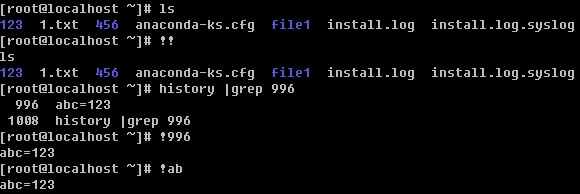

2）指令和文件名补全

在本教程最开始笔者就介绍过这个功能了，记得吗？对了就是按tab键，它可以帮你补全一个指令，也可以帮你补全一个路径或者一个文件名。连续按两次tab键，系统则会把所有的指令或者文件名都列出来。

3）别名

前面也出现过alias的介绍，这个就是bash所特有的功能之一了。我们可以通过alias把一个常用的并且很长的指令别名一个简洁易记的指令。如果不想用了，还可以用unalias解除别名功能。直接敲alias会看到目前系统预设的alias ：

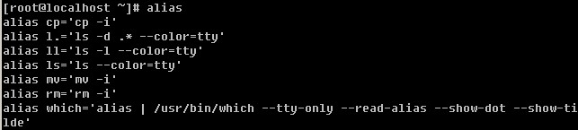

看到了吧，系统预设的alias指令也就这几个而已，你也可以自定义你想要的指令别名。alias语法很简单，alias [命令别名]=[’具体的命令’]。

4）通配符

在bash下，可以使用*来匹配零个或多个字符，而用?匹配一个字符。

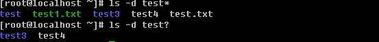

5）输入输出从定向

输入重定向用于改变命令的输入，输出重定向用于改变命令的输出。输出重定向更为常用，它经常用于将命令的结果输入到文件中，而不是屏幕上。输入重定向的命令是<，输出重定向的命令是>，另外还有错误重定向2>，以及追加重定向>>，稍后会详细介绍。

6）管道符

前面已经提过过管道符”|”，就是把前面的命令运行的结果丢给后面的命令。

7）作业控制。

当运行一个进程时，你可以使它暂停（按Ctrl+z），然后使用fg命令恢复它，利用bg命令使他到后台运行，你也可以使它终止（按Ctrl+c）。

**【****变量****】**

前面章节中笔者曾经介绍过环境变量PATH，这个环境变量就是shell预设的一个变量，通常shell预设的变量都是大写的。变量，说简单点就是使用一个较简单的字符串来替代某些具有特殊意义的设定以及数据。就拿PATH来讲，这个PATH就代替了所有常用命令的绝对路径的设定。因为有了PATH这个变量，所以我们运行某个命令时不再去输入全局路径，直接敲命令名即可。你可以使用echo命令显示变量的值。

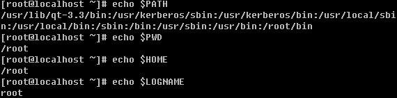

除了PATH, HOME, LOGNAME外，系统预设的环境变量还有哪些呢？

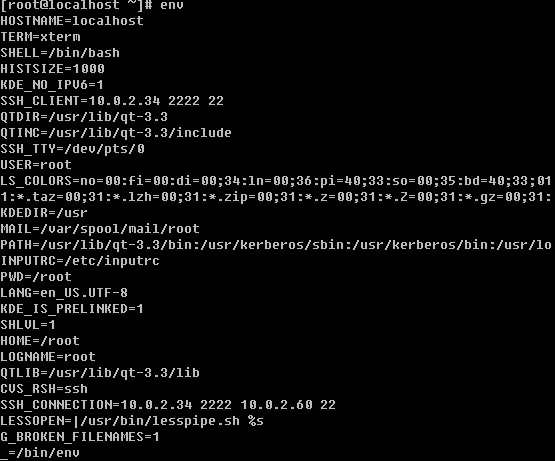

使用env命令即可全部列出系统预设的全部系统变量了。不过登录的用户不一样这些环境变量的值也不一样。当前显示的就是root这个账户的环境变量了。下面笔者简单介绍一下常见的环境变量：

PATH 决定了shell将到哪些目录中寻找命令或程序

HOME 当前用户主目录

HISTSIZE 历史记录数

LOGNAME 当前用户的登录名

HOSTNAME 指主机的名称

SHELL 前用户Shell类型

LANG 语言相关的环境变量，多语言可以修改此环境变量

MAIL 当前用户的邮件存放目录

PWD 当前目录

env命令显示的变量只是环境变量，系统预设的变量其实还有很多，你可以使用set命令把系统预设的全部变量都显示出来。

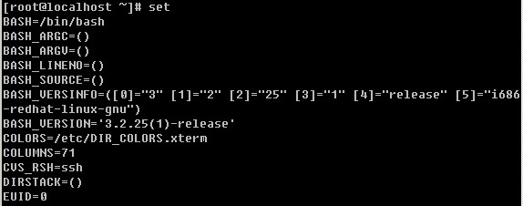

限于篇幅，笔者在上例中并没有把所有显示结果都截图。set不仅可以显示系统预设的变量，也可以连同用户自定义的变量显示出来。用户自定义变量？是的，用户自己同样可以定义变量。

虽然你可以自定义变量，但是该变量只能在当前shell中生效，不信你再登录一个shell试试？

使用bash命令即可再打开一个shell，此时先前设置的myname变量已经不存在了，退出当前shell回到原来的shell，myname变量还在。那要想设置的变量一直生效怎么办？有两种情况：

1）要想系统内所有用户登录后都能使用该变量

需要在/etc/profile文件最末行加入 “export myname=Aming” 然后运行”source /etc/profile”就可以生效了。此时你再运行bash命令或者直接su - test账户看看。

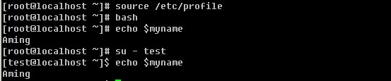

2）只想让当前用户使用该变量

需要在用户主目录下的.bashrc文件最后一行加入“export myname=Aming” 然后运行”source .bashrc”就可以生效了。这时候再登录test账户，myname变量则不会生效了。上面用的source命令的作用是，讲目前设定的配置刷新，即不用注销再登录也能生效。

笔者在上例中使用”myname=Aming”来设置变量myname，那么在linux下设置自定义变量有哪些规则呢？

a. 设定变量的格式为”a=b”，其中a为变量名，b为变量的内容，等号两边不能有空格；

b. 变量名只能由英、数字以及下划线组成，而且不能以数字开头；

c. 当变量内容带有特殊字符（如空格）时，需要加上单引号；

有一种情况，需要你注意，就是变量内容中本身带有单引号，这就需要用到双引号了。

d. 如果变量内容中需要用到其他命令运行结果则可以使用反引号；

e. 变量内容可以累加其他变量的内容，需要加双引号；

在这里如果你不小心把双引号加错为单引号，将得不到你想要的结果

通过上面几个例子也许你能看得出，单引号和双引号的区别：用双引号时不会取消掉里面出现的特殊字符的本身作用（这里的$），而使用单引号则里面的特殊字符全部失去它本身的作用。

在前面的例子中笔者多次使用了bash命令，如果在当前shell中运行bash指令后，则会进入一个新的shell，这个shell就是原来shell的子shell了，不妨你用pstree指令来查看一下。

pstree这个指令会把linux系统中所有进程通过树形结构打印出来。限于篇幅笔者没有全部列出，你可以直接输入pstree查看即可。在父shell中设定一个变量后，进入子shell后该变量是不会生效的，如果想让这个变量在子shell中生效则要用到export指令，笔者曾经在前面用过。

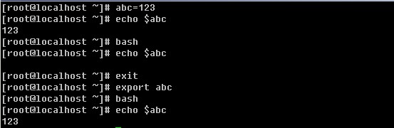

export其实就是声明一下这个变量的意思，让该shell的子shell也知道变量abc的值是123.如果export后面不加任何变量名，则它会声明所有的变量。

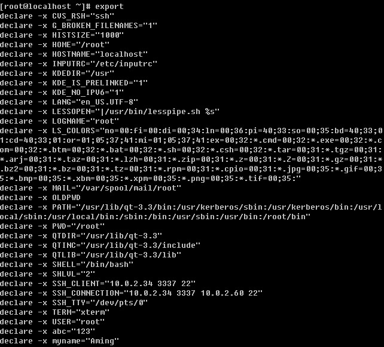

在最后面连同我们自定义的变量都被声明了。

前面光讲如何设置变量，如果想取消某个变量怎么办？只要输入”unset 变量名”即可。

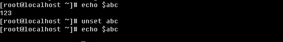

用unset abc后，再echo $abc则不再输出任何内容。

**【****系统环境变量与个人环境变量的配置文件****】**

上面讲了很多系统的变量，那么在linux系统中，这些变量被存到了哪里呢，为什么用户一登陆shell就自动有了这些变量呢？

**/etc/profile**：这个文件预设了几个重要的变量，例如PATH, USER, LOGNAME, MAIL, INPUTRC, HOSTNAME, HISTSIZE, umas等等。

**/etc/bashrc** ：这个文件主要预设umask以及PS1。这个PS1就是我们在敲命令时，前面那串字符了，例如笔者的linux系统PS1就是 [root@localhost ~]# ，你不妨看一下PS1的值。

\u就是用户，\h 主机名， \W 则是当前目录，\$就是那个’#’了，如果是普通用户则显示为’$’

除了两个系统级别的配置文件外，每个用户的主目录下还有几个这样的隐藏文件：

**.bash_profile**：定义了用户的个人化路径与环境变量的文件名称。每个用户都可使用该文件输入专用于自己使用的shell信息,当用户登录时,该文件仅仅执行一次。

**.bashrc**：该文件包含专用于你的shell的bash信息,当登录时以及每次打开新的shell时,该该文件被读取。例如你可以将用户自定义的alias或者自定义变量写到这个文件中。

**.bash_history**：记录命令历史用的。

**.bash_logout** ：当退出shell时，会执行该文件。可以把一些清理的工作放到这个文件中。

 

【**linux shell****中的特殊符号**】

你在学习linux的过程中，也许你已经接触过某个特殊符号，例如”*”，它是一个通配符号，代表零个或多个字符或数字。下面笔者就说一说常用到的特殊字符。

**1\. *** ：代表零个或多个字符或数字。

test后面可以没有任何字符，也可以有多个字符，总之有或没有都能匹配出来。

**2\. ?** ：只代表一个任意的字符

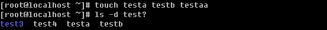

不管是数字还是字母，只要是一个都能匹配出来。

**3\. #** ：这个符号在linux中表示注释说明的意思，即”#”后面的内容linux忽略掉。

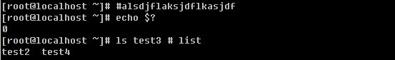

在命令的开头或者中间插入”#” ，linux都会忽略掉的。这个符号在shell脚本中用的很多。

**4\. \** ：脱意字符，将后面的特殊符号（例如”*” ）还原为普通字符。

**5\. |** ：管道符，前面多次说过，它的作用在于将符号前面命令的结果丢给符号后面的命令。这里提到的后面的命令，并不是所有的命令都可以的，一般针对文档操作的命令比较常用，例如cat, less, head, tail, grep, cut, sort, wc, uniq, tee, tr, split, sed, awk等等，其中grep, sed, awk为正则表达式必须掌握的工具，在后续内容中详细介绍。

6\. $ ：除了用于变量前面的标识符外，还有一个妙用，就是和’!’结合起来使用。

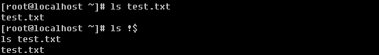

‘!$’表示上条命中中最后一个变量（也许称为变量不合适，总之就是上条命令中最后出现的那个东西）例如上边命令最后是test.txt那么在当前命令下输入!$则代表test.txt。

**1****）****grep**：过滤一个或多个字符，将会在后续内容中详细介绍其用法。

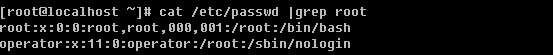

**2) cut**：截取某一个字段

语法：cut -d “分隔字符” [-cf] n 这里的n是数字

-d ：后面跟分隔字符，分隔字符要用双引号括起来

-c ：后面接的是第几个字符

-f ：后面接的是第几个区块

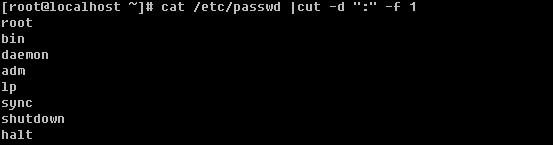

-d 后面跟分隔字符，这里使用冒号作为分割字符，-f 1 就是截取第一段，-f和1之间的空格可有可无。

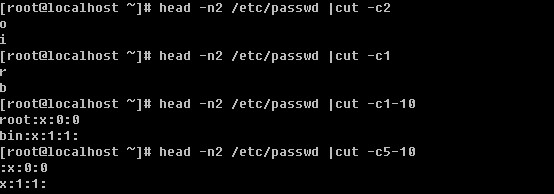

-c 后面可以是1个数字n，也可以是一个区间n1-n2，还可以是多个数字n1,n2,n3

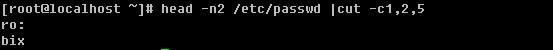

**3) sort**：用做排序

语法：sort [-t 分隔符] [-kn1,n2] [-nru] 这里的n1 < n2

-t 分隔符：作用跟cut的-d一个意思

-n ：使用纯数字排序

-r ：反向排序

-u ：去重复

-kn1,n2 ：由n1区间排序到n2区间，可以只写-kn1，即对n1字段排序

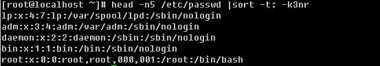

**4) wc**：统计文档的行数、字符数、词数，常用的选项为：

-l ：统计行数

-m ：统计字符数

-w ：统计词数

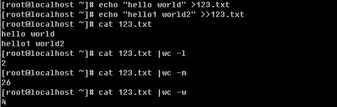

**5****）** **uniq**：去重复的行，笔者常用的选项只有一个：

-c ：统计重复的行数，并把行数写在前面

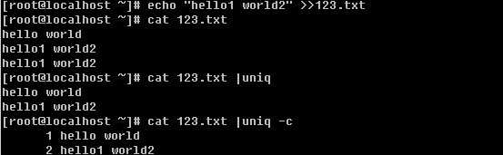

有一点需要注意，在进行uniq之前，需要先用sort排序然后才能uniq，否则你将得不到你想要的，笔者上面的试验当中已经是排序过所以省略掉那步了。

**6****）****tee** ：后跟文件名，类似与重定向”>”，但是比重定向多了一个功能，在把文件写入后面所跟的文件中的同时，还显示在屏幕上。

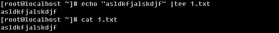

**7****）****tr** ：替换字符，常用来处理文档中出现的特殊符号，如DOS文档中出现的^M符号。常用的选项有两个：

-d ：删除某个字符，-d 后面跟要删除的字符

-s ：把重复的字符去掉

最常用的就是把小写变大写： tr ‘[a-z]’ ‘[A-Z]’

当然替换一个字符也是完全可以的。

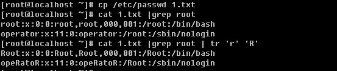

不过替换、删除以及去重复都是针对一个字符来讲的，有一定局限性。如果是针对一个字符串就不再管用了，所以笔者建议只是简单了解这个tr即可，以后你还会学到更多可以实现针对字符串操作的工具。

**8****）****split** ：切割文档，常用选项：

-b ：依据大小来分割文档，单位为byte

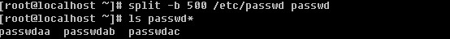

格式如上例，后面的passwd为分割后文件名的前缀，分割后的文件名为passwdaa, passwdab, passwdac …

-l ：依据行数来分割文档

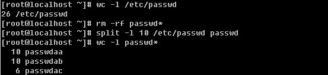

**6\.** **；**：分号。平时我们都是在一行中敲一个命令，然后回车就运行了，那么想在一行中运行两个或两个以上的命令如何呢？则需要在命令之间加一个”;”了。

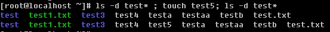

**7\. ~**：用户的家目录，如果是root则是 /root ，普通用户则是 /home/username

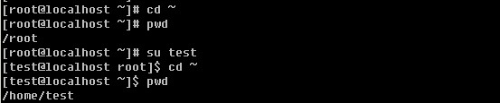

**8\. &** ：如果想把一条命令放到后台执行的话，则需要加上这个符号。通常用于命令运行时间非常长的情况。

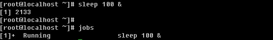

使用jobs可以查看当前shell中后台执行的任务。用fg可以调到前台执行。这里的sleep命令就是休眠的意思，后面跟数字，单位为秒，常用语循环的shell脚本中。

此时你按一下CTRL +z 使之暂停，然后再输入bg可以再次进入后台执行。

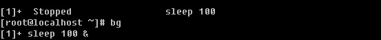

如果是多任务情况下，想要把任务调到前台执行的话，fg后面跟任务号，任务号可以使用jobs命令得到。

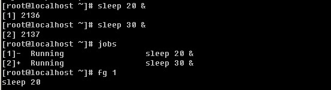

9\. **>, >>, 2>, 2>>**：前面讲过重定向符号> 以及>>　分别表示取代和追加的意思，然后还有两个符号就是这里的2> 和 2>>　分别表示错误重定向和错误追加重定向，当我们运行一个命令报错时，报错信息会输出到当前的屏幕，如果想重定向到一个文本里，则要用2>或者2>>。

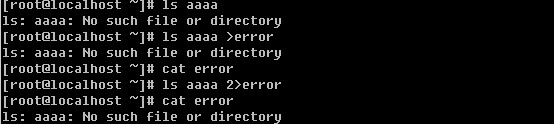

**10\. [ ]**：中括号，中间为字符组合，代表中间字符中的任意一个

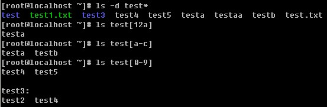

**11\. &&** **与** **||**

在上面刚刚提到了分号，用于多条命令间的分隔符。另外还有两个可以用于多条命令中间的特殊符号，那就是 “&&”和”||”。下面笔者把这几种情况全列出：

1) command1 ; command2

2) command1 && command2

3) command1 || command2

使用”;”时，不管command1是否执行成功都会执行command2；使用”&&”时，只有command1执行成功后，command2才会执行，否则command2不执行；使用”||”时，command1执行成功后command2 不执行，否则去执行command2，总之command1和command2总有一条命令会执行。

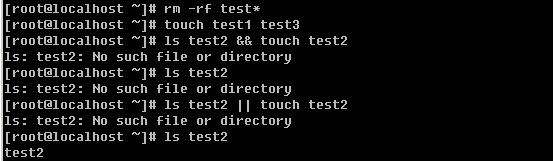

