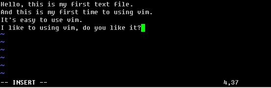

# 文本编辑工具 vim

前面多次提到过vim这个东西，它是linux中必不可少的一个工具。没有它很多工作都无法完成。早期的Unix都是使用的vi作为系统默认的编辑器的。你也许会有疑问，vi与vim有什么区别？可以这样简单理解，vim是vi的升级版。很多linux系统管理员都习惯用vi，那是因为他们接触linux的时候用的就是vi，vim后来才比较流行。所以，无所谓用vi和vim，只要你能达到你想要的目的即可。

在笔者看来vi 和vim最大的区别就是编辑一个文本时，vi不会显示颜色，而vim会显示颜色。显示颜色更易于用户进行编辑。其他功能没有什么区别。所以在linux系统下，使用vi还是vim完全取决你的个人爱好而已。笔者从一开始学linux就一直使用vim，所以也会一直以vim的角色来教授给你。

vim的三种模式：一般模式、编辑模式、命令模式。这需要你牢记的，因为以前笔者刚刚从事linux工作的时候去面试，很多单位的笔试题就有这个知识点。

* 一般模式：当你vim filename 编辑一个文件时，一进入该文件就是一般模式了。在这个模式下，你可以做的操作有，上下移动光标；删除某个字符；删除某行；复制、粘贴一行或者多行。

* 编辑模式：一般模式下，是不可以修改某一个字符的，只能到编辑模式了。从一般模式进入编辑模式，只需你按一个键即可（i,I,a,A,o,O,r,R）。当进入编辑模式时，会在屏幕的最下一行出现“INSERT或REPLACE”的字样。从编辑模式回到一般模式只需要按一下键盘左上方的ESC键即可。

* 命令模式：在一般模式下，输入”:”或者”/”即可进入命令模式。在该模式下，你可以搜索某个字符或者字符串，也可以保存、替换、退出、显示行号等等。

下面笔者教你如何在一个空白文档中写入一段文字，然后保存。

输入vim test.txt直接回车进入一般模式。然后按"i" 字母进入编辑模式

会看到窗口的左下方出现”INSERT”字样，说明已经进入了编辑模式，此时就可以写入内容了。

等编辑完内容后，按ESC退出编辑模式，进入一般模式。此时在左下方的”INSERT”字样消失，然后按”:”进入命令模式，最后输入wq保存并退出vim。

这时，看一下test.txt文档的内容吧。

其实vim为全键盘操作的编辑器，所以在各个模式下都有很多功能键盘的。下面笔者列举一下，其中笔者认为常用的会用红色标出，需要你多加练习，另外不常用的你也要知道的。

| 

**一般模式下移动光标**

 |

| 

h或向左方向键

 | 

光标向左移动一个字符

 |
| 

j或者向下方向键

 | 

光标向下移动一个字符

 |
| 

K或者向上方向键

 | 

光标向上移动一个字符

 |
| 

l或者向右方向键

 | 

光标向右移动一个字符

 |
| 

Ctrl + f 或者pageUP键

 | 

屏幕向前移动一页

 |
| 

Ctrl + b 或者pageDOWN键

 | 

屏幕向后移动一页

 |
| 

Ctrl + d

 | 

屏幕向前移动半页

 |
| 

Ctrl + u

 | 

屏幕向后移动半页

 |
| 

+

 | 

光标移动到非空格符的下一列

 |
| 

-

 | 

光标移动到非空格符的上一列

 |
| 

n空格（n是数字）

 | 

按下数字n然后按空格，则光标向右移动n个字符，如果该行字符数小于n，则光标继续从下行开始向右移动，一直到n

 |
| 

0（数字0）或者Shift+6

 | 

移动到本行行首

 |
| 

Shift+4

 | 

即’$’移动到本行行尾

 |
| 

H

 | 

光标移动到当前屏幕的最顶行

 |
| 

M

 | 

光标移动到当前屏幕的中央那一行

 |
| 

L

 | 

光标移动到当前屏幕的最底行

 |
| 

G

 | 

光标移动到文本的最末行

 |
| 

nG（n是数字）

 | 

移动到该文本的第n行

 |
| 

gg

 | 

移动带该文本的首行

 |
| 

n回车（n是数字）

 | 

光标向下移动n行

 |

| 

**一般模式下查找与替换**

 |

| 

/word

 | 

向光标之后寻找一个字符串名为word的字符串，当找到第一个word后，按”n”继续搜后一个

 |
| 

?word

 | 

想光标之前寻找一个字符串名为word的字符串，当找到第一个word后，按”n”继续搜前一个

 |
| 

:n1,n2s/word1/word2/g

 | 

在n1和n2行间查找word1这个字符串并替换为word2，你也可以把”/”换成”#”

 |
| 

:1,$s/word1/word2/g

 | 

从第一行到最末行，查找word1并替换成word2

 |
| 

:1,$s/word1/word2/gc

 | 

加上c的作用是，在替换前需要用户确认

 |

| 

**一般模式下删除****、****复制粘贴**

 |

| 

x,X

 | 

x为向后删除一个字符，X为向前删除一个字符

 |
| 

nx（n为数字）

 | 

向后删除n个字符

 |
| 

dd

 | 

删除光标所在的那一行

 |
| 

ndd（n为数字）

 | 

删除光标所在的向下n行

 |
| 

d1G

 | 

删除光标所在行到第一行的所有数据

 |
| 

dG

 | 

删除光标所在行到末行的所有数据

 |
| 

yy

 | 

复制光标所在的那行

 |
| 

nyy

 | 

复制从光标所在行起向下n行

 |
| 

p,P

 | 

p复制的数据从光标下一行粘贴，P则从光标上一行粘贴

 |
| 

y1G

 | 

复制光标所在行到第一行的所有数据

 |
| 

yG

 | 

复制光标所在行到末行的所有数据

 |
| 

J

 | 

讲光标所在行与下一行的数据结合成同一行

 |
| 

u

 | 

还原过去的操作

 |

| 

**进入编辑模式**

 |

| 

i

 | 

在当前字符前插入字符

 |
| 

I

 | 

在当前行行首插入字符

 |
| 

a

 | 

在当前字符后插入字符

 |
| 

A

 | 

在当前行行末插入字符

 |
| 

o

 | 

在当前行下插入新的一行

 |
| 

O

 | 

在当前行上插入新的一行

 |
| 

r

 | 

替换光标所在的字符，只替换一次

 |
| 

R

 | 

一直替换光标所在的字符，一直到按下ESC

 |

| 

**命令模式**

 |

| 

:w

 | 

将编辑过的文本保存

 |
| 

:w!

 | 

若文本属性为只读时，强制保存

 |
| 

:q

 | 

退出vim

 |
| 

:q!

 | 

不管编辑或未编辑都不保存退出

 |
| 

:wq

 | 

保存，退出

 |
| 

:e!

 | 

将文档还原成最原始状态

 |
| 

ZZ

 | 

若文档没有改动，则不储存离开，若文档改动过，则储存后离开，等同于:wq

 |
| 

:w [filename]

 | 

编辑后的文档另存为filename

 |
| 

:r [filename]

 | 

在当前光标所在行的下面读入filename文档的内容

 |
| 

:set nu

 | 

在每行的行首显示行号

 |
| 

:set nonu

 | 

取消行号

 |
| 

n1,n2 w [filename]

 | 

将n1到n2的内容另存为filename这个文档

 |
| 

:! command

 | 

暂时离开vim运行某个linux命令，例如 :! ls /home 暂时列出/home目录下的文件，然后会提示按回车回到vim

 |

暂时就讲这么多了。如果你全部掌握，你就是vim高手啦。如果你觉得太多，只要记住笔者标红部分即可，其他的用时再过来查就ok啦。下面笔者给你留一个小作业，希望你要认真完成！

1\. 请把/etc/init.d/iptables 复制到/root/目录下，并重命名为test.txt

2\. 用vim打开test.txt并设置行号

3\. 分别向下、向右、向左、向右移动5个字符

4\. 分别向下、向上翻两页

5\. 把光标移动到第49行

6\. 让光标移动到行末，再移动到行首

7\. 移动到test.txt文件的最后一行

8\. 移动到文件的首行

9\. 搜索文件中出现的 iptables 并数一下一共出现多少个

10\. 把从第一行到第三行出现的iptables 替换成iptable

11\. 还原上一步操作

12\. 把整个文件中所有的iptables替换成iptable

13\. 把光标移动到50行，删除字符”$”

14\. 还原上一步操作

15\. 删除第50行

16\. 还原上一步操作

17\. 删除从37行到42行的所有内容

18\. 还原上一步操作

19\. 复制48行并粘贴到52行下面

20\. 还原上一步操作（按两次u）

21\. 复制从37行到42行的内容并粘贴到44行上面

23\. 还原上一步操作（按两次u）

24\. 把37行到42行的内容移动到19行下面

25\. 还原上一步操作（按两次u）

26\. 光标移动到首行，把/bin/sh 改成 /bin/bash

27\. 在第一行下面插入新的一行，并输入”# Hello!”

28\. 保存文档并退出
