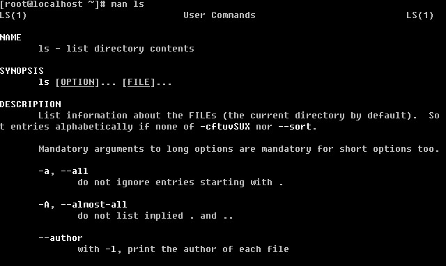
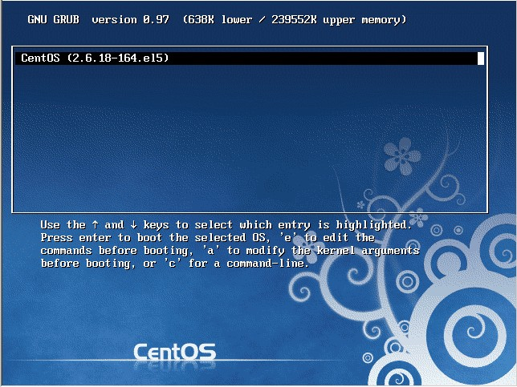
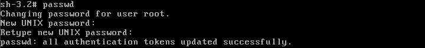
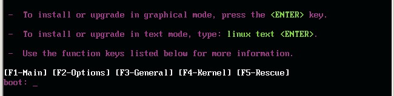
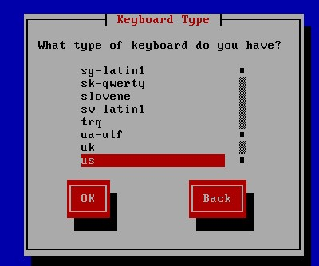

# 初步进入 linux 世界

## Linux 系统启动过程

Linux 的启动其实和 Windows 的启动过程很类似，不过 Windows 我们是无法看到启动信息的，而 linux 启动时我们会看到许多启动信息，例如某个服务是否启动。

Linux 系统的启动过程大体上可分为五部分：内核的引导；运行 init；系统初始化；建立终端 ；用户登录系统。

### 内核引导

当计算机打开电源后，首先是 BIOS 开机自检，按照 BIOS 中设置的启动设备（通常是硬盘）来启动。紧接着由启动设备上的 grub 程序开始引导 linux，当引导程序成功完成引导任务后，Linux 从它们手中接管了 CPU 的控制权，然后 CPU 就开始执行 Linux 的核心映象代码，开始了 Linux 启动过程。也就是所谓的内核引导开始了，在内核引导过程中其实是很复杂的，我们就当它是一个黑匣子，反正是 linux 内核做了一些列工作，最后内核调用加载了 init 程序，至此内核引导的工作就完成了。交给了下一个主角 init。

### 运行 init

init 进程是系统所有进程的起点，你可以把它比拟成系统所有进程的老祖宗，没有这个进程，系统中任何进程都不会启动。init 程序首先是需要读取配置文件 /etc/inittab。inittab 是一个不可执行的文本文件，它有若干行指令所组成。具体内容如下：（你可以在你的linux上执行命令 cat /etc/inittab 这样获得）

```
# inittab       This file describes how the INIT process should set up
　　#               the system in a certain run-level.
　　#
　　# Author:       Miquel van Smoorenburg,
　　#               Modified for RHS Linux by Marc Ewing and Donnie Barnes
　　#
　　# Default runlevel. The runlevels used by RHS are:
　　#   0 - halt (Do NOT set initdefault to this)
　　#   1 - Single user mode
　　#   2 - Multiuser, without NFS (The same as 3, if you do not havenetworking)
　　#   3 - Full multiuser mode
　　#   4 - unused
　　#   5 - X11
　　#   6 - reboot (Do NOT set initdefault to this)
　　#
　　###表示当前缺省运行级别为5(initdefault)；
　　id:5:initdefault:
　　###启动时自动执行/etc/rc.d/rc.sysinit脚本(sysinit)
　　# System initialization.
　　si::sysinit:/etc/rc.d/rc.sysinit
　　l0:0:wait:/etc/rc.d/rc 0
　　l1:1:wait:/etc/rc.d/rc 1
　　l2:2:wait:/etc/rc.d/rc 2
　　l3:3:wait:/etc/rc.d/rc 3
　　l4:4:wait:/etc/rc.d/rc 4
　　###当运行级别为5时，以5为参数运行/etc/rc.d/rc脚本，init将等待其返回(wait)
　　l5:5:wait:/etc/rc.d/rc 5
　　l6:6:wait:/etc/rc.d/rc 6
　　###在启动过程中允许按CTRL-ALT-DELETE重启系统
　　# Trap CTRL-ALT-DELETE
　　ca::ctrlaltdel:/sbin/shutdown -t3 -r now
　　# When our UPS tells us power has failed, assume we have a few minutes
　　# of power left.  Schedule a shutdown for 2 minutes from now.
　　# This does, of course, assume you have powerd installed and your
　　# UPS connected and working correctly.
　　pf::powerfail:/sbin/shutdown -f -h +2 "Power Failure; System Shutting Down"
　　# If power was restored before the shutdown kicked in, cancel it.
　　pr:12345:powerokwait:/sbin/shutdown -c "Power Restored; Shutdown Cancelled"
　　###在2、3、4、5级别上以ttyX为参数执行/sbin/mingetty程序，打开ttyX终端用于用户登录，
　　###如果进程退出则再次运行mingetty程序(respawn)
　　# Run gettys in standard runlevels
　　1:2345:respawn:/sbin/mingetty tty1
　　2:2345:respawn:/sbin/mingetty tty2
　　3:2345:respawn:/sbin/mingetty tty3
　　4:2345:respawn:/sbin/mingetty tty4
　　5:2345:respawn:/sbin/mingetty tty5
　　6:2345:respawn:/sbin/mingetty tty6
　　###在5级别上运行xdm程序，提供xdm图形方式登录界面，并在退出时重新执行(respawn)
　　# Run xdm in runlevel 5
　　x:5:respawn:/etc/X11/prefdm -nodaemon
```

以上面的 inittab 文件为例，来说明一下 inittab 的格式。其中以`#`开始的行是注释行，除了注释行之外，每一行都有以下格式： 

```
　　id:runlevel:action:process
```

对上面各项的详细解释如下：

1.id

　　id是指入口标识符，它是一个字符串，对于getty或mingetty等其他login程序项，要求id与tty的编号相同，否则getty程序将不能正常工作。
2.Runlevel

runlevel 是 init 所处于的运行级别的标识，一般使用 0－6 以及 S 或 s。0、1、6 运行级别被系统保留：其中 0 作为 shutdown 动作，1 作为重启至单用户模式，6 为重启；S 和 s 意义相同，表示单用户模式，且无需 inittab 文件，因此也不在 inittab 中出现，实际上，进入单用户模式时，init 直接在控制台（/dev/console）上运行 /sbin/sulogin。在一般的系统实现中，都使用了 2、3、4、5 几个级别，在 CentOS 系统中，2 表示无 NFS 支持的多用户模式，3 表示完全多用户模式（也是最常用的级别），4 保留给用户自定义，5 表示 XDM 图形登录方式。7－9 级别也是可以使用的，传统的 Unix 系统没有定义这几个级别。runlevel 可以是并列的多个值，以匹配多个运行级别，对大多数 action 来说，仅当 runlevel 与当前运行级别匹配成功才会执行。

3.action

action 是描述其后的 process 的运行方式的。action 可取的值包括：initdefault、sysinit、boot、bootwait等：initdefault 是一个特殊的 action 值，用于标识缺省的启动级别；当 init 由核心激活以后，它将读取 inittab 中的 initdefault 项，取得其中的 runlevel，并作为当前的运行级别。如果没有 inittab 文件，或者其中没有 initdefault 项，init 将在控制台上请求输入 runlevel。sysinit、boot、bootwait 等 action 将在系统启动时无条件运行，而忽略其中的 runlevel。其余的 action（不含 initdefault）都与某个 runlevel 相关。各个 action 的定义在 inittab 的 man 手册中有详细的描述。

4.process

process 为具体的执行程序。程序后面可以带参数。 

Tips: 如果你看不懂这个文件，没有关系，随着你对linux的深入了解，你再回过头看这个文件你就会豁然开朗的。但是你现在必须要明白runlevel的各个级别的含义。

### 系统初始化

在 init 的配置文件中有这么一行： si::sysinit:/etc/rc.d/rc.sysinit　它调用执行了/etc/rc.d/rc.sysinit，而 rc.sysinit是一个bash shell的脚本，它主要是完成一些系统初始化的工作，rc.sysinit 是每一个运行级别都要首先运行的重要脚本。它主要完成的工作有：激活交换分区，检查磁盘，加载硬件模块以及其它一些需要优先执行任务。

rc.sysinit 约有 850 多行，但是每个单一的功能还是比较简单，而且带有注释，建议有兴趣的用户可以自行阅读自己机器上的该文件，以了解系统初始化所详细情况。由于此文件较长，所以不在本文中列出来，也不做具体的介绍。当 rc.sysinit 程序执行完毕后，将返回 init 继续下一步。通常接下来会执行到 /etc/rc.d/rc 程序。以运行级别 3 为例，init 将执行配置文件 inittab 中的以下这行：

```
　　l5:5:wait:/etc/rc.d/rc 5
```

这一行表示以 5 为参数运行/etc/rc.d/rc，/etc/rc.d/rc 是一个 Shell 脚本，它接受 5 作为参数，去执行/etc/rc.d/rc5.d/ 目录下的所有的 rc 启动脚本，/etc/rc.d/rc5.d/ 目录中的这些启动脚本实际上都是一些连接文件，而不是真正的 rc 启动脚本，真正的 rc 启动脚本实际上都是放在 /etc/rc.d/init.d/ 目录下。而这些 rc 启动脚本有着类似的用法，它们一般能接受 start、stop、restart、status 等参数。

/etc/rc.d/rc5.d/ 中的 rc 启动脚本通常是 K 或 S 开头的连接文件，对于以 S 开头的启动脚本，将以 start 参数来运行。而如果发现存在相应的脚本也存在 K 打头的连接，而且已经处于运行态了(以 /var/lock/subsys/ 下的文件作为标志)，则将首先以 stop 为参数停止这些已经启动了的守护进程，然后再重新运行。这样做是为了保证是当 init 改变运行级别时，所有相关的守护进程都将重启。

至于在每个运行级中将运行哪些守护进程，用户可以通过 chkconfig 或 setup 中的"System Services"来自行设定。

### 建立终端

rc 执行完毕后，返回 init。这时基本系统环境已经设置好了，各种守护进程也已经启动了。init 接下来会打开 6 个终端，以便用户登录系统。在 inittab 中的以下 6 行就是定义了 6 个终端：

```
　　1:2345:respawn:/sbin/mingetty tty1
　　2:2345:respawn:/sbin/mingetty tty2
　　3:2345:respawn:/sbin/mingetty tty3
　　4:2345:respawn:/sbin/mingetty tty4
　　5:2345:respawn:/sbin/mingetty tty5
　　6:2345:respawn:/sbin/mingetty tty6
```
　
从上面可以看出在 2、3、4、5 的运行级别中都将以 respawn 方式运行 mingetty 程序，mingetty 程序能打开终端、设置模式。同时它会显示一个文本登录界面，这个界面就是我们经常看到的登录界面，在这个登录界面中会提示用户输入用户名，而用户输入的用户将作为参数传给 login 程序来验证用户的身份。

### 用户登录系统

对于运行级别为 5 的图形方式用户来说，他们的登录是通过一个图形化的登录界面。登录成功后可以直接进入KDE、Gnome 等窗口管理器。而本文主要讲的还是文本方式登录的情况：当我们看到 mingetty 的登录界面时，我们就可以输入用户名和密码来登录系统了。

Linux 的账号验证程序是 login，login 会接收 mingetty 传来的用户名作为用户名参数。然后 login 会对用户名进行分析：如果用户名不是 root，且存在 /etc/nologin文件，login 将输出 nologin 文件的内容，然后退出。这通常用来系统维护时防止非 root 用户登录。只有 /etc/securetty 中登记了的终端才允许 root 用户登录，如果不存在这个文件，则 root 可以在任何终端上登录。/etc/usertty 文件用于对用户作出附加访问限制，如果不存在这个文件，则没有其他限制。

在分析完用户名后，login 将搜索 /etc/passwd 以及 /etc/shadow 来验证密码以及设置账户的其它信息，比如：主目录是什么、使用何种 shell。如果没有指定主目录，将默认为根目录；如果没有指定 shell，将默认为 /bin/bash。

login 程序成功后，会向对应的终端在输出最近一次登录的信息(在 /var/log/lastlog 中有记录)，并检查用户是否有新邮件(在 /usr/spool/mail/ 的对应用户名目录下)。然后开始设置各种环境变量：对于 bash 来说，系统首先寻找 /etc/profile 脚本文件，并执行它；然后如果用户的主目录中存在 .bash_profile 文件，就执行它，在这些文件中又可能调用了其它配置文件，所有的配置文件执行后后，各种环境变量也设好了，这时会出现大家熟悉的命令行提示符，到此整个启动过程就结束了。 

## 图形模式与文字模式的切换方式

Linux 预设提供了六个命令窗口终端机让我们来登录。默认我们登录的就是第一个窗口，也就是 tty1，这个六个窗口分别为 tty1,tty2 … tty6，你可以按下 Ctrl + Alt + F1 ~ F6 来切换它们。如果你安装了图形界面，默认情况下是进入图形界面的，此时你就可以按 Ctrl + Alt + F1 ~ F6 来进入其中一个命令窗口界面。当你进入命令窗口界面后再返回图形界面只要按下 Ctrl + Alt + F7 就回来了。如果你用的 vmware 虚拟机，命令窗口切换的快捷键为 Alt + Space + F1~F6. 如果你在图形界面下请按 Alt + Shift + Ctrl + F1~F6 切换至命令窗口。 

## 学会使用快捷键

Ctrl + C：这个是用来终止当前命令的快捷键，当然你也可以输入一大串字符，不想让它运行直接 Ctrl + C，光标就会跳入下一行。 

Tab： 这个键是最有用的键了，也是笔者敲击概率最高的一个键。因为当你打一个命令打一半时，它会帮你补全的。不光是命令，当你打一个目录时，同样可以补全，不信你试试。

Ctrl + D： 退出当前终端，同样你也可以输入 exit。

Ctrl + Z： 暂停当前进程，比如你正运行一个命令，突然觉得有点问题想暂停一下，就可以使用这个快捷键。暂停后，可以使用 fg 恢复它。

Ctrl + L： 清屏，使光标移动到第一行。

## 学会查询帮助文档 — man

这个 man 通常是用来看一个命令的帮助文档的。例如：



输入 man ls 其实格式为 man + 命令

你就会看到相关的帮助文档了。从命令的介绍到命令的参数以及用法介绍的都非常详细的。不错吧。

## Linux 系统目录结构

登录系统后，在当前命令窗口下输入 ls / 你会看到


以下是对这些目录的解释：

/bin bin 是 Binary 的缩写。这个目录存放着最经常使用的命令。

/boot 这里存放的是启动 Linux 时使用的一些核心文件，包括一些连接文件以及镜像文件。

/dev dev 是 Device(设备)的缩写。该目录下存放的是 Linux 的外部设备，在 Linux 中访问设备的方式和访问文件的方式是相同的。

/etc 这个目录用来存放所有的系统管理所需要的配置文件和子目录。

/home 用户的主目录，在 Linux 中，每个用户都有一个自己的目录，一般该目录名是以用户的账号命名的。

/lib 这个目录里存放着系统最基本的动态连接共享库，其作用类似于 Windows 里的 DLL 文件。几乎所有的应用程序都需要用到这些共享库。

/lost+found 这个目录一般情况下是空的，当系统非法关机后，这里就存放了一些文件。

/media linux 系统会自动识别一些设备，例如U盘、光驱等等，当识别后，linux 会把识别的设备挂载到这个目录下。

/mnt 系统提供该目录是为了让用户临时挂载别的文件系统的，我们可以将光驱挂载在 /mnt/ 上，然后进入该目录就可以查看光驱里的内容了。

/opt 这是给主机额外安装软件所摆放的目录。比如你安装一个 ORACLE 数据库则就可以放到这个目录下。默认是空的。

/proc 这个目录是一个虚拟的目录，它是系统内存的映射，我们可以通过直接访问这个目录来获取系统信息。这个目录的内容不在硬盘上而是在内存里，我们也可以直接修改里面的某些文件，比如可以通过下面的命令来屏蔽主机的 ping 命令，使别人无法 ping 你的机器：

echo 1 > /proc/sys/net/ipv4/icmp_echo_ignore_all。

/root 该目录为系统管理员，也称作超级权限者的用户主目录。

/sbin s 就是 Super User 的意思，这里存放的是系统管理员使用的系统管理程序。

/selinux 这个目录是 Redhat/CentOS 所特有的目录，Selinux 是一个安全机制，类似于 Windows 的防火墙，但是这套机制比较复杂，这个目录就是存放 selinux 相关的文件的。

/srv 该目录存放一些服务启动之后需要提取的数据。

/sys 这是 linux2.6 内核的一个很大的变化。该目录下安装了 2.6 内核中新出现的一个文件系统 sysfs ，sysfs 文件系统集成了下面3种文件系统的信息：针对进程信息的 proc 文件系统、针对设备的 devfs 文件系统以及针对伪终端的 devpts 文件系统。该文件系统是内核设备树的一个直观反映。当一个内核对象被创建的时候，对应的文件和目录也在内核对象子系统种被创建。

/tmp 这个目录是用来存放一些临时文件的。

/usr 这是一个非常重要的目录，用户的很多应用程序和文件都放在这个目录下，类似与 windows 下的 program files目录。

/usr/bin：系统用户使用的应用程序。

/usr/sbin：超级用户使用的比较高级的管理程序和系统守护程序。

/usr/src：内核源代码默认的放置目录。

/var 这个目录中存放着在不断扩充着的东西，我们习惯将那些经常被修改的目录放在这个目录下。包括各种日志文件。

在 linux 系统中，有几个目录是比较重要的，平时需要注意不要误删除或者随意更改内部文件。/etc： 上边也提到了，这个是系统中的配置文件，如果你更改了该目录下的某个文件可能会导致系统不能启动。/bin, /sbin, /usr/bin, /usr/sbin: 这是系统预设的执行文件的放置目录，比如 ls 就是在 /bin/ls 目录下的。值得提出的是，/bin, /usr/bin 是给系统用户使用的指令（除 root 外的通用户），而 /sbin, /usr/sbin 则是给 root 使用的指令。 /var： 这是一个非常重要的目录，系统上跑了很多程序，那么每个程序都会有相应的日志产生，而这些日志就被记录到这个目录下，具体在 /var/log 目录下，另外 mail 的预设放置也是在这里。


## 如何正确关机

其实，在 linux 领域内大多用在服务器上，很少遇到关机的操作。毕竟服务器上跑一个服务是永无止境的，除非特殊情况下，不得已才会关机。

linux 和 Windows 不同，在 Linux 底下，由于每个程序（或者说是服务）都是在在背景下执行的，因此，在你看不到的屏幕背后其实可能有相当多人同时在你的主机上面工作，例如浏览网页啦、传送信件啦以 FTP 传送档案啦等等的，如果你直接按下电源开关来关机时，则其它人的数据可能就此中断！那可就伤脑筋了！此外，最大的问题是，若不正常关机，则可能造成文件系统的毁损（因为来不及将数据回写到档案中，所以有些服务的档案会有问题！）。

如果你要关机，必须要保证当前系统中没有其他用户在线。可以下达 who 这个指令，而如果要看网络的联机状态，可以下达 netstat -a 这个指令，而要看背景执行的程序可以执行 ps -aux 这个指令。使用这些指令可以让你稍微了解主机目前的使用状态！（这些命令在以后的章节中会提及，现在只要了解即可！）

正确的关机流程为：sysnc ? shutdown ? reboot ? halt

sync 将数据由内存同步到硬盘中。

shutdown 关机指令，你可以man shutdown 来看一下帮助文档。例如你可以运行如下命令关机：

shutdown –h 10 ‘This server will shutdown after 10 mins’ 这个命令告诉大家，计算机将在10分钟后关机，并且会显示在登陆用户的当前屏幕中。

Shutdown –h now 立马关机

Shutdown –h 20:25 系统会在今天20:25关机

Shutdown –h +10 十分钟后关机

Shutdown –r now 系统立马重启

Shutdown –r +10 系统十分钟后重启

reboot 就是重启，等同于 shutdown –r now

halt 关闭系统，等同于shutdown –h now 和 poweroff

最后总结一下，不管是重启系统还是关闭系统，首先要运行 sync 命令，把内存中的数据写到磁盘中。关机的命令有 shutdown –h now halt poweroff 和 init 0 , 重启系统的命令有 shutdown –r now reboot init 6。

## 忘记 root 密码如何做

以前笔者忘记 Windows 的管理员密码，由于不会用光盘清除密码最后只能重新安装系统。现在想想那是多么愚笨的一件事情。同样 linux 系统你也会遇到忘记 root 密码的情况，如果遇到这样的情况怎么办呢？重新安装系统吗？当然不用！进入单用户模式更改一下 root 密码即可。如何进入呢。

1 重启 linux 系统


3 秒之内要按一下回车，出现如下界面



然后输入 e


在第二行最后边输入 single，有一个空格。具体方法为按向下尖头移动到第二行，按“e”进入编辑模式


在后边加上 single 回车


最后按“b”启动，启动后就进入了单用户模式了


此时已经进入到单用户模式了，你可以更改 root 密码了。更密码的命令为 passwd



## 使用系统安装光盘的救援模式

救援模式即 rescue ，这个模式主要是应用于，系统无法进入的情况。如，grub 损坏或者某一个配置文件修改出错。如何使用 rescue 模式呢？

光盘启动，按 F5 进入 rescue 模式



输入 linux rescue 回车


选择语言，笔者建议你选择英语


选择 us 键盘




这里问你是否启动网络，有时候可能会联网调试。我们选 no


这里告诉我们，接下来会把系统挂载在 /mnt/sysimage 中。其中有三个选项，Continue 就是挂载后继续下一步； Read-Only 挂载成只读，这样更安全，有时文件系统损坏时，只读模式会防止文件系统近一步损坏；Skip 就是不挂载，进入一个命令窗口模式。这里我们选择 Continue。


至此，系统已经挂载到了 /mnt/sysimage 中。接下来回车，输入 chroot /mnt/sysimage 进入管理员环境。


Tips： 其实也可以到 rescue 模式下更改 root 的密码的。这个 rescue 模式和 Windows PE 系统很相近。当运行了 chroot /mnt/sysimage/ 后，再 ls 看到目录结构和原来系统中的目录结构是一样的。没错！现在的环境和原来系统的环境是一模一样的。你可以输入 exit 或者按 Ctrl + D 退出这个环境。然后你再 ls 看一下


这个目录其实就是 rescue 模式下的目录结构，而我们的系统文件全部在 /mnt/sysimage目录下。

 


 

